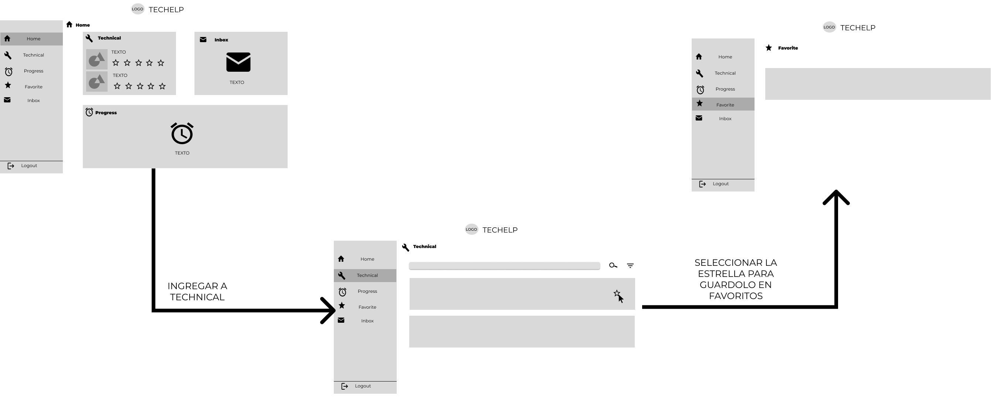
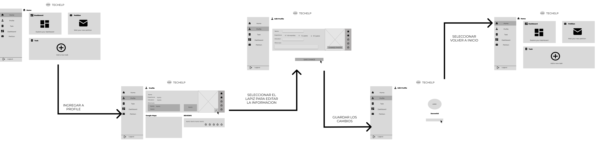
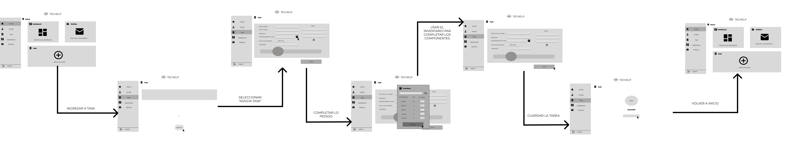
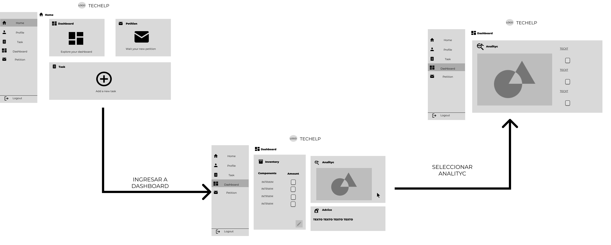
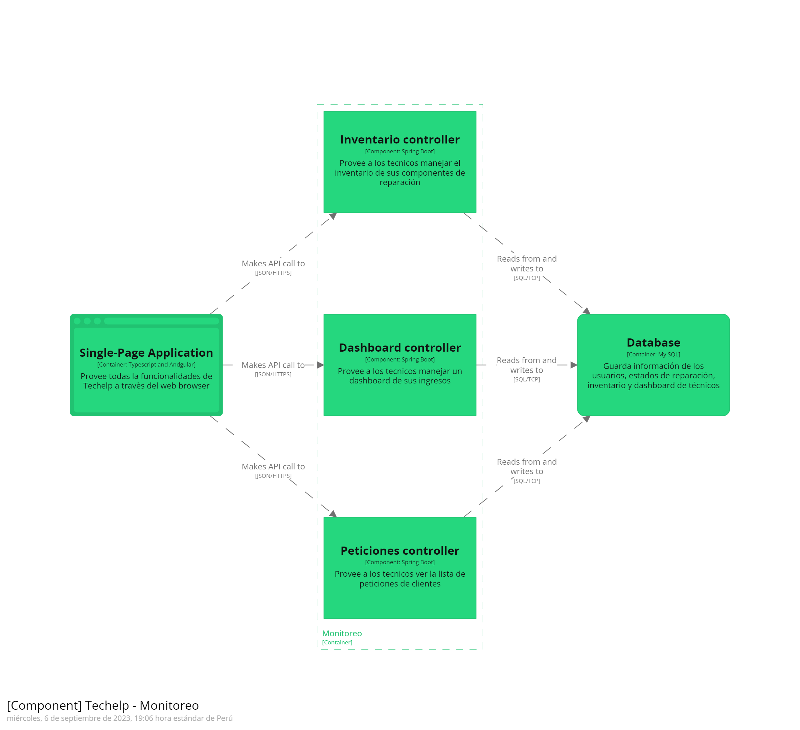
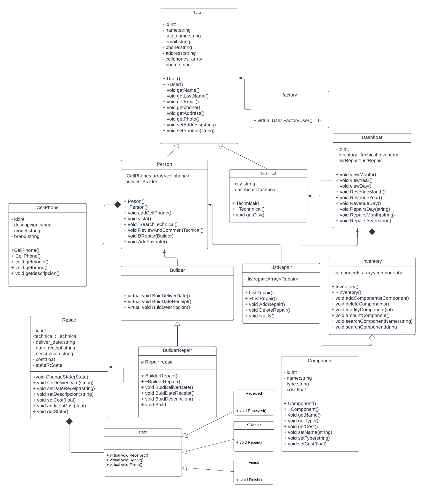
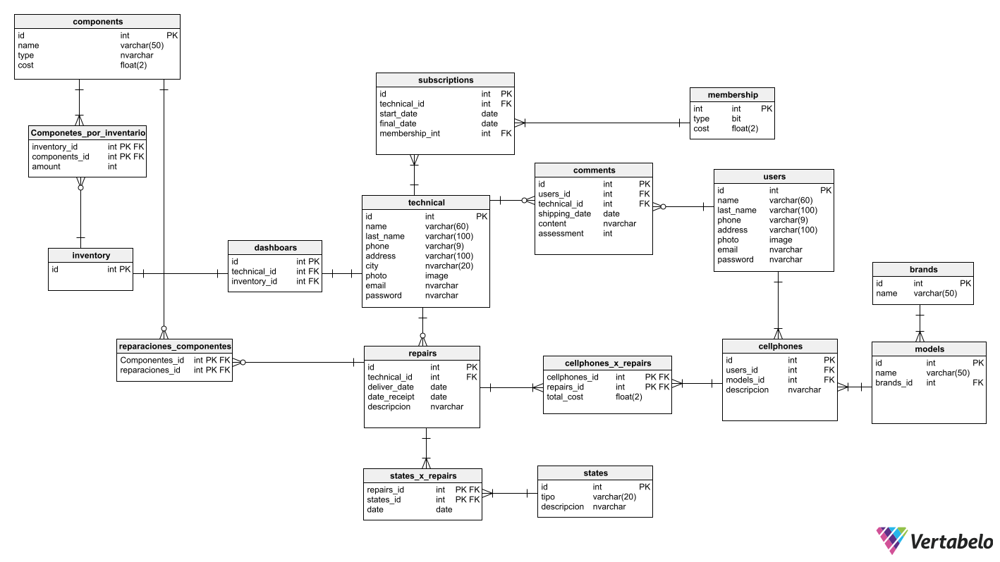

## 4.1. StyleGuidelines

### 4.1.1. General Style Guidelines.

En este apartado, se mostrará de manera organizada los estilos y herramientas que se usarán para diseñar nuestra solución.

**Brand Overview**

La necesidad de contar con un celular en buen funcionamiento se hace más notoria cada día en el Perú, ya sea por estudios, trabajos, etc. El servicio que se le brinda a la persona que desea reparar su celular,  muchas veces no es el adecuado. Es verdad que no todos los técnicos dan un  pésimo servicio, pero los que realmente son buenos, no son conocidos o muy poca gente conoce de ellos, lo que demuestra una desconexión  entre un cliente y un buen técnico por ende ambos segmentos son afectados.

Nuestra solución Techelp, surge a partir de esa desconexión que hay entre los dos segmentos. Nuestro equipo ha diseñado un producto el cual conectará ambos segmentos  para que de esta manera ambos consigan sus objetivos.

**Brand name**

El nombre de nuestra solución es Techelp. Esto debido al notar la necesidad de las personas  por un buen servicio de un técnico de celulares. Del mismo modo, los técnicos son los que brindan ese servicio “Tecnológico”. Por ello, la “tecnología”  en este caso los celulares y el brindar “ayuda” son las piezas claves de este software. Asimismo ambas se juntan ya que queremos dejar claro al usuario que ambas palabras van de la mano. Además, se escogió el inglés  por ser una lengua universal, lo que lo hace más comercial al usuario.

A continuación, se presenta el Logo:

**Typography**

La tipografía nos ayuda a seccionar por niveles los distintos contenidos de las páginas. Además, atrapa visualmente al usuario si estas son amigables y a su vez lo guía por toda nuestra interfaz.

El tipo de letra que nuestro equipo eligió fue Montserrat debido a su legibilidad al momento de leerlo y escribirlo. La tipografía de Techelp se organiza en 4 niveles headings, body, button y link.

**Colors**

La elección de colores es una parte importante del diseño. Una buena elección de colores transmite al usuario lo que nosotros realmente ofrecemos. Por eso tenemos como color primario el azul y el color secundario el verde azulado. Además, se muestran los colores estado los cuales usaremos para que el usuario sepa qué sucede mientras interactúa con nuestra aplicación.

**Color Primario Azul:**

El color azul siempre hace alucion a dos cosas 	la tecnología y el bienestar. Con ese enfoque, 	damos entender al usuario de que será nuestra 	aplicación web. Además se sabe que el azul	genera serenidad y calma a las personas, 		lo cual queremos lograr con el usuario.

**Color secundario azul-verdoso:**

Se eligió por su impacto, su tranquilidad y paz que transmite a los usuarios, pero sobre todo	la confianza. Lo cual es primordial que desea 	mostrar nuestra aplicación.

**Color estado: Rojo - (Acción inconclusa	o incorrecta)**

Se usa el rojo para este estado debido 	a que el usuario identificará la acción		que comito de manera errónea 		rápidamente.

**Color estado: Verde (Acción exitosa)**

Se consideró el verde como color de	este estado debido a que el usuario			ya se siente familiarizado con este 			color y sabra que la acción fue exitosa		de manera inmediata.

**Color estado: Amarillo (Advertencia de 		una acción)**

Se eligió el color amarillo para este	estado debido a que siempre se ha 	usado para advertir al usuario si está 	cometiendo una acción que afectara 	a futuro las actividades que realice.

**Color Estado: Gris (Botón o Acción deshabilitada)**

Sé usa este color gris par mostrar al usuario que la acción o boton está 	deshabilitada, ya que deberá completar otras posteriormente para poder así 	habilitarlas.

**Spacing**

El espacio que usaremos para cada componente serán múltiplos de 8 pixeles.

**Tono de lenguaje de comunicación y lenguaje aplicado**

El lenguaje que implementaremos será formal ,serio, calma, confiabilidad y entusiasmo. Ya que se desea potenciar la paz, calma y confianza del usuario y darle a entender que la aplicación es serie y podrán solucionar sus problemas con esa aplicación.

### 4.1.2. Web Style Guidelines

Implementaremos un sitio web responsive, ose que se pueda adaptar a cualquier dispositivo sin arruinar la experiencia del usuario, siendo siempre comprensible y visualmente agradable. Teniendo en cuenta lo mencionado se tendrá que adaptar nuestra aplicación web a las resoluciones que hoy en día se usan en los diversos dispositivos.

Se usará el patrón Z, ya que queremos que el usuario comience la navegación de nuestro landing page y aplicación web visualizando el logo para que  luego se ubique a la derecha donde verá las distintas opciones que le brindaremos.  Seguidamente de manera vertical hacia abajo el usuario verá el contenido general de nuestra landing page y aplicación web, Para que al final visualice de manera horizontal a la derecha la información de nuestro startup y cómo se puede contactar con nosotros.

Cabe mencionar que el diseño presenta colores que atraigan al usuario, para que le generen paz, confianza y ganas de usar nuestra aplicación. Además, los espacios y efectos que se incluirán facilitará al usuario saber de qué se trata nuestro landing page y aplicación web.

## 4.2. Information Architecture

### 4.2.1. Organization Systems

A Continuación, se indican los tipos de estructura visual que tendrá cada grupo de información con respecto al segmento objetivo y al tipo de categorización que se usará.

**Segmento 1: Personas que deseen el servicio de un buen técnico**

**Jerarquía:**

Lista de Tecnicos: Los técnicos se mostrarán de manera vertical y ordenada, se podrán usar filtros  para variar el orden, esto depende del usuario. De esta manera el usuario podrá elegir el técnico de su preferencia.

Perfil de Técnico: El usuario podrá acceder y visualizar el perfil del técnico para tener más información del mismo.

Lista de Favoritos: Los técnicos se mostrarán de manera vertical y ordenada, se podrán usar filtros  para variar el orden, esto depende del usuario. De esta manera el usuario podrá elegir al técnico que le brindó un mejor servicio de manera más rápida.

Bandeja de entrada: Esta bandeja se dividirá en dos , por una parte las solicitudes de servicios a técnicos se mostrarán  de manera ordenada y vertical . De igual manera las solicitudes aceptadas se mostrarán en una segunda pestaña dentro de la misma bandeja de entrada.

**Secuencial:**

Solicitud de servicio técnico: Este es un proceso en el cual el cliente debe realizar su solicitud detallada para que le puedan brindar un servicio técnico. Debe brindar nombre completo, fecha y hora , fallo del equipo y método de pago.

Calificar y comentar al técnico: Este es un proceso a la hora de finalizar el servicio con el técnico la persona puede calificar el servicio y comentar su experiencia a la hora de acudir a ese técnico.

**Matricial:**

Visualizar el progreso de la reparación:  En esta sección el usuario puede verificar en qué estado de reparación se encuentra su celular ya sea inicio, en proceso o finalizado.

**Segmento 2: Técnico de Celulares**

**Jerarquía:**

Lista de peticiones de reparación:  Se mostrarán de manera organizada y vertical las peticiones de los clientes que deseen reservar una cita con el técnico. El técnico en cuestión puede filtrar a su gusto para aceptar las reservas con las que él se sienta más cómodo.

Lista de tareas: Se mostrarán de manera organizada todas las tareas asignadas  por el técnico las cuales estarán detalladas y podrán ser filtradas a gusto del técnico.

**Secuencial:**

Designar una tarea:Para designar una tarea el técnico  ya debió realizar la cita con el cliente para que luego al designar esa tarea pueda detallar todos los términos en los cuales el cliente y él acordaron como también otros detalles técnicos.

Compra de membresia: Para poder realizar la compra de la membresía el técnico debe registrar datos de una tarjeta en la cual pueda realizar el pago y así obtener su membresía

Visualizar el Inventario: Para poder visualizar el inventario el técnico tendrá que dirigirse a su dashboard y seleccionar el apartado de su inventario.

Cancelar membresía: Para cancelar su membresía el técnico debe dirigirse a su perfil y describirse detallando el porqué ya no desea la membresía y aceptando que se le quitaran los beneficios de la misma.

**Matricial:**

Visualizar las tareas en progreso: Técnico podra visualizar las tareas que se ha designado, visualizando los detalles y el tiempo que le queda para realizar la tarea.

De igual manera hay algunas funciones la cual va dirigida a ambos segmentos:

**Jerarquía:**

Landing Page: El sitio web estático es la sección en la cual nuevos usuarios observarán toda la información y beneficios que brinda nuestra aplicación web, además de nuestra información como equipo entre otros .  Toda la información será categorizada y organizada para que los nuevos usuarios se sientan cómodos.

Lista de comentarios: Los comentarios de los clientes sobre los servicios de los técnicos  se muestran de manera ordenada para ambos en el perfil del técnico en el cual se le comentó su servicio.

**Matricial :**

Menú: Usuario y técnico podrán visualizar un menú de opciones que varía dependiendo de si es usuario o técnico en el cual se le brindará un acceso rápido a los apartados de la aplicación web.

### 4.2.2. Labeling Systems

En este apartado el equipo de trabajo mostrará el etiquetado que tendrá nuestra página de aterrizaje.

**Inicio/Home:** Sección preseleccionada que mostrará un banner con una frase representativa, de igual manera brindará una idea principal y a su vez un botón con el cual el usuario podrá entrar a la aplicación.

**Servicios/Service:** Sección dividida por cada segmento en donde se le mostrarán los beneficios que tendrá cada uno a la hora de usar la aplicación.

**Membresía/Membership:** Se mostraran los precios que tendrá las membresías a los técnicos y los beneficios que tendrá a la hora de pagar por esta.

**Contactanos/Contact Us:** Se mostrarán nuestros canales de comunicación, a la vez que un formulario en donde pueda enviar sus comentarios.

**Nosotros/ About Us:** Esta sección el cliente podrá visualizar la información del equipo la cual trabaja en la aplicación.

A continuación  el equipo de trabajo mostrará el etiquetado que tendrá nuestra aplicación web para ambos segmentos.

**Segmento 1: Personas que deseen el servicio de un buen técnico**

**Inicio/Home:** Sección preseleccionada que mostrará el progreso de reparación  de su equipo, lista de técnicos y la bandeja de entrada. Todas sin detallar para que el mismo usuario vaya a las demás secciones para ver los detalles.

**Progreso de Reparación/ Progress:** La sección le detalla al usuario que tanto le falta a su equipo para que él pueda ir a recogerlo.

**Técnicos / Technical:** Esta sección le brinda al usuario una lista de técnicos organizada de tal manera que se visualizará los técnicos con mejor calificación primero. Del mismo modo habrá un apartado en donde pueda filtrar los técnicos ya sea por su experiencia, calificación, costo. Además de contar con una barra de búsqueda.

**Favoritos/ Favorite:** Esta sección el usuario podrá visualizar a los técnicos que tiene como favoritos de esta manera se le facilitará  la búsqueda si desea contactar de nuevo con ellos.

**Bandeja de entrada/Inbox:** En esta sección el usuario puede visualizar todas las peticiones aceptadas por algún técnico con el que solicitó su servicio.

**Segmento 2: Tecnico de Celulares**

**Inicio/Home:** Sección preseleccionada que mostrará las tareas que están en progreso , el dashboard y los pedidos.  Todas sin detallar para que el mismo usuario vaya a las demás secciones para ver los detalles.

**Perfil/ Profile:** Sección el cual el técnico puede visualizar su perfil y comentarios que le han dedicado, además de poder editar su información.

**Tareas/ Task:** Sección la cual el técnico podrá  generar una tarea la cual usará como  método de recordatorio de a quién le está brindando su servicio que día debe ser culminado el servicio y el fallo que debe solucionar.

**Pedidos/Request:** Es una bandeja en la cual el técnico puede aceptar o no las citas de los clientes.

**Panel de control /Dashboard:** En este apartado se mostrará al técnico dos herramientas que le ofreceremos para que gestione su negocio. Se le brindará un inventario de componentes y  las estadísticas de ingresos mensuales y semanales.

### 4.2.3. SEO Tags and Meta Tags

Esta etiqueta se utiliza para especificar la codificaci�n de caracteres del documento HTML. Ayuda a los motores de b�squeda y navegadores a interpretar correctamente los caracteres especiales y asegura la correcta representaci�n de texto en diferentes idiomas.

Esta etiqueta indica al navegador que utilice la �ltima versi�n de Internet Explorer (o el modo de emulaci�n Edge) para representar la p�gina. Ayuda a garantizar la compatibilidad y la representaci�n adecuada en navegadores antiguos de Internet Explorer.

Esta etiqueta es esencial para el dise�o web receptivo (responsive design). Espec�ficamente, indica que el ancho del viewport debe ser igual al ancho del dispositivo y que la escala inicial debe ser 1.0, lo que ayuda a optimizar la visualizaci�n en dispositivos m�viles.

Esta etiqueta meta se utiliza para especificar palabras clave relacionadas con el contenido del sitio web.

Esta etiqueta meta proporciona una breve descripci�n del contenido de la p�gina. La descripci�n meta se muestra en los resultados de b�squeda de Google y otros motores de b�squeda.

La etiqueta title se utiliza para definir el t�tulo de la p�gina, que es crucial para el SEO. El t�tulo aparece en la barra de t�tulo del navegador y es uno de los factores m�s importantes para el posicionamiento en motores de b�squeda.

En resumen, estas etiquetas y meta tags se utilizan para mejorar la optimizaci�n de motores de b�squeda y la experiencia del usuario en el sitio web TecHelp al definir la codificaci�n, la compatibilidad del navegador, el dise�o receptivo, el t�tulo de la p�gina, las palabras clave y la descripci�n del contenido.  

### 4.3.1. Landing Page Wireframe
En esta sección se mostrará el desarrollo final de los Wireframes del Landing Page. [Link del Wireframe](https://www.figma.com/file/qSyCbAqHOXsX1mVh4EX8yy/Open-Source?type=design&node-id=508%3A838&mode=design&t=c0yzJ4yiEgVpak2m-1)

En este capítulo se desarrolló lo wireframes que es una representación de bajo nivel a una escala de grises que permite tener una idea temprana de nuestro diseño del landing page.

### 4.3.2. Landing Page Mock-up
En esta sección se mostrará el desarrollo final de los Mockup del Landing Page. [Link del Mockup](https://www.figma.com/file/qSyCbAqHOXsX1mVh4EX8yy/Open-Source?type=design&node-id=508%3A838&mode=design&t=c0yzJ4yiEgVpak2m-1)

En este capítulo se desarrolló el mockup, diseñado con tonalidades de azul, con el tipo de letra Montserrat e implementando las imagenes necesarias.

### 4.4.1. Web Application Wireframes
En esta sección se mostrará el desarrollo final de los Wireframes de la Web Application, que es una representacion de baja fidelidad en una escala de grises. [Link](https://www.figma.com/file/qSyCbAqHOXsX1mVh4EX8yy/Open-Source?type=design&node-id=508%3A838&mode=design&t=c0yzJ4yiEgVpak2m-1)

* __Interfaz para nuevos usuarios y antiguos usuarios__

  En estos wireframes se muestra el inicio de sesion y registro que fueron desarrollados con la tipografia y tamaño establecido en la documentacion.

  

* __Interfaz de Personas__

  En esta seccion se muestra las paginas de "Home" para el cliente donde se puede ver el progreso,tecnicos y se vera algunas reparaciones que se estan llevando acabo o ya finalizaron. La siguiente pagina "Tecnicos "mostrara a los tecnicos cercanos,donde ademas podemos filtrarlos y buscar por nombre.En la pagina "Progreso" se mostrara el estado de la reparacion que sera representada por un grafico. La pagina "Favorita" mostrara los tecnicos guardados como favoritos por el usuario y  el "Inbox" se podra ver notificaciones de aceptacion de reparacion de los tecnicos ademas de brindar al usuario el contacto con el tecnico.

  

* __Pedir una reparacion al tecnico__

  En esta seccion se puede ver la forma que al momento de pedir una reparacion a un tecnico determinado escogido de la pagina "Tecnicos".
  
  
  
  
  

  

* __Interfaz de Tecnico__

  En esta seccion se muestra las paginas de "Home" que muestra un resumen de tareas,dashboard y peticiones recientes.El "DashBoard" que es exclusivo para los tecnicos. La pagina "Peticion" que permite mostrar al tecnico las peticiones de reparacion.El "perfil" que permitira administar al tecnico su propia informacion, comprar membresia o cancelarla y el "Task" que permite al tecnico visualizar las tareas aceptadas y en proceso.

  

* __Conseguir Menbresia__

  En esta seccion se muestra la compra de una membresia mostrando los beneficios de esta,para luego de aceptar mostrara el formulario para rellenar la tarjeta de credito o debito.Ademas de mostrar una ventana emergente que muestre la finalizacion correcta y regrese al inicio.

* __Agregar una nueva tarea__

  En esta seccion se mostrará la forma de agregar una nueva tarea al apartado "task", en el proceso podra usar su inventario de componentes previamente establecidos por usted.

* __Inventario__

  En esta seccion se muestra el menu del inventario donde se podra agregar componentes para la reparacio de los equipos ademas de poder mostrar los costos a los clientes de una formas mas rapida.
  
  
  

### 4.4.2. Web Application Wireflow Diagrams
#### Usuarios

* __User Goal:__ Como usuario deseo registrarse dentro de la aplicación web.

El usuario comienza su interacción con la aplicación rellenando los siguientes datos para la creación de su cuenta: Nombre completo, email, contraseña , confirme su contraseña y fecha de nacimiento, seleccionando qué es  un usuario que desea un servicio.

* __User Goal:__ Como usuario deseo iniciar mi sesion para acceder al contenido de la aplicación web

El usuario rellena los datos que le pide el inicio de sesión los cuales son: correo electrónico y su contraseña. De esta manera podrá ingresar a su cuenta.

* __User Goal:__ Como usuario deseo solicitar una cita con el servicio de un técnico

El usuario se dirige al apartado de "Technical", luego selecciona la opción para solicitar el servicio del técnico, luego rellena los datos que se pide la solicitud, depues envia la solicitud y regresa al inicio.

* __User Goal:__  Como usuario deseo ver cuanto tiempo le falta a mi equipo para ser reparado.

El usuario se dirige al apartado de "Progress", luego selección el equipo el cual el técnico esta reparando y visualiza los detalles y el tiempo que le queda al equipo en ser reparado.

* __User Goal:__  Como usuario deseo comentar y calificar el servicio que me proporcionaron
  

El usuario se dirige a la opción progress, luego al visualizer que su servicio ha concluido selecciona "Finalizar y comentar", después califica y comenta el servicio, como último paso envia la resaña y retorna a la página de inicio.

* __User Goal:__ Como usuario deseo guardar a mis técnicos favoritos
  

El usuario se dirige a la opción Technical y elige la el técnico que desea enviar a favoritos, luego le da a la "estrella" para poder enviarlo.

* __User Goal:__ Como usuario deseo saber si el técnico acepto mi petición.
  

El usuario se dirige a la opción inbox y visualiza el comentario que le mando el técnico que acepto su cita. Ver los detallles del mismo.

* __User Goal:__ Como usuario deseo buscar a un técnico por su nombre

El usuario se dirige a la opción Technical, sucesivamente selecciona la barra de búsqueda y escribe el nombre de cualquier técnico.

* __User Goal:__ Como usuario deseo buscar a un técnico por un filtro.

El usuario se dirige a la opción Technical, sucesivamente selecciona la sección de filtro, filtra a un  técnico ya sea por sus estrellas o experiencia.

#### Tecnicos
* __User Goal:__ Como Tecnico, deseo crear una cuenta para poder usar la aplicacion.

En tecnico ingresa a rellenar el formulario con los siguientes datos "Nombre","Ocupacion","Email","Contraseña" y "Cumpleaños" para poder crear su cuenta y poder usar las herramientas que dispone la aplicacion.

* __User Goal:__ Como Tecnico, deseo poder iniciar sesion en mi cuenta.

El tecnico esta en la pagina de inicio de sesion donde procede a rellenar con sus datos "email" y "Contraseña" par luego ir a su pagina de inicio.

* __User Goal:__ Como Tecnico, deseo completar mi perfil para poder destacar sobre los demas tecnicos.

El tecnico esta en su pagina de inicio, este quiere configurar su perfil, para eso va a la barra lateral y busca la opcion "Perfil" donde procede a rellenar los datos para tener un perfil mas relevante en la app.

* __User Goal:__ Como Tecnico, deseo comprar la membresia de la aplicacion.
  

El tecnico esta en su pagina de inicio, este quiere comprar la membresia para esto se va a la barra lateral donde selecciona la opcion "Perfil", para luego comprar la memebresia poniendo los datos de su tarjeta bancaria para luego esta confirmarse y redirigir al inicio.

* __User Goal:__ Como Tecnico, deseo generar una nueva tarea acomplandome a los datos y servicios que pide el cliente.
  

El tecnico esta en su pagina de inicio, este quiere ver sus tareas, para esto se va a la barra lateral donde selecciona la opcion "Task" donde puede administar la peticiones de reparacion que le llegan podiendo ver detalles.

* __User Goal:__ Como Tecnico, deseo poder ver los detalles de las tareas del celular que estoy reparando
  

El tecnico esta en su pagina de inicio, este quiere ver sus tareas, para esto se va a la barra lateral donde selecciona la opcion "Task" donde puedo ver los detalles del equipo que ayudaran en la reparacion del equipo.

* __User Goal:__ Como Tecnico, deseo poder crear un nuevo inventario.
  

El tecnico esta en su pagina de inicio, este quiere ver sus inventario, para esto se va a la barra lateral donde selecciona la opcion "Dashboard" donde esete le dirige al dashboard y le da la opcion de empezar agregar componentes en su inventario,para que luego estos se vean en el inicio del dashboard.

* __User Goal:__ Como Tecnico, deseo poder ver mis ingresos semanales.
  

El tecnico esta en su pagina de inicio, este quiere ver sus centas semanales, para esto se va a la barra lateral donde selecciona la opcion "Dashboard", donde se aprecia una grafica semanal permitiendole ver sus ventas
* __User Goal:__ Como tecnico, deseo poder ingresar a ver los consejos.
  

El tecnico esta en su pagina de inicio, este quiere ver sus consejos, para esto se va a la barra lateral donde selecciona la opcion "Dashboard", donde este seleciona los consejos  parpoder ver muchos consejos sobre la aplicacion.

* __User Goal:__  Como tecnico deseo poder mandar un mensaje comunicándole al cliente cualquier cambio en su equipo

El tecnico esta en su pagina de inicio, este quiere enviar un mensaje que ayuden a la comunicacion entre el usuario y el, para esto se va a la barra lateral donde selecciona la opcion "Inbox" que le permitira enviar un mensaje automatizado al cliente proporcionandole comunicacion entre ellos por otros medios como Whatsapp.

### 4.4.3. Web Application Mock-ups

En esta seccion se mostrara el desarrollo final de los Mock-ups de la Web Application, que es una representacion de mediana o alta fidelidad teniendo en cuenta los Style Guidelines . [Link](https://www.figma.com/file/qSyCbAqHOXsX1mVh4EX8yy/Open-Source?type=design&node-id=508%3A838&mode=design&t=c0yzJ4yiEgVpak2m-1)

* __Interfaz para nuevos usuarios y antiguos usuarios__

  En estos wireframes se muestra el inicio de sesion y registro que fueron desarrollados con la tipografia y tamaño establecido en la documentacion.

  

* __Interfaz de Personas__

  En esta seccion se muestra las paginas de "Home" para el cliente donde se puede ver el progreso,tecnicos y se vera algunas reparaciones que se estan llevando acabo o ya finalizaron. La siguiente pagina "Tecnicos "mostrara a los tecnicos cercanos,donde ademas podemos filtrarlos y buscar por nombre.En la pagina "Progreso" se mostrara el estado de la reparacion que sera representada por un grafico. La pagina "Favorita" mostrara los tecnicos guardados como favoritos por el usuario y  el "Inbox" se podra ver notificaciones de aceptacion de reparacion de los tecnicos ademas de brindar al usuario el contacto con el tecnico.

  

* __Pedir una reparacion al tecnico__

  En esta seccion se puede ver la forma que al momento de pedir una reparacion a un tecnico determinado escogido de la pagina "Tecnicos".

  

* __Interfaz de Tecnico__

  En esta seccion se muestra las paginas de "Home" que muestra un resumen de tareas,dashboard y peticiones recientes.El "DashBoard" que es exclusivo para los tecnicos. La pagina "Peticion" que permite mostrar al tecnico las peticiones de reparacion.El "perfil" que permitira administar al tecnico su propia informacion, comprar membresia o cancelarla y el "Task" que permite al tecnico visualizar las tareas aceptadas y en proceso.

  

* __Conseguir o Cancelar Menbresia__

  En esta seccion se muestra la compra de una membresia mostrando los beneficios de esta,para luego de aceptar mostrara el formulario para rellenar la tarjeta de credito o debito.Ademas de mostrar una ventana emerfente que muestre la finalizacion correcta y regrese al inicio.
  
  
  
  
  

* __Agregar una nueva tarea__

  En esta seccion se mostrará la forma de agregar una nueva tarea al apartado "task", en el proceso podra usar su inventario de componentes previamente establecidos por usted.
  
  
  
  
  

* __Inventario__

  En esta seccion se muestra el menu del inventario donde se podra agregar componentes para la reparacion de los equipos ademas de poder mostrar los costos a los clientes de una formas mas rapida.
  
  
  

### 4.4.3. Web Application User Flow Diagram

En este apartado se presenta los user flows diagrams de nuestro mockup, el usuario tendrá que realizar varios flujos.

#### Segmento Objetivo: Pacientes

*__USER GOAL__

Como usuario deseo registrarse dentro de la aplicación web.

*__USER GOAL__

Como usuario deseo iniciar mi sesion para acceder al contenido de la aplicación web

*__USER GOAL__

Como usuario deseo buscar a un técnico por su nombre

*__USER GOAL__

Como usuario deseo buscar a un técnico por un filtro

*__USER GOAL__

Como usuario deseo solicitar una cita con el servicio de un técnico

*__USER GOAL__

Como usuario deseo ver cuanto tiempo le falta a mi equipo para ser reparado.

*__USER GOAL__

Como usuario deseo comentar y calificar el servicio que me proporcionaron

*__USER GOAL__

Como usuario deseo ver el comentario del tecnico

## 4.5. Web Applications Prototyping
En esta seccion se mostrara el prototipo de la aplicacion web desarrollado en figma siguiendo los estilos establecidos en los anteriores puntos.
[Link: Visualizar Prototipo en Figma](https://www.figma.com/proto/9U0r61ZoDHjQf7Ck7zotUL/Prototype-TecHelp-APP?type=design&node-id=1-3234&t=HruT40GoBdMnazGq-1&scaling=min-zoom&page-id=0%3A1&starting-point-node-id=1%3A3234&show-proto-sidebar=1&mode=design )

## 4.6 Domain-Driven Software Architecture

Los diagramas de arquitectura de software nos ayudan a plantear el sistema de nuestro software, basándonos en el enfoque de desarrollo de Domain Driven Design.
### 4.6.1. Software Architecture Context Diagram.

A continuación presentamos el diagrama de contexto de nuestra arquitectura, el cual muestra como encaja en el mundo con los usuarios que lo usa y con los sistemas de software externo que interactúa.

### 4.6.2. Software Architecture Container Diagrams.

En esta sección indicamos los contenedores de nuestro diagrama de contexto. Donde se muestan los elementos tecnológicos de alto nivel.

### 4.6.3. Software Architecture Components Diagrams.

En este apartado se presenta el diagrama de componentes, donde se detallan los componentes que pertencen a cada uno de nuestros contenedores relacionados a los bounded context de nuestro proyecto.

#### Reparación Component Diagram

#### Monitoreo Component Diagram

#### Seguridad Component Diagram

#### Calificación Component Diagram

## 4.7 Software Object-Oriented Design
### 4.7.1. Class Diagrams.
Para el desarrollo del diagrama de clases se uso diferentes patrones entre creacionales (Factory y Builder) y de comportamiento (State).Ademas del uso de lucip.app

[Link de lucid del diagrama de clases](https://lucid.app/lucidchart/667477fb-235b-4eb3-9565-e1784ea10efa/edit?viewport_loc=-1946%2C-1960%2C5713%2C2716%2C0_0&invitationId=inv_a6dd4c01-7a29-4da7-8688-209bb0e06f14)

### 4.7.2. Class Dictionary
En esta seccion se mostrara el diccionario de las clases usado para el desarrollo de nuestra solucion.

* __User:__ Clase padre de las clase Person y Technical.Contiene atributos basicos y metodos que heredan sus hijos.
* __Person:__ Clase hija de la clase User que puede buscar tecnicos,realizar una reseña,pedir una reparacion y añadir a favoritos a los tecnicos
* __Technical:__ Clase hija de la clase User, que tiene de atributos a Dashboard y city propios de este mismo
* __Factory:__ Clase que permite la creacion de un diferente tipo de usuario ya sea Person y Technical

* __CellPhone:__ Clase que es parte de Person,pues una Person tiene varios celulares

* __State:__ Clase que permite cambiar el estado de la reparacion

* __Received:__ Clase hija de State que define el estado de Recibido.

* __SRepair:__ Clase hija de State que define el estado de Reparacion.

* __Delivered:__ Clase hija de State que define el estado de Entregado.

* __Finish:__ Clase hija de State que define el estado de finalizado.

* __BuilderRepair:__ Clase hija de Builder que especifica la construccion de una reparacion.

* __Builder:__ Clase padre de BuildeRepair que tiene metodos virtuales que permite cambiarlos en la clase hija.Esto es escencial para la construccion de diferente tipos de reparaciones

* __DashBoar:__ Clase que pertenece al tecnico,donde se puede realizar la peticion de mostrar ingresos,visitas y mayor servicio realizado (por mes,año y dia).Ademas de permitirnos acceder al inventario de componentes asociado al tecnico.

* __Inventory:__ Clase que permite almacenar objetos de la clase componente,modificarlos,añadirlos,eliminar,buscar por id o por nombre.

* __Component:__ Clase que es parte del inventario. Dado que un componente esta almacenado en un inventario.

* __ListRepair:__ Clase que que guarda las reparaciones realizadas por el usario para luego para luego el tecnico lo pueda ver.

## 4.8. Database Design.
### 4.8.1. Database Diagram

En este punto se presentará nuestro Physical data model  desarrollado en veratbelo, con sus respectivas relaciones y entidades.

[Link para visualizar el diagrama de base de datos](https://my.vertabelo.com/doc/fO4P0j8AMrEflYiQRGERtsJAMCOcbVjB)