# Capítulo V: Product Implementation, Validation & Deployment

## 5.1. Software Configuration Management.

En esta sección se detallan las decisiones y normas que posibilitarán que el equipo garantice la coherencia a lo largo de todo el ciclo de vida de desarrollo de nuestra solución.

#### 5.1.1. Software Development Environment Configuration

En este apartado se proporcionan los enlaces a las aplicaciones y productos de software creados durante el ciclo del proyecto utilizando los programas correspondientes.

Con ese fin, se organizará en las siguientes secciones:

* Project Management
* Requirements Management
* Product UX/UI Design
* Software Development
* Software Testing
* Software Documentation

Asimismo, se clasificarán los elementos de estas secciones como rutas de referencia (para software basado en modelos Saas) o rutas de descarga (para productos que se ejecuten en las computadoras de los miembros del equipo) para cada uno de los productos de software.

**Project Management**

Esta disciplina se fundamenta en la administración de proyectos y busca principalmente la mejora de procesos y su entorno con el propósito de lograr los resultados esperados.

* Durante el ciclo digital del proyecto, se llevará a cabo la implementación de un producto de software basado en el modelo SaaS, el cual funcionará a través de un navegador web; no obstante, no se desarrollará una versión de la aplicación móvil correspondiente.

**Requirements Management:**

Este proceso se enfoca en asegurar que una organización documente, verifique y satisfaga las necesidades y expectativas de sus clientes, así como las de las partes interesadas internas o externas.

* **Pivotal Tracker:** Esta herramienta se describe como una plataforma que facilita la gestión de las historias de usuario, organizándolas en epopeyas y evaluando su importancia en el programa según su puntuación. Se utilizó debido a su capacidad para permitir que cada miembro del equipo comparta una vista en tiempo real de los avances en cada proyecto, contribuyendo con diferentes secciones o ajustando el flujo del proyecto.

**Product UX/UI Design**

Esta herramienta facilita la creación digital de modelos que se integran en la vida del consumidor. En este caso, estamos desarrollando un modelo de sitio web compatible tanto con computadoras como con dispositivos móviles.

Para lograrlo, utilizamos varias herramientas de diseño y colaboración, que incluyen:

**1\. Uxpressia:** Uxpressia es una plataforma en línea especializada en el mapeo de la trayectoria del cliente. Nos ayuda a crear mapas de impacto y perfiles de usuario, como User Personas, Empathy Maps y Journey Maps. Puedes encontrar más información sobre Uxpressia en [este enlace](https://uxpressia.com/).
**2\. MIRO:** MIRO es una pizarra digital colaborativa en línea que se adapta a diversas actividades colaborativas, como investigación, ideación, creación de lluvias de ideas y mapas mentales. Es una herramienta versátil que facilita el trabajo en equipo. Descubre más sobre MIRO en [su sitio web](https://miro.com/app/dashboard/).
**3\. Figma:** Figma es una herramienta de prototipado web y un editor de gráficos vectoriales. A diferencia de otras herramientas, Figma se ejecuta en línea, lo que permite crear modelos que funcionan tanto en navegadores web como en navegadores móviles. Puedes explorar Figma en [este enlace](https://www.figma.com/design/).
**4\. Lucid Chart:** Esta es una aplicación de diagramación en línea que permite a los usuarios colaborar y trabajar juntos en tiempo real para crear una variedad de diseños, incluidos diagramas UML, mapas mentales, prototipos de software y otros tipos de diagramas. Puedes conocer más acerca de Lucid Chart en [este enlace](https://lucid.app/lucidchart/).
**5\. Overflow:** Overflow es una herramienta de diagramación que ofrece la posibilidad de colaborar en tiempo real. Utilizamos esta herramienta para crear diagramas de Userflows. Si deseas obtener más información sobre Overflow, visita [su sitio web](https://userflow.com/app/).

Estas herramientas nos ayudan a dar vida a nuestros diseños digitales y a garantizar que nuestros productos sean accesibles y atractivos en diferentes plataformas.

**Software Development:**

El desarrollo de software es una metodología aplicada en la creación de productos de software. Esta metodología se utiliza para establecer un proceso que guía el desarrollo del software, y cada uno de sus pasos describe un enfoque específico para las distintas actividades que ocurren durante el proceso.

Aquí te presentamos algunas herramientas y tecnologías clave que utilizaremos en el proyecto:

**1\. GitHub:** GitHub es una plataforma de repositorio comunitario que se utiliza para almacenar y gestionar los avances de proyectos realizados por grupos de personas. Puedes acceder al repositorio del proyecto en [este enlace](https://github.com/LogicVersee).
**2\. Webstorm:** Webstorm es un entorno de desarrollo de JetBrains, una empresa especializada en software, orientado al desarrollo web en JavaScript. Esta herramienta proporciona facilidades para probar sitios web en navegadores como Google Chrome. En nuestro proyecto, utilizaremos webstorm para trabajar con lenguajes como HTML, CSS y JavaScript. Obtén más información sobre WebStorm [aquí](https://www.jetbrains.com/webstorm/).
**3\. HTML:** HTML es un lenguaje de marcado que se utiliza en el desarrollo de sitios web para crear hipertextos y enlazar a otros documentos. Este lenguaje proporciona herramientas para diseñar sitios web y se puede combinar eficazmente con CSS y JavaScript. En nuestro proyecto, utilizaremos HTML para implementar la documentación de la página web. Obtén más información sobre la edición de archivos HTML en WebStorm [aquí](https://www.jetbrains.com/help/idea/editing-html-files.html).
**4\. CSS:** CSS es un lenguaje de diseño destinado al entorno web, que posibilita la mejora de la interfaz de usuario previamente diseñada al añadir elementos como colores y tamaños, entre otros. Además, es posible crear un estilo en CSS y compartirlo en el sitio web creado en HTML. Este lenguaje será empleado en la implementación del diseño de nuestra plataforma web. Puedes obtener más información sobre CSS en [enlace](https://www.jetbrains.com/help/idea/style-sheets.html).
**5\. JavaScript:** Es un lenguaje de programación que es interpretado por otros programas. Funciona bajo el paradigma de programación orientada a objetos (POO), utilizando prototipos en lugar de clases para la implementación. Este lenguaje permite crear dinámicas para los usuarios a través de la lógica de programación y será utilizado en la creación de las interacciones dinámicas en la plataforma web. Puedes encontrar más detalles sobre JavaScript en [enlace](https://www.jetbrains.com/help/idea/javascript-specific-guidelines.html).

Estas herramientas y tecnologías desempeñarán un papel fundamental en la creación exitosa de nuestro producto de software.

**Software Testing:**

Se trata de la acción de evaluar los elementos y el funcionamiento del software sometido a prueba mediante procesos de validación y verificación.

**Lenguaje Gherkin:** Este lenguaje, conocido como DSL (Lenguaje Específico de Dominio), está diseñado específicamente para abordar problemas particulares. Además de poder ser interpretado en código, permite agregar historias de usuario del programa junto con sus componentes correspondientes, como Característica, Escenario, Ejemplo, Esquema de Escenario, Dado, Cuando, Entonces y Y.

**Software Documentation**

Se refiere a textos escritos o ilustraciones que acompañan al software de computadora o están integrados en su código fuente. Esta documentación tiene como objetivo explicar cómo funciona el software o cómo utilizarlo.

### 5.1.2. Source Code Management.

A continuación, se describe la gestión del código fuente, también conocida por sus siglas en inglés como SCM (Source Code Management). Su función principal consiste en rastrear las modificaciones que el equipo llevará a cabo durante el desarrollo de sus proyectos en los repositorios de código fuente. Se utilizará como un sistema de control de versiones que permite seguir los cambios realizados por cada miembro o desarrollador en el proyecto. Además, es importante destacar que utilizaremos **GitHub** como nuestro sistema de control de versiones.

* URL de la organización: [LogicVersee](https://github.com/LogicVersee) - *https://github.com/LogicVersee*
* URL del repositorio de la Landing Page: [LandingPageTecHelp](https://github.com/LogicVersee/LandingPageTecHelp) - *https://github.com/LogicVersee/LandingPageTecHelp*
* URL del repositorio del Front-End: [Front-End TecHelp](https://github.com/LogicVersee/TecHelp-FronEnd) - *https://github.com/LogicVersee/TecHelp-FronEnd*
* URL del repositorio del Back-End: [Back-End TecHelp](https://github.com/LogicVersee/TecHelp-Backend) - *https://github.com/LogicVersee/TecHelp-Backend*

**GitFlow**

GitFlow es un modelo alternativo para la creación de ramas en Git que se ha convertido en una herramienta esencial para muchos desarrolladores en los últimos años. Este flujo de trabajo de control de versiones, desarrollado y popularizado por Vicent Driessen, desempeña un papel crucial en la gestión de las versiones de un código, facilitando la creación ordenada de nuevas características (Features) y correcciones de problemas urgentes (Hotfixes).

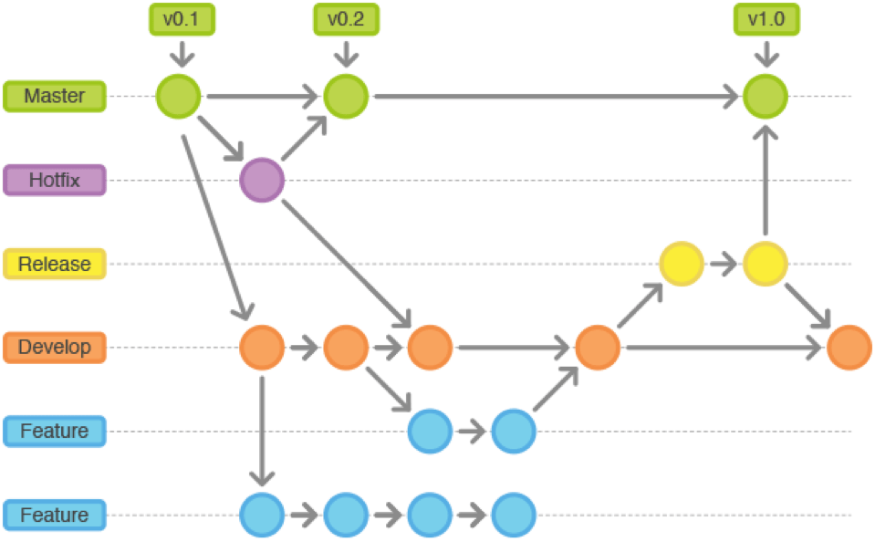

Como se mencionó previamente, GitFlow opera con ramas o "branches". A continuación, se detallan las ramas que se utilizarán en el flujo de trabajo de nuestro proyecto.

* **Main Branches:**
    * **Master:** Esta es la rama principal desde la cual se ramifican todas las demás. Contendrá la versión más reciente junto con las versiones anteriores creadas por los desarrolladores. Aquí se mantendrá el historial oficial de las versiones publicadas.
    * **Develop:** Esta rama puede ser creada a partir de la rama principal (Master) y contendrá todas las características (Features) estables. A través de esta rama, el equipo podrá integrar las funcionalidades de manera efectiva.
* **Support Branches**
A diferencia de las ramas principales, estas ramas secundarias tienen una vida útil limitada, ya que se eliminan al fusionarse con sus ramas primarias.
    * **Feature:**
        * Se ramifica de: develop
        * Debe fusionarse de nuevo en: develop
        * Se utilizan para desarrollar las nuevas funciones que se integrarán en la próxima versión. Es importante destacar que esta rama existe únicamente mientras está en proceso de desarrollo. Sin embargo, una vez que el desarrollador haya completado esa función, se fusionará nuevamente con la rama "develop".
* **Convenciones para nombrar los Features:**
    * **Feture Branch:** feature/name
    **Example:**
        1. feature/welcome
        2. feature/about
        3. feture/myfeture
    * **Conventional Commits**
    El commit debe seguir la siguiente estructura:
    **\<type> [optional scope]: \<description>**
    **[optional body]**
    **[optional footer(s)]**
        * **Type:**
        **1\. feat:** Cuando se agrega un nuevo feature.
        **2\. fix:** cuando corriges un error.
        **3\. build:** cuando afectan los componentes de compilación como la herramienta de compilación, las dependencias o la version del proyecto.
        **4\. chore:** modificaciones privadas del código.
        **5\. docs:** commits que afectan solo a la documentación.
        **6\. refractor:** commits que reescriben o reestructura el código, pero no cambia el comportamiento.
        **7\. perf:** commits especiales que mejoran el rendimiento.
        **8\. style:** commits que no afectan el programa. (espacios en blanco, formato, puntos o comas faltantes).
        **9\. test:** commits que agregan pruebas.
        * **Scope**
        Ofrece información contextual adicional. Aunque es opcional, es beneficioso incluirlo para proporcionar a los desarrolladores una descripción más detallada del commit.
        **\<description>**
        Es una parte obligatoria del formato de los commits. Siempre debemos usar lenguaje en modo imperativo y evitar escribir en mayúsculas
        **[optional body]**
        El cuerpo es opcional y, cuando se utiliza, debe explicar la motivación detrás del cambio y contrastarlo con el comportamiento anterior. Es ideal para mencionar identificadores de problemas y sus relaciones.
        **[optional footer(s)]**
        Esta sección es opcional y puede incluir información sobre cambios significativos. Puede hacer referencia al problema por su identificación y, en esta sección, se incluyen los cambios importantes precedidos por "BREAKING CHANGES:" seguido de uno o dos saltos de línea.
        **Ejemplos:**
            1. feat(welcome): add welcome section
            2. build(release): bump version to 1.0.0
            3. style: remove empty line
            4. feat(sign up): add the button to sign up
            5. feat!: send an email to the costumer when product is shipped
            6. feat: remove ticket list endpoint
            refers to JIRA-1337
            BREAKING CHANGES: ticket enpoints no longer supports list all entites.

Como se mencionó previamente, la gestión de nuestro código fuente se llevará a cabo mediante GitHub. El IDE utilizado en este caso, WebStorm, debe estar vinculado directamente con el repositorio creado por nuestra empresa, MIRAI. De esta manera, cada commit realizado por un miembro del equipo se subirá automáticamente y se cargará en el GitHub de la organización. A continuación, se detallarán las pautas para llevar a cabo este proceso de vinculación de manera correcta:

* **Activar el controlador de versiones del IDE**
Dado que utilizaremos GitHub para gestionar nuestro código, la opción que debe estar habilitada o seleccionada es aquella que indique que el sistema de control se realizará mediante Git. Para hacer esto, siga los siguientes pasos:
    1. Diríjase a la pestaña "VCS" en WebStorm.
    2. Luego, seleccione la opción "Enable Version Control Integration".

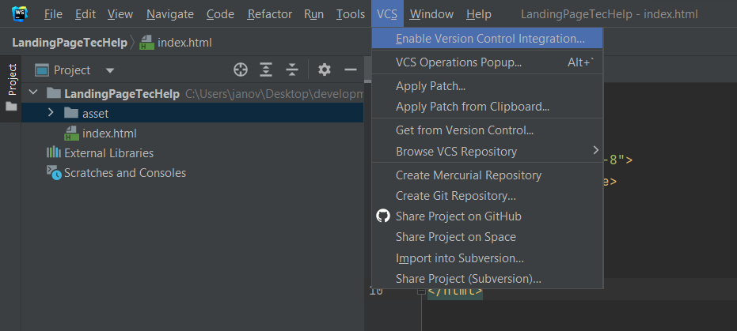

Ahora se debe seleccionar el sistema de control a través de Git y, por último aceptar los cambios.

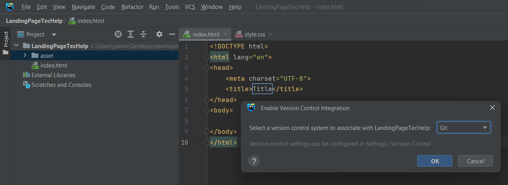

* **Agregar una cuenta de GitHub, siga estos pasos:**
    1. Diríjase a la sección de configuración en su aplicación.
    2. Dentro de la pestaña 'File', busque y seleccione la opción 'Settings'.
    3. En la configuración, busque la sección de cuentas o integraciones.
    4. Agregue su cuenta de GitHub para obtener acceso a los repositorios.

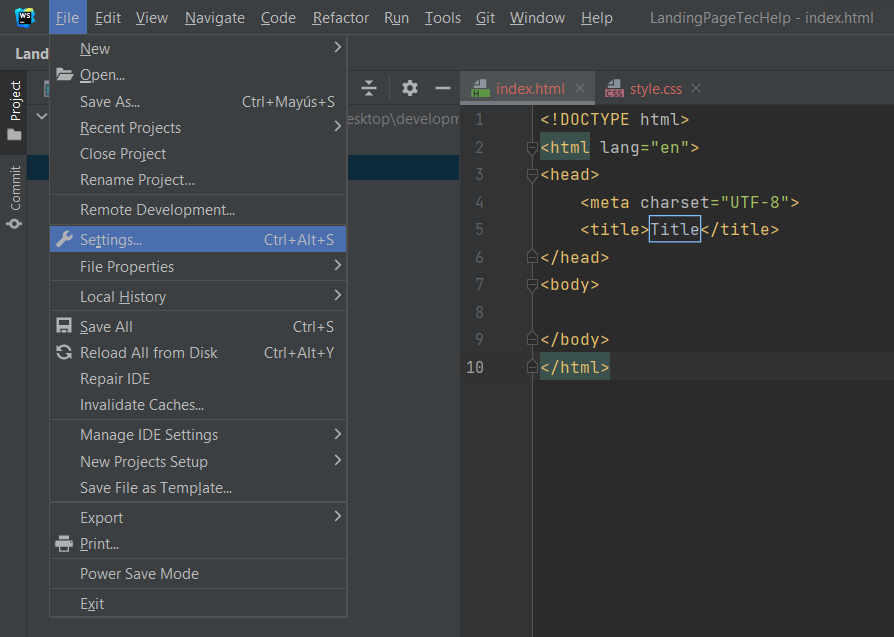

* **Configurar el nombre de usuario de Git**
Una vez que hayas establecido el sistema de control de versiones que se vinculará con tu IDE, deberás ingresar la cuenta que utilizarás. Para hacerlo, sigue estos pasos:
    1. Realiza un commit en tu proyecto. Durante este proceso, se te solicitará que ingreses tu nombre de usuario de Git.
    2. Después de haberlo añadido, todos los cambios se guardarán en el repositorio especificado en esa plataforma, siempre y cuando des la orden correspondiente.
    3. Para configurar tu nombre de usuario de Git, primero selecciona la opción 'commit' que se encuentra dentro de la pestaña 'Git'.

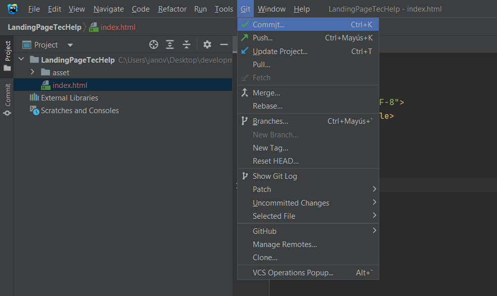

* **Guardar el progreso en GitHub**
Con todo configurado en WebStorm, ahora puedes subir tu código a GitHub sin problemas. Simplemente dirígete a la opción 'GitHub' que se encuentra en la pestaña 'Git' y comparte el proyecto.

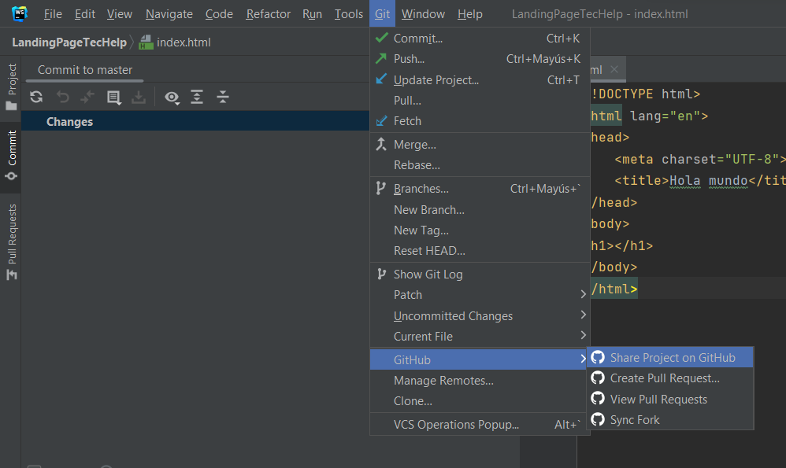

A continuación, debes ingresar el nombre del repositorio y, si lo deseas, proporcionar una breve descripción. Una vez realizado esto, podrás transferir o copiar el código a un repositorio en GitHub.


* **Configurar la propiedad del repositorio en GitHub**
Ahora, solo necesitas configurar la ubicación del repositorio. El código ya debería estar guardado en GitHub, pero solo estará presente en tu propia cuenta. Para cambiar la propiedad y transferirla a la organización deseada, sigue estos pasos:
    1. Ingresa al repositorio creado en GitHub.
    2. Selecciona la pestaña 'settings'
    3. Dirigite al apartado de 'DangerZone'
    4. Luego da click en 'transfer'
    5. Finalmente elegimos el nuevo lugar para guardar el repositorio.

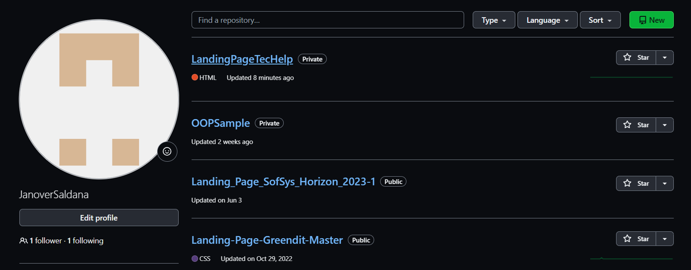


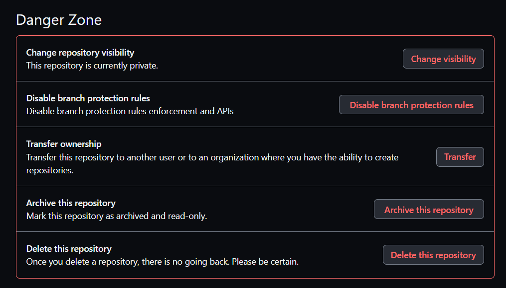

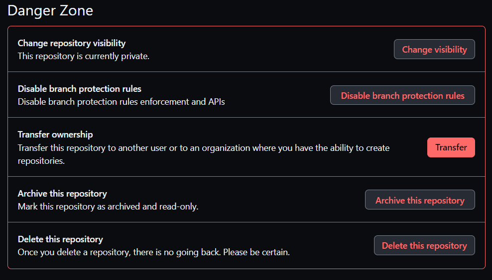

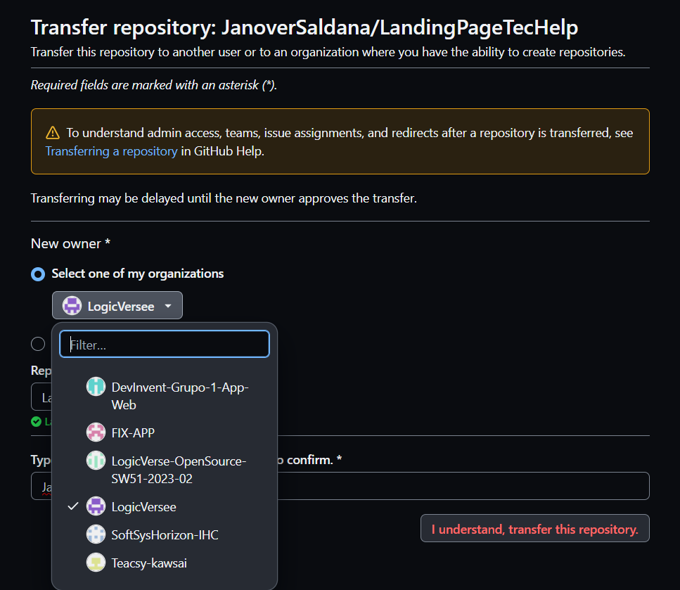

* **Configurar control remoto en Git**
Por último, dado que el repositorio ahora está bajo la propiedad de la empresa y depende de ella, es necesario acceder al control remoto del código. Para hacerlo, simplemente ingresa al repositorio creado y copia la URL del repositorio.

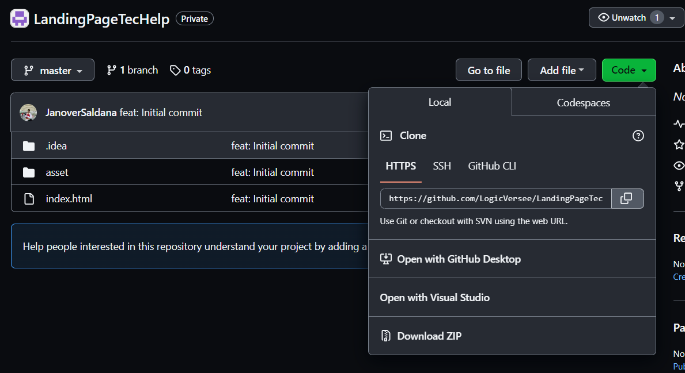

Ahora, en el IDE, dirígete a la pestaña 'Git' y elige la opción 'Manage Remotes'.

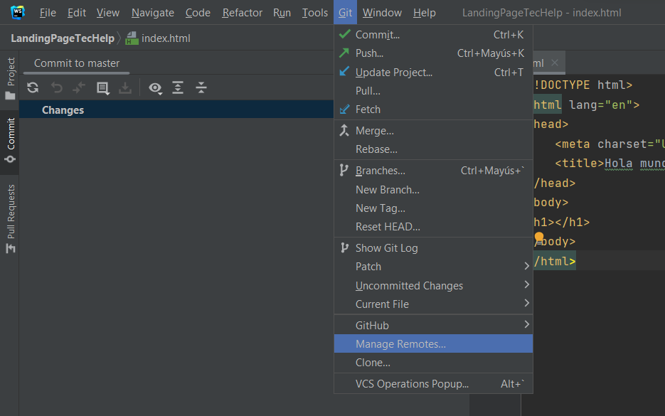

Finalmente, como último paso, debes pegar el enlace copiado en el campo de dirección que solicita el IDE para el control remoto en Git.


Si has seguido correctamente todos los pasos y directrices mencionados, entonces has completado la configuración con éxito. Ahora, solo necesitas realizar un commit y los cambios que hayas efectuado se guardarán en el repositorio de GitHub, ya sea que hayas realizado modificaciones en el código, creado nuevas ramas u otras acciones.

### 5.1.3. Source Code Style Guide & Conventions.

En esta sección, se presentarán las pautas, convenciones, estilos y principios que se aplicarán a cada uno de los lenguajes utilizados en la creación de nuestra aplicación. La observancia de este conjunto de directrices reviste una importancia fundamental, ya que tiene el propósito de mantener la calidad estructural del software, mejorar la legibilidad del código fuente y simplificar el mantenimiento del mismo.

Dado que en este proyecto se emplearán varios lenguajes, como HTML, CSS, JavaScript, Java y TypeScript para el desarrollo de la plataforma web, así como Gherkin para el proceso de pruebas del programa, a continuación, se detallarán y describirán las reglas y recomendaciones generales que se tendrán en cuenta al utilizarlos.

**Nomenclatura General**

Para los nombres de variables, objetos, elementos y funciones que se utilicen en el proyecto, se emplearán términos en inglés que estén relacionados con lo que representan. No se utilizarán mayúsculas en estos nombres, ya que, de acuerdo con W3Schools (sin fecha), la combinación de mayúsculas y minúsculas puede dificultar la legibilidad del código. En su lugar, se optará por utilizar exclusivamente letras minúsculas, lo que contribuirá a una mayor claridad en el código.

Ejemplos de nomenclatura estándar, siguiendo las recomendaciones de Google (s.f.):

```
.gallery {}
.video {}
.login {}
```

Estas pautas de nomenclatura ayudarán a mantener una coherencia en el código y facilitarán su comprensión.

**Sangría**

Cuando se trabaje con HTML, CSS y/o JavaScript, se aplicará un espaciado de dos espacios antes de cada línea que se encuentre dentro de un bloque. Según W3Schools (sin fecha), no se recomienda el uso de la tecla "Tabulación". A continuación, se muestra un ejemplo de la sangría estándar en HTML siguiendo las directrices de W3Schools (s.f.):

``` html
<!DOCTYPE html>
<html>
  <head>
    <title>Título del Documento</title>
  </head>
  <body>
    <h1>Encabezado Principal</h1>
    <p>Este es un párrafo dentro del cuerpo del documento.</p>
  </body>
</html>
```

Este estilo de sangría proporciona una estructura clara y organizada al código, lo que facilita su lectura y mantenimiento.

Ejemplo de formato estándar de sangría en CSS, conforme a las recomendaciones de W3Schools (s.f):

``` CSS
html {
  background: #fff; /* Fondo blanco */
  color: #404;     /* Color de texto gris */
}
```

Ejemplo de nomenclatura estándar de la sangría en JavaScript según W3School (s.f.):

``` JavaScript
function toCelsius(fahrenheit) {
  return (5 / 9) * (fahrenheit - 32);
}
```

**Especificaciones generales**

A continuación, detallaremos las reglas específicas necesarias para comprender el código de nuestra aplicación en cada lenguaje.

**HTML:**

HTML, acrónimo de HyperText Markup Language en inglés, es un lenguaje de marcado que se utiliza para definir la estructura de una página web. También incluye funcionalidades que permiten controlar el comportamiento de diferentes elementos del contenido de la página, como cambiar el tamaño del texto o aplicar formato cursiva, entre otros. En nuestro proyecto, emplearemos HTML5, y a continuación, se presentan las características y directrices que debemos seguir para utilizar este lenguaje de la siguiente manera:

* **Declare Document Type**
La declaración del tipo de documento debe realizarse en la primera línea del código. Según las recomendaciones de Google (s.f.), se prefiere la sintaxis de HTML5 para todos los documentos HTML. Para declararla, simplemente copia lo siguiente:

``` html
<!DOCTYPE html>
```

* **Blank Lines**
Cada vez que comiences un nuevo bloque, lista o tabla de gran longitud, es recomendable dejar una línea en blanco después del elemento anterior para mejorar la legibilidad y la presentación del código, de acuerdo con las pautas de W3Schools (s.f.):

``` html
<!DOCTYPE html>
<html>
<head>
<title>Animales Exóticos</title>
</head>
<body>
<h1>Lemur de Madagascar</h1>
<p>El lémur de Madagascar es un primate endémico de la isla de Madagascar en el Océano Índico.</p>

<h1>Pangolín</h1>
<p>El pangolín es un mamífero cubierto de escamas que se encuentra en regiones de África y Asia.</p>

<h1>Ocelote</h1>
<p>El ocelote es un felino salvaje que habita en América del Sur y Central, conocido por su pelaje moteado.</p>
</body>
</html>
```

Esta práctica de dejar una línea en blanco mejora la estructura y legibilidad del código HTML.

* **Quote attribute Values**
Para los valores de los atributos, es común utilizar comillas dobles alrededor de ellos, aunque esta característica no sea obligatoria. Según W3Schools (sin fecha), esto mejora la legibilidad del código y es una práctica común entre los desarrolladores. Aquí tienes un ejemplo:

``` html
<table class="striped">
```

Este enfoque de usar comillas dobles alrededor de los valores de los atributos es ampliamente aceptado y recomendado en la comunidad de desarrollo web.

* **Never Skip the \<title> Element**
El elemento `<title>` permite que las páginas aparezcan en la lista de resultados al realizar búsquedas en un navegador web. Además, este elemento es responsable de proporcionar el nombre de la página cuando se agrega a marcadores o favoritos. A continuación, se muestra un ejemplo de su uso:

``` html
<title>Guía de Estilo HTML y Convenciones de Codificación</title>
```

Este elemento es esencial para mejorar la identificación y accesibilidad de una página web.

* **HTML Line-Wrapping**
A pesar de que en un documento HTML no exista un límite estricto en la cantidad de palabras por línea, no se recomienda generar líneas de código excesivamente largas. De hecho, hacerlo dificulta la legibilidad del código. Para continuar en la siguiente línea, se deben utilizar al menos cuatro espacios para distinguir elementos secundarios. Aquí tienes un ejemplo basado en las recomendaciones de Google (sin fecha):

``` html
<button mat-icon-button color='primary' class="menu-button"
(click)="openMenu()">
<mat-icon>menu</mat-icon>
</button>
```

Este estilo de formateo ayuda a mantener un código más legible y facilita la identificación de los elementos y su jerarquía en la estructura del documento HTML.

**CSS:**

CSS, conocido por sus siglas en inglés, Cascading Style Sheets (Hojas de Estilo en Cascada), es un lenguaje que se enfoca en definir y mejorar la presentación de un documento basado en HTML. A continuación, se presentan las directrices que debemos seguir al utilizar CSS:

* **Shorthand Properties**
Se recomienda utilizar abreviaturas de propiedades y declarar los campos de los elementos en la menor cantidad de líneas posible, según las pautas de Google (sin fecha). Esto aumenta la eficiencia del código y lo hace más legible. Además, se debe evitar agregar unidades después del valor cero. Aquí tienes un ejemplo:

``` css
border-top: 0;
font: 100%/1.6 palatino, georgia, serif;
padding: 0 1em 0;
```

Siguiendo estas recomendaciones, se puede lograr un código CSS más conciso y fácil de entender.

* **Declaration Stops**
Es importante incluir un punto y coma al final de cada declaración en CSS, al igual que en la mayoría de los lenguajes de programación. Siguiendo las pautas de Google (sin fecha), esta práctica contribuye a mantener la coherencia en el código. A continuación, se muestra un ejemplo:

``` css
html {
  background: #fff;
  color: #404;
}
```

El uso consistente de puntos y comas al final de las declaraciones CSS ayuda a prevenir errores y mejora la claridad del código.

* **Property Name Stops**
Es necesario incluir un espacio entre los dos puntos que siguen al nombre de una propiedad y el valor correspondiente. Siempre se debe colocar un solo espacio después de los dos puntos, pero no antes. A continuación, se muestra un ejemplo siguiendo esta convención estándar de Google (s.f):

``` css
html {
  background: #fff;
  color: #404;
}
```

Mantener esta consistencia en la colocación de espacios ayuda a que el código CSS sea más legible y fácil de entender.

* **Declaration Block Separation**
Es esencial utilizar un espacio separador después del nombre de un selector de elemento y antes de la llave que inicia un bloque de declaración CSS. Además, la llave de apertura del bloque debe estar en la misma línea que el selector. Aquí tienes un ejemplo siguiendo esta convención estándar de Google (sin fecha):

``` css
html {
  background: #fff;
  color: #404;
}
```

El cumplimiento de estas directrices ayuda a mantener la consistencia y la legibilidad en el código CSS.

* **CSS quotation Marks**
No se deben utilizar comillas dobles (`"`) en el código CSS; en su lugar, se permiten y deben emplearse comillas simples (`'`) únicamente para selectores de atributos y valores de propiedades.
Ejemplo conforme a las pautas estándar de Google (sin fecha):

``` css
html {
  font-family: 'open sans', arial, sans-serif;
}
```

Este ejemplo demuestra el uso de comillas simples para encerrar el valor del atributo `font-family` en CSS, lo cual es una práctica común y aceptada.

**JavaScript**

JavaScript es un lenguaje de programación que permite especificar de manera precisa las acciones que debe realizar el navegador web, incluyendo el orden de ejecución de tareas y la frecuencia con la que se deben llevar a cabo. A continuación, se presentan las pautas para el uso de JavaScript en nuestro proyecto:

* **Spaces around operators**
Es importante añadir espacios alrededor de cada operador matemático y comas que se utilicen en el código JavaScript. A continuación, se muestra un ejemplo siguiendo la convención estándar de W3Schools (sin fecha):

``` javascript
let x = y + z;
const myArray = ['Volvo', 'Saab', 'Fiat'];
```

El uso consistente de espacios alrededor de operadores y comas mejora la legibilidad del código JavaScript.

* **Simple Statement's End**
Es fundamental que una instrucción simple finalice con un punto y coma, tal como es el caso en muchos otros lenguajes de programación. A continuación, se muestra un ejemplo que cumple con la convención estándar de W3Schools (sin fecha):

``` javascript
let x = v + 7;
const myArray = ['Volvo', 'Saab', 'Fiat'];
```

El uso de punto y coma al final de cada instrucción ayuda a garantizar la estructura correcta del código JavaScript y a evitar posibles errores.

* **Beginning and End of Function**
Un bloque de función debe incluir una llave al final de la primera línea, de modo que el cierre de la función esté en la última línea, sin necesidad de un punto y coma. Este mismo principio se aplica a las estructuras condicionales y los bucles. A continuación, se muestra un ejemplo que cumple con la convención estándar de W3Schools (sin fecha):

``` javascript
function toCelsius(fahrenheit) {
  return (5 / 9) * (fahrenheit - 32);
}
```

En este ejemplo, la función `toCelsius` está formateada de acuerdo con estas pautas, con la llave de apertura en la misma línea que la declaración de la función y la llave de cierre en la última línea. Esto ayuda a mantener la estructura y la legibilidad del código JavaScript.

* **Object Rules**
Para la creación de un objeto, al igual que en una función, se comienza con una llave al final de la primera línea. Sin embargo, en este caso, la llave de cierre debe ir seguida de un punto y coma. Para definir las propiedades del objeto, se utilizan dos puntos y un espacio para separar el nombre de la propiedad de su valor. Si el valor es un string, se debe encerrar entre comillas dobles. A continuación, se muestra un ejemplo siguiendo la convención estándar de W3Schools (sin fecha):

``` javascript
const person = {
  firstName: "John",
  lastName: "Doe",
  age: 50,
  eyeColor: "blue"
};
```

En este ejemplo, el objeto `person` está formateado de acuerdo con estas pautas, lo que mejora la legibilidad y la estructura del código JavaScript.

**Gherking:**

Gherkin es un Lenguaje Específico de Dominio (DSL por sus siglas en inglés) que se utiliza para resolver problemas específicos mediante la generación de casos de prueba que validan una característica en diversos escenarios. Gherkin incluye varios elementos, entre los cuales los más conocidos y utilizados son Feature, Scenario, Example, Given, When y Then. A continuación, se presentan las pautas que debemos seguir al utilizar Gherkin en nuestro código:

* **Discernible Given-When-Then Blocks**
Es importante aplicar sangría a los elementos que representan los pasos a seguir en un escenario. En el caso de "And", se debe aplicar una sangría adicional. Siguiendo la recomendación de Keiblinger (2021), este enfoque ayuda a identificar rápidamente las partes que componen un escenario. A continuación, se muestra un ejemplo:

``` gherkin
Scenario: Ingreso de requisitos con claridad
  Given que en el formulario de ingreso de oferta laboral
  When escribo claramente los requisitos
  Then se mostrará el mensaje
  And mi oferta solo aparecerá a quienes cumplan con estos
  And se habilita la opción
```

En este ejemplo, se ha aplicado la sangría de manera adecuada para resaltar los pasos del escenario, y se ha utilizado una sangría adicional para los pasos que comienzan con "And". Esto mejora la legibilidad y la comprensión de los escenarios escritos en Gherkin.

* **Step with Tables**
Conforme a la recomendación de Keiblinger (2021), cuando sea necesario introducir valores en partes del escenario, se debe emplear una tabla o crear un formulario que refleje esa parte del escenario. Antes de esta representación, se deben colocar dos puntos. Aquí tienes un ejemplo:

``` gherkin
Then se mostrará el mensaje:
  | Mensaje |
  | Se completaron los requisitos adecuadamente |
```

Este enfoque permite una representación clara y estructurada de los valores relacionados con una parte específica del escenario.

* **Reducing Noise**
Para evitar la acumulación de demasiadas líneas de código en un escenario, es recomendable incluir valores por defecto dentro de los pasos para campos que no sean muy relevantes para ese escenario en particular. Los valores "estándar" que se coloquen deben estar entre comillas simples. Siguiendo el consejo de Keiblinger (2021), esta práctica contribuye significativamente a la reducción del tamaño del código. A continuación, se muestra un ejemplo:

``` gherkin
When escribo claramente los requisitos 'dominio en C'
```

En este ejemplo, se ha incluido un valor por defecto ('dominio en C') entre comillas simples dentro del paso para representar un campo que no es esencial en ese escenario. Esto ayuda a mantener el escenario más conciso y legible.

* **Scenarios Separator**
Para separar dos escenarios, se debe insertar un salto de línea y, según la sugerencia de Keiblinger (2021), si es posible, agregar una línea de comentario para facilitar la visualización de estos. De esta manera, se identifica rápidamente el inicio y el fin de un escenario. A continuación, se presenta un ejemplo:

``` gherkin
Scenario: Ingreso de requisitos con claridad
Given que en el formulario de ingreso de oferta laboral
When escribo claramente los requisitos
Then se mostrará el mensaje
And mi oferta solo aparecerá a quienes cumplan con estos
And se habilita la opción

# --------------------------

Scenario: Otro escenario
Given que en otro contexto
When ocurre algo diferente
Then se muestra otro resultado
```

En este ejemplo, se ha agregado un salto de línea entre los dos escenarios y se ha incluido una línea de comentario como separador para mejorar la visualización y la identificación de cada escenario.

**Java:**

Java es una plataforma informática de lenguaje de programación que fue desarrollada por Sun Microsystems en 1995. A lo largo de los años, ha experimentado una evolución significativa y ha desempeñado un papel fundamental en la creación de numerosos servicios y aplicaciones que conforman gran parte del mundo digital actual. A continuación, se presentan las pautas para utilizar Java en nuestro proyecto:

* **Clases e interfaces en Java**
Los nombres de las clases deben ser sustantivos y seguir una convención de mayúsculas y minúsculas, con la primera letra de cada palabra interna en mayúscula. Del mismo modo, los nombres de las interfaces deben comenzar con una letra mayúscula, al igual que los nombres de las clases. Se debe utilizar palabras completas y evitar el uso de acrónimos y abreviaturas. Aquí tienes un ejemplo:

``` java
interface Bicycle
class MountainBike implements Bicycle
interface Sport
class Football implements Sport
```

En este ejemplo, se han seguido las pautas para nombrar clases e interfaces de manera clara y legible.

* **Métodos en Java**
Los métodos deben seguir una convención de nombres que utilice verbos y mantenga la combinación de mayúsculas y minúsculas, con la primera letra de cada palabra interna (a partir de la segunda) en mayúscula. A continuación, se presenta un ejemplo:

``` java
void changeGear(int newValue);
void speedUp(int increment);
void applyBrakes(int decrement);
```

En este ejemplo, los nombres de los métodos siguen la convención recomendada, lo que los hace descriptivos y legibles.

* **Variables en Java**
Los nombres de las variables deben ser concisos pero significativos, evitando comenzar con un guión bajo (\_) o caracteres especiales como el signo de dólar ($). Deben ser mnemotécnicos, es decir, diseñados de manera que indiquen claramente su propósito a un observador casual. Generalmente, se deben evitar los nombres de una sola letra para las variables, a menos que se utilicen como variables temporales. Los nombres comunes para variables temporales son: i, j, k, m y n para enteros, y c, d y e para caracteres. A continuación, se muestra un ejemplo:

``` java
// Variables para la clase MountainBike
int speed = 0;
int gear = 1;
```

En este ejemplo, se han utilizado nombres de variables significativos y legibles, lo que facilita la comprensión de su propósito en el contexto de la clase MountainBike.

* **Excepciones**
A menos que se justifique en un comentario, es extremadamente raro que sea apropiado no realizar ninguna acción en respuesta a una excepción detectada. En el caso en que no sea necesario realizar ninguna acción en un bloque catch, la razón debe explicarse de manera clara en un comentario. A continuación, se presenta un ejemplo:

``` java
try {
    int i = Integer.parseInt(response);
    return handleNumericResponse(i);
} catch (NumberFormatException ok) {
    // No es un valor numérico; eso está bien, simplemente continúa
    return handleTextResponse(response);
}
```

En este ejemplo, se ha incluido un comentario para explicar por qué no se realiza ninguna acción en el bloque catch cuando se detecta una excepción de formato numérico. Esto ayuda a comprender el motivo detrás de esta decisión en el código.
En el contexto de las pruebas, es aceptable ignorar una excepción detectada sin comentarios si su nombre es o comienza con "expected". Esto es un patrón común para verificar que el código bajo prueba arroje una excepción del tipo esperado, por lo que no se requiere un comentario adicional en este caso. A continuación, se muestra un ejemplo:

``` java
try {
    emptyStack.pop();
    fail();
} catch (NoSuchElementException expected) {
    // No es necesario comentar aquí, ya que esperábamos esta excepción
}
```

En este ejemplo, la excepción "expected" no requiere un comentario adicional, ya que el nombre mismo indica que es esperada como parte de la prueba.
La anotación `@Override` se utiliza para marcar un método cuando es legal hacerlo. Esto incluye un método de clase que anula un método de una superclase, un método de clase que implementa un método de una interfaz y un método de interfaz que vuelve a especificar un método de una superinterfaz.
Excepción: Se puede omitir la anotación `@Override` cuando el método principal está marcado como `@Deprecated`.

**Typescript**

JavaScript es uno de los lenguajes más populares y ha experimentado un rápido avance y mejora en los últimos años. A continuación, se presentan las pautas para utilizar JavaScript en nuestro proyecto:

En TypeScript, se recomienda que las variables se declaren en minúsculas y se especifique el tipo de dato utilizando dos puntos después del nombre de la variable. Aquí tienes ejemplos de cómo declarar y asignar valores a variables en TypeScript:

``` typescript
// Definición e inicialización separadas
let edad: number;
edad = 20;

// Definición e inicialización en la misma línea.
let edadAitor: number = 18;
```

Además, en TypeScript, se siguen las mismas convenciones que se utilizan en JavaScript.

### 5.1.4. Software Deployment Configuration.

Dado que hemos mencionado anteriormente, la administración de nuestro código fuente se llevará a cabo mediante GitHub. Además, utilizaremos GitHub Pages para la publicación y despliegue de la página.

En cuanto al desarrollo de la página de inicio de TecHelp, hemos empleado las siguientes herramientas:

* **HTML:** Es el lenguaje de marcado que hemos utilizado para estructurar nuestro Landing Page

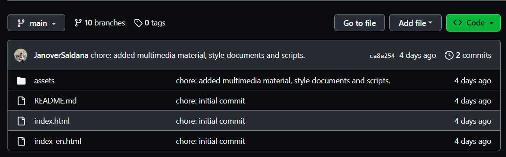

* **CSS:** Nos ayudó con la parte de diseño de interface para que esta sea interactubale con los visitantes de la Langding Page

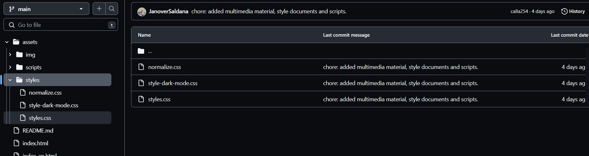

* **git:**

Git es un sistema de control de versiones diseñado para optimizar la eficiencia y la compatibilidad de versiones. Esta herramienta desempeñó un papel fundamental en nuestra colaboración en equipo durante el desarrollo de la Landing Page.


**GitHub**

GitHub: Plataforma de desarrollo colaborativo.


**Git Flow**

Git Flow: Nos permitió controlar el avance de cada uno de nuestros
integrantes con respecto al desarrollo del Landing Page.


**Git Hub Pages**

Git Hub Pages: Servicio de Github que nos permitió alojar nuestra
lading page.


## 5.2. Landing Page, Services & Applications Implementation.

### 5.2.1. Sprint 1

En la fase inicial de nuestro proyecto, nos propusimos llevar a cabo la implementación del diseño de nuestra Landing Page utilizando WebStorm como entorno de desarrollo. Esto implica que al concluir el Sprint, todas las secciones, ya sea Home, Services, Pricing, Testimonials o About Us, deben estar completadas. A continuación, adjuntamos imágenes que ilustran cómo gestionamos las tareas en Pivotal Tracker.

**Repositorio:** [LandingPageTecHelp](https://github.com/LogicVersee/LandingPageTecHelp) https://github.com/LogicVersee/LandingPageTecHelp

**LandingPageDeployed:**

#### 5.2.1.1. Sprint Planning 1.

#### 5.2.1.2. Sprint Backlog 1.

A continuación, compartimos imágenes que demuestran cómo gestionamos las tareas en Pivotal Tracker. Posteriormente, presentamos la tabla de control de estado del Sprint.

<table>
  <tr>
    <td> <strong>Sprint #</strong></td>
    <td align="center" colspan="7"> <strong>Sprint 1</strong> </td>
  </tr>

   <tr>
    <td align="center" colspan="2"> <strong>User Story</strong></td>
    <td align="center" colspan="6"> <strong>Work-item/Task</strong></td>
  </tr>
  <tr>
    <td align="center"> <strong>ID</strong> </td>
    <td align="center"> <strong>Title<strong></td>
    <td align="center"> <strong>ID</strong> </td>
    <td align="center"> <strong>Title<strong></td>
    <td align="center"> <strong>Description<strong></td>
    <td align="center"> <strong>Estimation (Hours)<strong></td>
    <td align="center"> <strong>Assigned To<strong></td>
    <td align="center"> <strong> Status (To-do/In-Process/To-Review/Done)  <strong></td>
  </tr>
  <!---------------------------------------------------------------------- -->
  <tr>
    <td rowspan="4" align="center"> ID </td>
    <td rowspan="4" align="center"> US14: Navegar libremente por la Landing Page </td>
    <td align="center"> TA01 </td>
    <td align="center"> Añadir lista de etiquetas</td>
    <td align="justify"> Se añadirán las etiquetas de home, services, membreship, contac-us, about-us.</td>
    <td align="center"> 1 </td>
    <td align="center"> Luis Lagos</td>
    <td align="center">Done</td>
  </tr>

  <tr>
    <td align="center"> TA02 </td>
    <td align="center"> Vincular las secciones </td>
    <td align="center"> se determina la esturctura e IDs de las secciones y se vincula las etiquetas a estas para luego comenzar a codificar estas</td>
    <td align="center"> 1</td>
    <td align="center"> Luis Lagos</td>
    <td align="center">Done</td>
  </tr>

  <tr>
    <td align="center"> TA03 </td>
    <td align="center"> Añadir Logo y estilos del nav</td>
    <td align="center"> Se añede el logo de la solución planteada y se implementa los estilos del toolbar </td>
    <td align="center"> 3</td>
    <td align="center"> Luis Lagos</td>
    <td align="center">Done</td>
  </tr>

  <tr>
    <td align="center"> TA04 </td>
    <td align="center"> Añadir botones de modo oscuro e idioma.</td>
    <td align="center"> Se añeden los botones de cambio de idioma y boton de modo oscuro para hacerlo mas agaradable al posible usuario</td>
    <td align="center"> 2</td>
    <td align="center"> Luis Lagos</td>
    <td align="center">Done</td>
  </tr>

  <tr>
    <td rowspan="3" align="center"> ID </td>
    <td rowspan="3" align="center"> US 15: Apartado de contacto con el Startup</td>
    <td align="center"> TA01 </td>
    <td align="center"> Añadir título y descripción</td>
    <td align="justify"> Se añadirá el tiítulo correspodniente a la sección a realizar y redactar una oración inivitando a las personas a escribirnos</td>
    <td align="center"> 2</td>
    <td align="center"> Gonzalo Saldaña</td>
    <td align="center"> Done</td>
  </tr>

  <tr>
    <td align="center"> TA02 </td>
    <td align="center"> Añadir formulario</td>
    <td align="justify"> Se añadirá un formulario donde los usuarios objetivos deben ingresas sus nombres, medio de contacto y una descripción sobre la duda que tienen</td>
    <td align="center"> 1</td>
    <td align="center"> Gonzalo Saldaña</td>
    <td align="center"> Done</td>
  </tr>

  <tr>
    <td align="center"> TA03 </td>
    <td align="center"> Añadir botón de enviar, imagen y estilos</td>
    <td align="justify"> Se añadirá una imagen llamativa sobre lo que ofrece nuestro software, se implementará un botón para enviar el contenido del formulario y se agregarán los estilos correspondientes. </td>
    <td align="center"> 3 </td>
    <td align="center"> Gonzalo Saldaña</td>
    <td align="center"> Done</td>
  </tr>

  <tr>
    <td rowspan="2" align="center"> ID </td>
    <td rowspan="2" align="center"> US 16: Beneficios de la aplicación</td>
    <td align="center"> TA01 </td>
    <td align="center"> Se añadirá el titulo y descripción de la sección</td>
    <td align="center"> Se añadirá una pregunta a modo de título (¿Por qué TecHelp?), descripciónes incitando a que usen nuestra solucón y lo que ofrece para cada tipo de posible usuario</td>
    <td align="center"> 1</td>
    <td align="center"> Sebastián Ramirez</td>
    <td align="center"> Done</td>
  </tr>

  <tr>
    <td align="center"> TA02 </td>
    <td align="center"> Organizar las beneficios en dos card</td>
    <td align="center"> Se organizará el contenido de la seccion de beneficios mediante cards para cada segmento objetivo</td>
    <td align="center"> 2</td>
    <td align="center"> Sebastián Ramirez</td>
    <td align="center"> Done</td>
  </tr>

   <tr>
    <td rowspan="3" align="center"> ID </td>
    <td rowspan="3" align="center"> US 19: Mostrar los planes disponibles</td>
    <td align="center"> TA01 </td>
    <td align="center"> Añadir título y decripción</td>
    <td align="center"> Se añade el título a manera de pregunta para captar la atención de nuestros posibles usuarios e invitamos a suscribirce a a nuestros planes </td>
    <td align="center"> 3</td>
    <td align="center"> Brayan Morales</td>
    <td align="center"> Done</td>
  </tr>

  <tr>
    <td align="center"> TA02 </td>
    <td align="center"> Cards para organizar las membresias</td>
    <td align="center"> Se agregarán cards para organizar la información de las membreisas e invitar a que sean parte de nostros con botones para suscribirse</td>
    <td align="center"> 2</td>
    <td align="center"> Brayan Morales</td>
    <td align="center"> Done</td>
  </tr>

  <tr>
    <td align="center"> TA03 </td>
    <td align="center"> Botones de suscripciones y estilos de seccion</td>
    <td align="center"> Se añadirán las botones correspondientes a cada tipo de membresia y además se ñadirán los estilos correspondientes para que la sección sea más consistente</td>
    <td align="center"> 2</td>
    <td align="center"> Brayan Morales</td>
    <td align="center"> Done</td>
  </tr>

   <tr>
    <td rowspan="3" align="center"> ID </td>
    <td rowspan="3" align="center">  US 18: Información del startup</td>
    <td align="center"> TA01 </td>
    <td align="center"> Titulo y descripción</td>
    <td align="center"> Se agregará un título para diferenciar la sección y los estilos corresponidentes para distinguir una sección de la otra.</td>
    <td align="center"> 1</td>
    <td align="center"> Giovanni Ramos</td>
    <td align="center"> Done</td>
  </tr>

  <tr>
    <td align="center"> TA02 </td>
    <td align="center"> Descripción de integrantes</td>
    <td align="center"> Se agregará una descripción breve de los integrante del equipo que se está dedicando al proceso de desarrollo de la solución </td>
    <td align="center"> 2</td>
    <td align="center"> Giovanni Ramos</td>
    <td align="center"> Done</td>
  </tr>

  <tr>
    <td align="center"> TA03 </td>
    <td align="center"> Organizar el contenido en cards</td>
    <td align="center"> Se agregarán los estilos correspondientes para separar cada integrante en cards para tener una mejor organización y cisualización de las mismas</td>
    <td align="center"> 3</td>
    <td align="center"> Giovanni Ramos</td>
    <td align="center"> Done</td>
  </tr>
</table>

##### 5.2.1.3. Development Evidence for Sprint Review.

<table>
  <tr>
    <td align ="center" > <strong>Repository</strong></td>
    <td  align ="center" > <strong>Branch</strong></td>
    <td  align ="center" > <strong>Commit ID</strong></td>
    <td  align ="center" > <strong>Commit message</strong></td>
    <td  align ="center" > <strong>Commit Masagge body</strong></td>
    <td  align ="center" > <strong>Commit on (date)</strong></td>
  </tr>

  <tr>
    <td rowspan="16" align="center"> https://github.com/LogicVersee/LandingPageTecHelp </td>
    <td align="center"> main</td>
    <td align="center"> 8bd0d4f30e77a3be35b7af58773bc12944e073dc</td>
    <td align="center"> chore: initial commit</td>
    <td align="center"> ---</td>
    <td align="center"> 18/09/2023</td>
  </tr>

  <tr>
    <td align="center"> main</td>
    <td align="center" > ca8a2540c8796fc2b32f8718539448faa82c3ae9</td>
    <td align="center"> chore: added multimedia material, style documents and scripts</td>
    <td align="center"> ---</td>
    <td align="center"> 18/09/2023</td>
  </tr>

  <tr>
    <td align="center"> feature/header</td>
    <td align="center"> f69c7dbc27c7a4f515a9b5a23b1472cb084c96b5</td>
    <td align="center"> chore(Directory): Added the assests folder and its components</td>
    <td align="center"> ---</td>
    <td align="center"> 18/09/2023</td>
  </tr>

  <tr>
    <td align="center"> feature/header</td>
    <td align="center"> 2ec418f0a5fbda0e26c7aa2d650bd306ae7f4541</td>
    <td align="center"> feat(Header): Added section Header</td>
    <td align="center"> ---</td>
    <td align="center"> 18/09/2023</td>
  </tr>

  <tr>
    <td align="center"> feature/header</td>
    <td align="center"> 0e688ffbef8d6b73ffad101e1a6d5dab191575d1</td>
    <td align="center"> feat(Style): Added Header´s styles</td>
    <td align="center"> ---</td>
    <td align="center"> 18/09/2023</td>
  </tr>

  <tr>
    <td align="center"> feature/header</td>
    <td align="center"> 2210435613199de5ec9d66a689ae7decae31a1f7</td>
    <td align="center"> feat(Header): Added english header</td>
    <td align="center"> ---</td>
    <td align="center"> 19/09/2023</td>
  </tr>

  <tr>
    <td align="center"> feature/hero</td>
    <td align="center"> 1537977c0bc20e4712ec12aa07aee20aac52d2a6</td>
    <td align="center"> Merge remote-tracking branch 'origin/feature/header' into developer</td>
    <td align="center"> ---</td>
    <td align="center"> 18/09/2023</td>
  </tr>

  <tr>
    <td align="center"> feature/hero</td>
    <td align="center"> 91cbbc1c6c47845a46293492ec728657a6eedf06</td>
    <td align="center"> feat(hero): add hero section</td>
    <td align="center"> ---</td>
    <td align="center"> 18/09/2023</td>
  </tr>

  <tr>
    <td align="center"> feature/hero</td>
    <td align="center"> 20f00eaec38c4eb4b3b7feede2c73c5025e5a44c</td>
    <td align="center"> feat(hero): add styles</td>
    <td align="center"> ---</td>
    <td align="center"> 19/09/2023</td>
  </tr>

  <tr>
    <td align="center"> feature/benefits</td>
    <td align="center"> d4be1d819cccada6d2d8f4773fc1f12db82af7ab</td>
    <td align="center"> feat(benefits): Added and fixed benefits and hero sections.</td>
    <td align="center"> ---</td>
    <td align="center"> 22/09/2023</td>
  </tr>

  <tr>
    <td align="center"> feature/membreship</td>
    <td align="center"> 8047ff4ebd05ac2ab5bb65db1f762baa589929a0</td>
    <td align="center"> feat(membreship): Added section membreship.</td>
    <td align="center"> ---</td>
    <td align="center"> 22/09/2023</td>
  </tr>

  <tr>
    <td align="center"> feature/contact </td>
    <td align="center"> d71ef61879d966483fbbf4ebaf69d2a2f457e47b</td>
    <td align="center"> feat(contact-us): added section contact-us.</td>
    <td align="center"> ---</td>
    <td align="center"> 22/09/2023</td>
  </tr>

  <tr>
    <td align="center"> feature/about-us-footer</td>
    <td align="center"> 7cf0543b50c76a55325d9d3049d95dc3746f4e73</td>
    <td align="center"> feat(about us): added about us section</td>
    <td align="center"> ---</td>
    <td align="center"> 23/09/2023</td>
  </tr>

  <tr>
    <td align="center"> feature/about-us-footer</td>
    <td align="center"> ffb6ebeb40c7e98b9cd410c1f51471979306c1f5</td>
    <td align="center"> feat(footer): added footer section</td>
    <td align="center"> ---</td>
    <td align="center"> 23/09/2023</td>
  </tr>

  <tr>
    <td align="center"> feature/release-1.0</td>
    <td align="center"> b1dd6d99a64e19f441f89cb542e2123ccf06ce2d</td>
    <td align="center"> feat: merge developer into release-1.0</td>
    <td align="center"> ---</td>
    <td align="center"> 23/09/2023</td>
  </tr>

</table>


##### 5.2.1.4. Testing Suite Evidence for Sprint Review.

En el Sprint 1, se completaron únicamente las características relacionadas con el sitio web estático, sin que se llevara a cabo la implementación de los Web Services.

##### 5.2.1.5. Execution Evidence for Sprint Review.

Después de completar el Sprint 1, logramos implementar todas las secciones de nuestro Landing Page para garantizar una visualización perfecta. Además, le dimos un formato atractivo que captura la atención del usuario hacia sus diferentes componentes. También agregamos métodos de navegación en la página, como botones ubicados al principio y al final, que te permiten moverte fácilmente de una sección a otra. A continuación, te mostraremos los avances a través de imágenes del resultado obtenido.

Es importante destacar que el objetivo principal del Landing Page es convertir a los visitantes en futuros clientes o usuarios habituales de nuestro servicio. Para lograrlo, utilizamos llamados a la acción (Call To Action) que los guían hacia la aplicación web.

A continuación, te presentamos capturas de pantalla del desarrollo del Landing Page:

En la parte superior, se encuentra el encabezado (Header) que incluye botones de inicio (Home), servicios (Service), membresias (membership), cantacto (Contact-Us), información sobre nosotros (About Us), un botón para cambiar el idioma entre inglés y español y un botón para cambiar el entorno a modo oscuro. Estos elementos permiten a los visitantes desplazarse fácilmente a la sección que deseen visualizar.


**Imagen 1:** Encabezado y botones de desplazamiento.

Se presenta la sección "Hero", que incluye una breve descripción y una frase representativa de TecHelp. Además, permite iniciar el uso del servicio web y proporciona una imagen relacionada con el mismo.


**Imagen 2:** Sección Hero.

Se presenta la sección de beneficios del servicio para cada segmento objetivo identificado por el equipo.

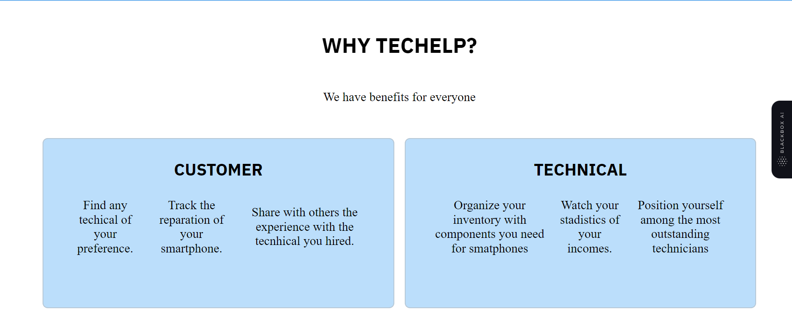
**Imagen 3:** Sección benefits ó service.

Se presenta la sección membership de la landing page, en esta sección nuestros posibles usuarios podrán ver los tipos de membresias y sus costos.


**Imagen 4:** Sección membership.

A continuación se presenta la sección de contacto, aquí nuestros posibles usuarios pueden realizarnos preguntas personalizadas acerca de la aplicación que se está presentando.

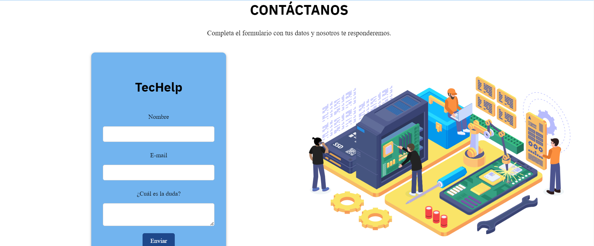
**Imagen 5:** Sección contact-us.


Seguidamente, se presenta la sección sobre nosotros (about-us). En este apartado se muestra información a menra de resumen sobre las personas que están desarrollando la salución de software.
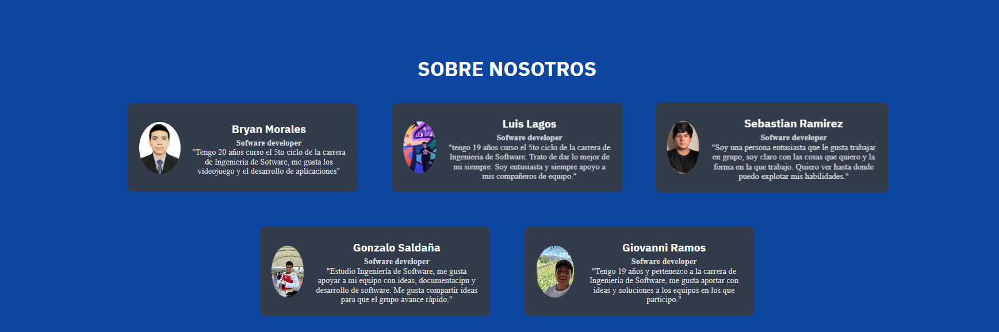
**Imagen 5:** Sección abot-us.

Por último, se exhibe la sección del pie de página, donde encontrará nuestros enlaces a redes sociales y botones que le facilitarán regresar a las secciones que desee el usuario.


**Imagen 5:** Sección footer.

##### 5.2.1.6. Services Documentation Evidence for Sprint Review.

En el primer sprint, hemos diseñado, programado y puesto en funcionamiento la página de inicio para presentar la aplicación web "Theraphy". En esta página de inicio, encontrarás varias secciones creadas por el equipo Digitalholic, cada una a cargo de un miembro del grupo.

<table> 
  <tr>
    <td> <strong>End Point </strong></td>
    <td align="center"> <strong>Funciones</strong> </td>
  </tr>

  <tr>
    <td> https://logicversee.github.io/LandingPageTecHelp/</td>
    <td> Desplegar Landing Page de TecHelp</td>
  </tr>
</table>

##### 5.2.1.7. Software Deployment Evidence for Sprint Review.

Para la implementación de nuestra página, optamos por utilizar GitHub Pages. En este proceso, creamos un repositorio en GitHub donde gestionamos el control de versiones. En la sección de Configuración, publicamos el proyecto almacenado en la rama "main" que previamente se encontrba en la rama release-1.0.

**Link de la Landing Page desplegada:** [TecHelp](https://logicversee.github.io/LandingPageTecHelp/) **-** https://logicversee.github.io/LandingPageTecHelp/

##### 5.2.1.8. Team Collaboration Insights during Sprint.

En esta entrega, nuestra meta principal fue la implementación de la Landing Page. Para llevar a cabo este objetivo, hicimos uso de diversas herramientas como GitHub, Visual Studio Code, WebStorm, HTML, CSS y JavaScript. A continuación, vamos a presentar los diagramas de flujo que representan los commits realizados por cada miembro del equipo LogicVerse:


En la imagen se evidencia el gráfico de barras de la cantidad de commits realizadas por cada uno de los integrantes del equipo. 

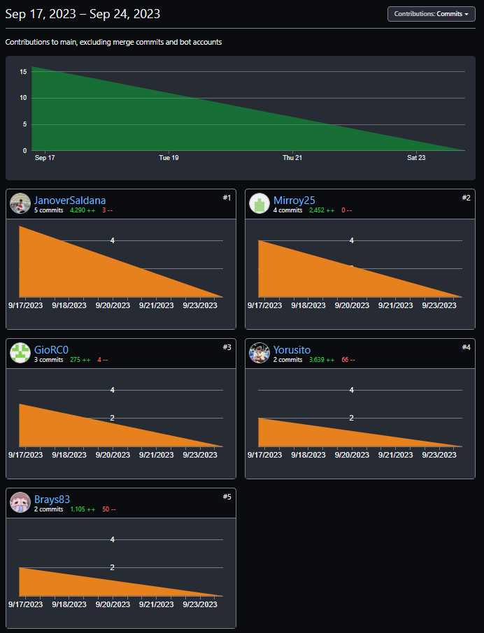

En esta imagen, se ofrece una representación visual de las fechas en las que se llevaron a cabo cambios en el repositorio de nuestra Landing Page, junto con la cantidad de modificaciones realizadas en cada uno de los commits. Esta representación gráfica es una herramienta valiosa para comprender la evolución temporal del proyecto y la intensidad del desarrollo a lo largo del tiempo.

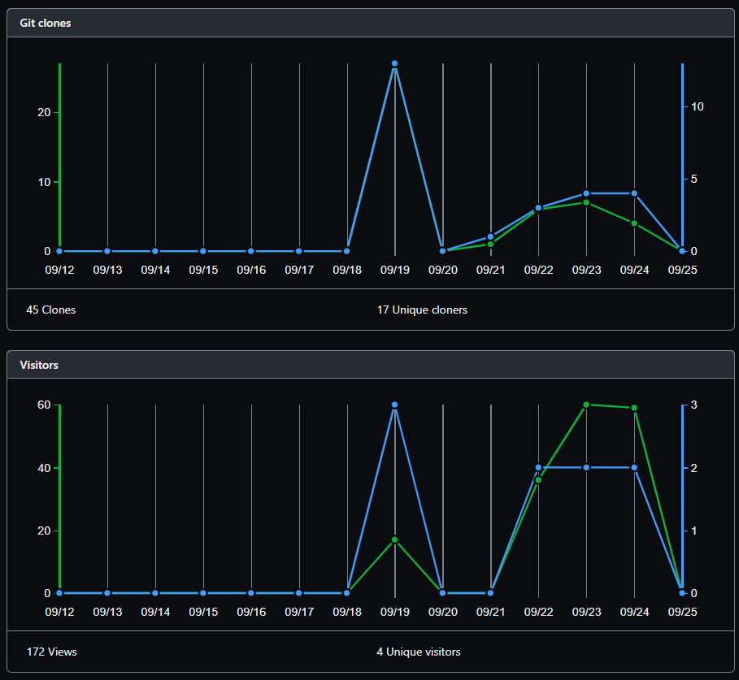

Estos gráficos ofrecen una representación visual de las clonaciones registradas en nuestro repositorio, junto con la fecha en que cada una de estas acciones se llevó a cabo. Además, se presenta información sobre la cantidad de visitantes que ha tenido el repositorio de nuestro equipo a lo largo del tiempo.

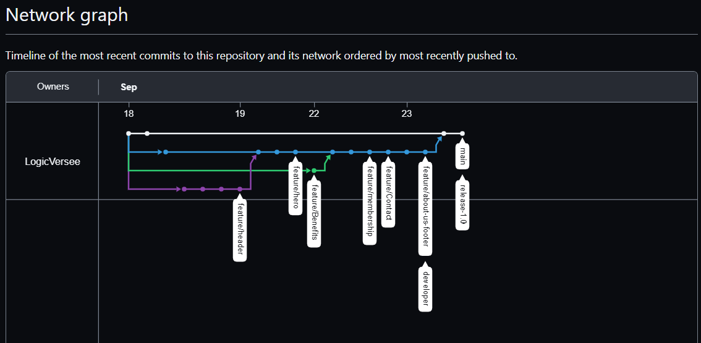