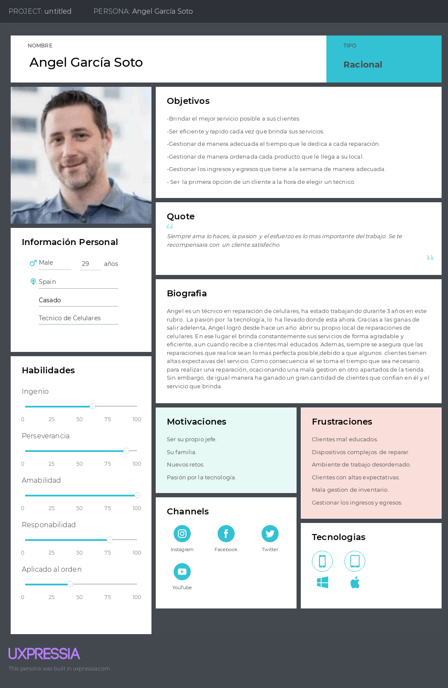

## 2.3. Needfinding

En este apartado se mostrarán los artefactos resultantes del proceso de recolección que se realizó en los segmentos objetivos y que concluye con la construcción del User Personas, User Task Matrix, User Journey Maps, Empathy Mapping y As-Is Scenario Mapping.

### 2.3.1. User Persona

En esta parte del documento, se presentan perfiles ficticios que personifican a los grupos de interés identificados y que han sido objeto de entrevistas. Los datos proporcionados abarcan información demográfica, características de personalidad, motivaciones, preferencias, objetivos, desafíos y patrones de conducta. Estos detalles están respaldados por las entrevistas realizadas anteriormente. Se han empleado herramientas disponibles en UXPressia para facilitar la creación de estos artefactos.

#### User Empathy Mapping: Técnico

#### User Empathy Mapping: Cliente

