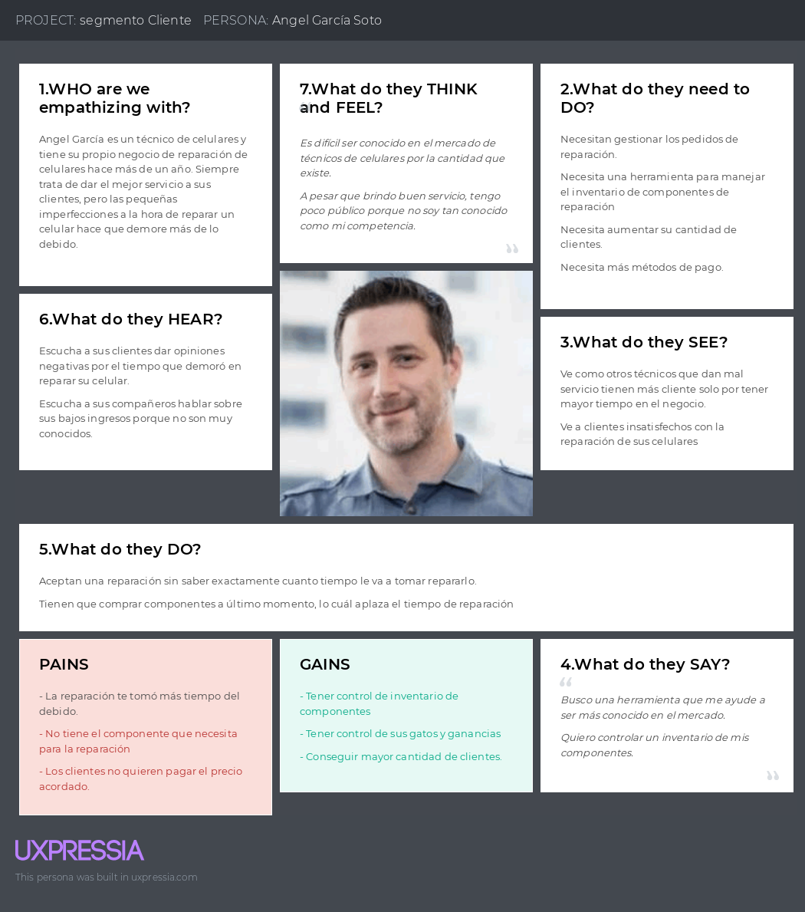

### 2.3.4. Empathy Mapping

En esta sección, se presenta el Empathy Mapping realizado para ambos segmentos (cliente y técnico). Esta herramienta resulta útil para crear perfiles detallados de los User Persona y desarrollar descripciones más profundas desde su perspectiva. Para cada User Persona, se incluyen elementos clave que son fundamentales para la implementación del artefacto, que incluyen lo que el usuario ve, escucha, dice, hace y siente. Además, se abordan las preocupaciones y los beneficios, analizados a partir de preguntas como: ¿Qué le preocupa? ¿Qué puede contribuir a resolver sus problemas? ¿Qué podría convencerlo de que somos la elección adecuada? ¿Qué comunica? Todo esto es de gran ayuda para crear un artefacto de fácil implementación y de vital importancia para el proceso de Needfinding.  

#### User Empathy Mapping: Cliente

#### User Empathy Mapping: Técnico

