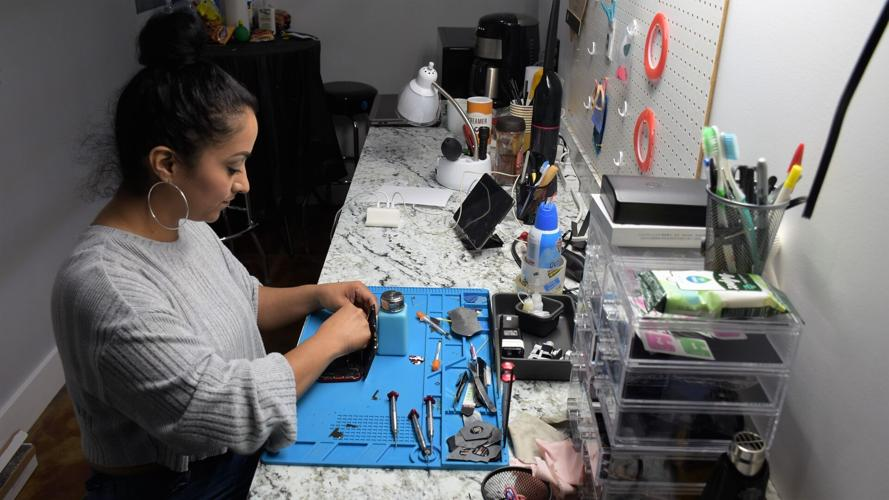

# Capítulo I: Introducción

## 1.1. Startup Profile

A continuación, procederemos a informar sobre a lo que se dedica nuestra empresa "LogicVerse", así como la presentación del equipo que lo conforma y la idea planteada como solución "TecHelp".

### 1.1.1. Descripción de la Startup

LogicVersee es una innovadora startup dedicada al desarrollode software que se destaca por su enfoque en la visión lógica y la búsqueda desoluciones creativas a los desafíos tecnológicos. Fundada por un grupo de estudiantes apasionados por la tecnología y expertos en desarrollo de software de la Universidad Peruna de Ciencias Aplicadas (UPC), LogicVersee adopta un enfoque orientado al cliente y trabaja en estrecha colaboración con estos para tener una mejor comprensión de sus necesidades comerciales y competitivas para desarrollar soluciones de software que cumplan con sus requisitos específicos. LogicVersee tiene como objetivo revolucionar la industria a través de su enfoque único y su compromiso con la excelencia técnica.

* **Misión:**
Nuestra misión en LogicVersee es simplificar la complejidadtecnológica y transformar ideas en soluciones digitales impactantes. Nos esforzamos por brindar software de alta calidad que responda a las necesidades de nuestros clientes y que aporte un valor real a sus proyectos y negocios.
* **Visión:**
Nuestra visión en LogicVersee es ser líderes en el desarrollo de software y ser reconocidos por nuestra capacidad para abordar los
desafíos tecnológicos más complejos. Queremos contribuir al progreso tecnológico y ser el socio de confianza de empresas y emprendedores que buscan soluciones de software de clase mundial.

### 1.1.2. Perfiles de integrantes del equipo

| **Integrantes** | **Descripcion** | **Conocimientos** |
| ----------- | ----------- | ------------- |
| Brayan Smith Morales Quispe (U20211F984) | Soy Brayan Smith tengo 20 años curso el 5to ciclo de la carrera de Ingenieria de Sotware escogi esta carrera porque me gusta los videojuego y el desarrollo de aplicaciones | Nivel Intermedio en C++ y C#. Nivel basico SQL. Nivel Intermedio Ilustrator y Photoshop |
| Giovanni Andres Ramos Calderon (U202122512) | Tengo 19 años y pertenezco a la carrera de Ingeniería de Software, me gusta aportar con ideas y soluciones a los equipos en los que participo. | Conocimientos intermedios en C++, Python y Microsoft SQL Server. Nivel básico en HTML y CSS |
| Luis Eduardo Lagos Aguilar (U202121975) | Me llamo Luis Lagos tengo 19 años curso el 5to ciclo de la carrera de Ingenieria de Software. Trato de dar lo mejor de mi siempre. Soy entusiasta y siempre apoyo a mis compañeros de equipo. Me gusta escuchar las ideas de los demás y siempre recepciona las criticas positivas en mis proyectos. | Tengo conocimiento en el legnuaje de programcion C ++ y Python. Mientras que en base de datos se los dos enfoques relacional y no relacional mediante MongoDB y Mysql. |
| Sebastián André Ramírez Méndez (U20191E575) | Soy una persona entusiasta que le gusta trabajar en grupo, soy claro con las cosas que quiero y la forma en la que trabajo. Además, me gusta complementar a mi equipo en las cosas que necesiten. Me gusta mucho mi carrera y quiero ver hasta donde puedo explotar mis habilidades. | Nivel Intermedio C++, Microsoft SQL Server. Nivel Básico HTML, CSS y Python. |
| Janover Gonzalo Saldaña Vela (U20201B510) | Mi nombre es Gonzalo, tengo 21 años, estudio la carrera de Ingeniería de Software en la Universidad Peruana de Ciencias Aplicadas. Elegí la carrera por mi interés en crear nuevas tecnologías que sirvan de apoyo dentro de las empresas, gobiernos, la educación y el entretenimiento. Tengo como intereses viajar y conocer nuevos lugares, realizar deportes de aventura y entretenimiento. | Nivel Intermedio en C++, Base de datos no relacionales. Nivel Básico HTML, CSS y JavaScript. |

## 1.2. Solution Profile

En este segmento del informe, procederemos a detallar nuestro producto de software, abordando tanto su característica innovadora como la estrategia de monetización que implementaremos.

**Product Name:**

Hemos optado por nombrar nuestro producto como "TecHelp", ya que en el idioma inglés, "Tec" significa técnico y "Help" significa "Ayuda"; por lo tanto, el nombre completo se traduce como "Ayuda Técnica". La elección de este idioma se basa en la intención de generar mayor atractivo entre nuestro público objetivo, dado que el inglés es la lengua más hablada en todo el mundo, lo que convierte a nuestra aplicación en una propuesta más comercial.

**Product Description:**

La idea planteada es una aplicación web que permita que cualquier persona que requiera del servicio de reparación para su teléfono celular pueda encontrar un centro técnico cercano a su ubicación, filtrar el resultado de la búsqueda según sus necesidades, calificaciones y comentarios que reciben los centros técnicos asociados a nuestra aplicación web, brinda la posibilidad de que estos se mantengan informados del proceso de en el que se encuentra el servicio contratado por medio del tracking administrada por el centro técnico contratado. Así mismo, la aplicación web brinda la posibilidad de que empresas que manejen grandes cantidades de teléfonos celulares de sus empleados pueda contratar el servicio de reparación o una revisión técnica de un centro técnico verificado y añadir a estos como favorito. La idea planteada también proporciona un dashboard para todos los técnicos que se encuentren asociados a la aplicación web para que puedan brindar una mejor experiencia a sus clientes y tener una mejor administración de su inventario y sus ingresos semanales.

**Monetización:**

Nuestro servicio propuesto a traves de la elaboración de un software podrá ser adquirido de manera gratuita por parte de ambis segmentos objetivos propuestos. Sin embargo, los profesionales técnicos que se dedican a la reparación de dispositivos móviles tendran ciertas herramientas adicionales que solo podran usar cuando estos hagan el pago de una membresia mensual. Posteirormente cuando la aplicación tenga mayor popularidad y el flujo de usuarios vaya en incremento de un 15% bimestral contará con convenios con empresas que tienen personal técnico a su cargo para que estas puedan tener un mejor control de inventarios y solicitudes de pedidos de servicio de reparación de dispositivos móviles.

### 1.2.1. Antecedentes y problematica

### Antecedentes

En la actualidad, contar con un smartphone se ha vuelto una necesidad prioritaria. Según los datos recopilados por OSIPTEL, durante la pandemia de Covid-19, los teléfonos inteligentes se afianzaron en el mercado peruano. El estudio reveló que la presencia de smartphones en los hogares peruanos aumentó del 66.3% en 2016 al 88.4% en 2021, un incremento de más de 22 puntos porcentuales en solo cinco años (OSIPTEL, 2022). Estos números reflejan la gran cantidad de personas que podrían requerir los servicios de centros técnicos para reparar o dar mantenimiento a sus dispositivos.

En 2019, Amparo Babiloni, directora de Xataka Android, lideró un experimento con un equipo de 8 personas. El objetivo era evaluar los servicios técnicos de distintas marcas reconocidas, centrándose en la calidad de la reparación de teléfonos móviles.
En el caso de Xiaomi, se utilizó la comunicación vía llamadas telefónicas y la espera para la reparación fue de 13 días, un aumento de 6 días comparado con su tiempo habitual.

Samsung ofrecía múltiples canales de comunicación, como teléfono, correo electrónico y chat. Sin embargo, hubo problemas al comunicar el estado de la reparación por teléfono. Babiloni y su equipo no pudieron responder en ese momento, y lamentablemente el servicio técnico no volvió a intentarlo.

Motorola optó por el contacto vía correo electrónico. En este mensaje, presentaron un presupuesto y dieron al cliente la opción de aceptar o rechazar la reparación basándose en dicho presupuesto.

En el caso de BQ, hubo errores por parte del servicio técnico al registrar incorrectamente el correo electrónico de contacto, resultando en un pequeño retraso en el proceso.

Tras una observación detallada, se notó que en empresas como Claro, los usuarios tenían preguntas sobre cómo obtener información actualizada sobre el estado de sus dispositivos en el Servicio Técnico. Esto señala una falta de comunicación entre el equipo de servicio técnico y los clientes que buscan reparar sus dispositivos. Aunque la comunidad de usuarios de Claro intenta abordar esta necesidad, el equipo técnico no proporciona suficiente información sobre el progreso de la reparación, requiriendo que el cliente se presente en persona.

Se empleó la herramienta ClaroBot para obtener información sobre el diagnóstico de dispositivos en reparación. Los resultados mostraron que una revisión técnica en Lima lleva alrededor de 4 días, mientras que en provincias el plazo es de 7 a 10 días.
Para acceder al estado del equipo, coordinar la recogida del dispositivo o conocer el estado de la atención, es necesario comunicarse a través de un número telefónico proporcionado por ClaroBot. Sin embargo, el chatbot no guió al usuario a la sección adecuada para conocer el estado del equipo, revelando una deficiencia en la comunicación.

Durante la investigación, se descubrió un canal de YouTube llamado DescoCaosTv, que compartió un video titulado "Pongo a prueba a dos técnicos de celulares". En el video, el presentador evaluó diagnósticos y costos de reparación en diversas tiendas. Los técnicos diagnosticaron un problema en la placa con un costo de 200 soles. Sin embargo, otro técnico impresionó al presentador al ofrecer una reparación por 20 soles si encendía el teléfono, lo que resultó exitoso.

Este caso resalta la falta de comunicación entre cliente y técnico en reparaciones de teléfonos, subrayando la importancia de la confianza en estos centros técnicos. Además, destaca la necesidad de comprender mejor las necesidades de los clientes. Para abordar esto, se utilizarán herramientas para establecer una conexión empática y mejorar en este aspecto.

* Objetivos de la solucion
    * El objetivo de nuestra solucion es facilitar al usuario encontrar tecnicos de confiaza cercanos llevando un monitoreo de la reparacion y mejorarndo la comunicacion cliente y tecnico.

### Problemáticas

#### Técnica de las 5 ‘W’s y 2 ‘H’s

#### What?

**¿Cuál es el problema?**

Falta comunicación efectiva, acceso seguro y confiable a servicios de reparación y mantenimiento de dispositivos móviles en Perú se refiere a las dificultades que enfrentan los usuarios para encontrar servicios técnicos que sean confiables en términos de calidad y seguridad. Muchas veces, los usuarios se enfrentan a la falta de opciones confiables para reparar sus dispositivos móviles, lo que puede llevar a reparaciones deficientes, pérdida de datos y en algunos casos, perdida de piezas o daño adicional a los dispositivos.

**¿Cuál es la relación con la persona en cuestión?**

Los usuarios o clientes requieren encontrar un centro técnico seguro y confiables para reparar sus teléfonos móviles que además le mantenga informado del proceso de reparación en el que se encuentren estos, así mismo informar sobre presupuesto, costo total de reparación o mantenimiento del dispositivo móvil.

#### When?

**¿Cuándo sucede el problema?**

Sucede al momento que una persona requiere de contratar un servicio técnico para su teléfono móvil, la falta de comunicación con el cliente puede llevar a múltiples visitas para obtener actualizaciones sobre la reparación y el costo. También preocupa la seguridad y la calidad de las reparaciones. Por eso, la gente busca opciones que ofrezcan comodidad, seguridad y seguimiento del estado del dispositivo.

**¿Cuándo utiliza el cliente le producto?**

El cliente podrá usarlo cuando requiera contratar un servicio técnico de celular y tenga que dejar su teléfono inteligente en este durante varios días e incluso horas, con el fin de estar actualizado en el estado de su reparación o encontrar servicios técnicos seguros y de calidad.

#### Where?

**¿Dónde está el cliente cuando usa el producto?**

Los clientes suelen encontrarse en el hogar realizando sus labores domésticas, universitarias o están trabajando.

**¿A dónde se dirige?**

Los clientes se dirigen a sus hogares, al trabajo o sus centros de estudio.

**¿Dónde surge el problema?**

El problema puede suceder en cualquier lugar, el cliente puede requerir de los servicios de un centro técnico en el lugar en el que su teléfono celular sufre un accidente y la parte de la comunicación entre ambas partes suele pasar en lugar en donde el cliente no puede estar pendiente de los mensajes o correos de su técnico como por ejemplo en el trabajo en donde tienes que cumplir una jornada laboral y no disponen de tiempo para contestar o estar pendiente de los posibles mensajes del centro técnico.

#### Who?

**¿Quiénes están involucrados?**

El problema identificado tiene dos públicos objetivos. En primer lugar, a toda persona que presente problemas con su teléfono inteligente y sientan desconfianza e inseguridad de dejar su equipo con los técnicos para que realicen el servicio de soporte y reparación. Por otro lado, los técnicos de soporte y reparación de celulares también se verán afectados, debido a que perderán posibles nuevos clientes, debido a las inseguridades que hay actualmente en el rubro del soporte de celulares.

#### Why?

**¿Cuál es la causa del problema?**

Los problemas comenzaron cuando los centros de reparación de celulares empezaron a robar partes de los dispositivos, generando preocupaciones de seguridad para los usuarios. Además, los servicios técnicos no priorizan la comunicación con el cliente y siguen usando métodos tradicionales de interacción. Esta situación se debe al temor de los usuarios hacia técnicos poco confiables que podrían cambiar partes originales por piezas de baja calidad y cobrar precios excesivos.

#### How?

**¿En qué condiciones los clientes usan nuestros productos?**

Cuando los servicios técnicos no incorporan mejores canales de comunicación con los clientes y no se sabe cuáles son los establecimientos de reparación más seguros.

**¿Cómo prefieren los clientes acceder a nuestro producto?**

En términos generales, se prefiere por aplicación web.

**¿Qué llevó al cliente a llegar a esta situación?**

El aumento de los problemas de seguridad en los servicios técnicos y los gastos frecuentes en visitas a técnicos de telefonía celular fue el punto de partida. En consecuencia, como equipo, nos esforzamos por lograr la meta establecida, que consiste en satisfacer las necesidades de nuestros usuarios a través de servicios técnicos confiables, la seguridad de nuestros clientes y una comunicación efectiva con los expertos en reparaciones.

#### How much?

La situación que enfrenta el cliente surge cuando no se le proporciona información sobre el tiempo estimado para la reparación de su teléfono celular, qué componentes serán reemplazados, si la reparación es inviable, el progreso del proceso de reparación y el costo total al finalizar, entre otros aspectos.

### 1.2.2. Lean UX Process

#### 1.2.2.1. Lean UX Problem Statements.

1. **Nuestro entorno** revela que los profesionales que se dedican a brindar servicios de reparación y soporte para dispositivos \| móviles enfrentan dificultades en establecer una sensación de confianza y seguridad en aquellos potenciales clientes que buscan dichos servicios\. Estas dificultades surgen en gran medida debido a los recurrentes casos de estafas perpetradas por individuos malintencionados que se hacen pasar por técnicos legítimos\.
Hemos observado que existe un elemento crítico que impacta negativamente a estos técnicos especializados en reparación y soporte de dispositivos móviles: la ausencia de una adecuada presencia y reconocimiento de sus servicios en el mercado. Esta carencia se traduce en la falta de visibilidad a través de plataformas como sitios web o redes sociales, lo cual limita su capacidad para recibir respaldo y recomendaciones por parte de clientes satisfechos.
**¿De qué forma se puede brindar apoyo a las personas que están en la búsqueda de servicios técnicos para sus smartphones, para que puedan descubrir centros de reparación de celulares que sean confiables y evitar aquellos que sean fraudulentos?**
2. **Nuestro entorno** evidencia que los profesionales que se dedican a brindar servicios de reparación y soporte para dispositivos móviles enfrentan dificultades al manejar la recepción de múltiples equipos de diversos clientes. Esta situación puede resultar en una falta de organización durante la ejecución del servicio, llevando a la realización de trabajos en paralelo con más de un celular. Esta práctica podría desencadenar problemas como la mezcla o extravío de componentes entre los dispositivos.
Hemos notado que un aspecto crucial que impacta a los técnicos encargados de proporcionar servicios de reparación y soporte para dispositivos móviles es la carencia de un sistema eficiente para gestionar el orden de llegada de los dispositivos de los clientes.
**¿Cómo mejorar la eficiencia en la gestión de dispositivos de clientes para técnicos de reparación y soporte de celulares?**
3. **Nuestro entorno** evidencia que los usuarios de servicios de reparación de teléfonos móviles han experimentado dificultades en la comunicación con los técnicos. Además, es frecuente que después de haber sido reparados, los teléfonos presenten problemas nuevamente en cuestión de meses debido a un servicio deficiente en el proceso de reparación.
Hemos observado que un elemento crucial que impacta a los usuarios de los servicios de reparación de dispositivos móviles es la necesidad de realizar varias visitas al centro técnico para obtener información sobre el progreso de la reparación de sus teléfonos celulares. En numerosas ocasiones, sus dispositivos han experimentado la sustitución de componentes originales.
**¿De qué manera se puede garantizar que los usuarios encuentren servicios de reparación de teléfonos celulares que sean seguros, al mismo tiempo que se mejora la eficiencia en la comunicación con los técnicos?**

#### 1.2.2.2. Lean UX Assumptions.

#### **User:**

* Personas que requieren contratar un servicio técnico de reparación para su dispositivo móvil y conocer si es confiable o no dicha empresa.
* Técnicos en reparación de teléfonos móviles que buscan tener un mejor manejo de su centro de labores (inventario de productos) además de mejorar la experiencia de sus clientes y tener una comunicación directa con sus clientes.

#### **User Outcomes:**

* **Usuario:**
    * Recurrir a un servicio que sea seguro y de confianza de un centro de reparación de teléfonos celulares.
    * Conocer los comentarios y calificaciones de los centros de reparación técnica de celulares para así tomar una decisión informada.
    * Tener disponible una lista de los lugares donde se brindan servicios de reparación de teléfonos celulares en cualquier lugar en el que se requiera.
* **Técnico:**
    * Generar confianza y seguridad a sus clientes al momento de reparar sus teléfonos celulares.
    * Abarcar más público objetivo y mercado.
    * Generar mayores ingresos y tener un mejor manejo de su inventario.
    * Brindad una mejor experiencia a sus clientes al mantenerlos informados sobre el proceso de reparación en el que se encuentran sus teléfonos celulares.

#### Features:

* Recomendación de centros técnicos cercanos según la ubicación de consulta.
* Dashboard para el control de inventario de los técnicos de teléfonos celulares.
* Implementación de un sistema de tracking.
* Valoración y posibilidad de comentar los perfiles de los centros técnicos asociados a la aplicación.

### Suposiciones de negocio:

1. Creo que mis usuarios necesitan, conocer a que centros de reparación técnico de teléfonos celulares acudir, cuales son de confianza y seguros en caso requieran de algún servicio relacionado con ello y que además se encuentre cercano al lugar donde se encuentran.
2. Creo que mis usuarios técnicos necesitan, un entorno en el cual puedan gestionar de manera adecuado el inventario de su negocio y además mantener informados a sus clientes del proceso de reparación en el que se encuentran sus equipos por medio del tracking.
3. Estas necesidades se pueden resolver con una aplicación capaz de proporcionar una lista de los centros técnicos mejor valorados por otros usuarios y que se encuentren cercanos al lugar de consulta. Por otro lado, la necesidad de los técnicos se puede solucionar brindándole una herramienta que le permita gestionar de manera óptima el inventario de su negocio y la comunicación con sus clientes.
4. El valor #1 que un cliente quiere de mi servicio es que, al buscar un centro técnico cercano a su ubicación, estos sean los mejores valorados, seguros y confiables. Por parte de los técnicos el valor #1 es que estos puedan expandir su mercado y mantener una mejor comunicación con sus clientes y un manejo óptimo de sus inventarios.
5. El cliente también puede obtener beneficios adicionales, respecto a los usuarios que buscan centros técnicos seguros, confiables y cercanos, estos podrán tiempo al momento de contratar un servicio mientras que, los técnicos obtendrán beneficios monetarios porque podrán ampliar su público objetivo y además tener una mejor administración de su negocio.
6. Voy a adquirir la mayoría de mis clientes a través de redes sociales tales como Facebook, Instagram y Twitter, ya que son las redes sociales más utilizadas, adicionalmente a lo mencionada, también se utilizará una Landing Page.
7. Haremos dinero a través de suscripciones mensuales de afiliación por parte de los centros de prestación técnica de reparación de teléfonos celulares y una posible implementación de comisiones al utilizar la aplicación como intermediario de pago.
8. Mi competencia principal en el mercado serán las aplicaciones que tienen como objetivo brindar información de centros técnicos y verificar estados de reparación tales como son Claro Perú, Movistar, entre otros.
9. Mi mayor riesgo de producto son errores funcionales como: problemas de bug, actualización, error de compatibilidad, etc. Estos errores podrán ser reportadas por el usuario para tener un registro de funciones a corregir.
10. Resolveremos esto a través de testeos, pruebas y mejoras en el diseño de la aplicación si es antes del lanzamiento. Si ocurre errores después del lanzamiento se corregirá con actualizaciones.

### Suposiciones de usuario:

1. **¿Quién utiliza nuestra plataforma?**
Nuestra plataforma es utilizada tanto por usuarios que poseen dispositivos móviles y buscan información sobre centros técnicos de calidad y seguridad, como por técnicos que desean promocionar su propio centro y establecer una comunicación efectiva con los usuarios.
2. **¿Cómo se integra nuestro producto en la rutina laboral o cotidiana?**
Nuestro producto se integra de manera natural en la vida cotidiana de las personas. Los usuarios que experimentan problemas con sus dispositivos móviles buscan información sobre centros técnicos, incluyendo su ubicación y el estado de sus reparaciones, lo que nuestro producto facilita.
3. **¿Cuáles son los desafíos que aborda nuestro producto?**
Nuestro producto se enfrenta al reto principal de asegurar un diseño sólido y libre de errores desde el inicio de su desarrollo. Además, al ser una novedad en el mercado, es importante aumentar su visibilidad a través de estrategias de publicidad en plataformas digitales populares. Para abordar este desafío, la confianza de los usuarios se construirá mediante retroalimentación y recomendaciones.
4. **¿Cuál es la imagen que deseamos proyectar con nuestro producto?**
Buscamos que nuestra aplicación se perciba como una fuente confiable de información que asista a los usuarios en la identificación de nuevos centros técnicos y aquellos con reputación destacada. Además, deseamos que nuestra plataforma sea vista como una herramienta para monitorear el progreso de las reparaciones de dispositivos móviles.
5. **¿Cuál es el propósito fundamental de nuestra aplicación?**
Nuestro objetivo principal con esta aplicación es satisfacer las necesidades de los usuarios al proporcionarles una plataforma que les permita descubrir servicios técnicos confiables, rastrear el estado de sus reparaciones y acceder a comentarios y experiencias compartidas por otros usuarios sobre diversos centros técnicos.
6. **¿Qué funcionalidades destacan en nuestra aplicación?**
Las funcionalidades clave de nuestra aplicación son las siguientes: Compatibilidad con dispositivos iOS, Android y acceso a través de la web. Proporciona detalles exhaustivos sobre servicios técnicos. Su diseño es minimalista y amigable, facilitando su uso para una experiencia óptima del usuario.

#### 1.2.2.3. Lean UX Hypothesis Statements.

1. **Creemos** que la recomendación de centros técnicoscercanos según la ubicación de consulta, contribuirán a que las personasahorren tiempo al momento de buscar y solicitar un servicio de reparación dedispositivos móviles

    **Sabremos** que hemos tenido éxito,

    **Cuando** el flujo de nuevos usuarios y las consultas de centros técnicos cercanos aumente en un 15% mensualmente.

2. **Creemos** que el dashboard implementado en la aplicación para los usuarios con rol de técnico contribuirá a que estos tengan un mejor control de su inventario de repuestos y tener una mejor visión de cómo está el flujo de ganancias de su negocio

    **Sabremos** que hemos tenido éxito,

    **Cuando** la cantidad de suscripciones de nuevos técnicos que formaran parte de la aplicación aumente en un 40% trimestralmente.

3. **Creemos** que el sistema de tracking administrada por el centro técnico ayudará a que el técnico brinde una mejor experiencia en sus servicios y mantendrá de informado a sus clientes de manera oportuna sobre el proceso de reparación.

    **Sabremos** que hemos tenido éxito,

    **Cuando** la cantidad de reclamos disminuya en un 20% y el flujo de actividad en este aumente en un 45%.

4. **Creemos** que darles la posibilidad a los usuarios de poder calificar y comentar los perfiles de los centros técnicos asociados a la aplicación contribuirá a que nuestros futuros usuarios tomen decisiones informadas y se sientan seguros de contratar un servicio en algún centro técnico.

    **Sabremos** hemos tenido éxito,

    **Cuando** en el centro técnico crezca un 20% más rápido en comparación con el enfoque tradicional.

#### 1.2.2.4. Lean UX Canvas

| Business Problem | Solution Ideas | Business Outcomes |
| ---------------- | -------------- | ----------------- |
| **Nuestro** entorno revela que los profesionales que se dedican a brindar servicios de reparación y soporte para dispositivos móviles enfrentan dificultades en establecer una sensación de confianza y seguridad en aquellos potenciales clientes que buscan dichos servicios. Estas dificultades surgen en gran medida debido a los recurrentes casos de estafas perpetradas por individuos malintencionados que se hacen pasar por técnicos legítimos.   **Hemos** observado que existe un elemento crítico que impacta negativamente a estos técnicos especializados en reparación y soporte de dispositivos móviles: la ausencia de una adecuada presencia y reconocimiento de sus servicios en el mercado. Esta carencia se traduce en la falta de visibilidad a través de plataformas como sitios web o redes sociales, lo cual limita su capacidad para recibir respaldo y recomendaciones por parte de clientes satisfechos.  **¿De qué forma se puede brindar apoyo a las personas que están en la búsqueda de servicios técnicos para sus smartphones, para que puedan descubrir centros de reparación de celulares que sean confiables y evitar aquellos que sean fraudulentos?**  **Nuestro** entorno evidencia que los usuarios de servicios de reparación de teléfonos móviles han experimentado dificultades en la comunicación con los técnicos. Además, es frecuente que después de haber sido reparados, los teléfonos presenten problemas nuevamente en cuestión de meses debido a un servicio deficiente en el proceso de reparación.  **Hemos** observado que un elemento crucial que impacta a los usuarios de los servicios de reparación de dispositivos móviles es la necesidad de realizar varias visitas al centro técnico para obtener información sobre el progreso de la reparación de sus teléfonos celulares. En numerosas ocasiones, sus dispositivos han experimentado la sustitución de componentes originales.  **¿De qué manera se puede garantizar que los usuarios encuentren servicios de reparación de teléfonos celulares que sean seguros, al mismo tiempo que se mejora la eficiencia en la comunicación con los técnicos?** | Aplicación que permita buscar, contactar y contratar servicios técnicos de reparación de teléfonos inteligentes y que además permita estar informados del proceso de reparación en el que se encuentran sus teléfonos inteligentes por medio del tracking administrada por el centro técnico  Aplicación que permita a los técnicos de teléfonos inteligentes tener un dashboard que pueda personalizar de acuerdo con las necesidades de su negocio.  Aplicación que permita contactar técnicos mejores valorados por las personas miembros de este para tomar una decisión informada | **Técnicos:**   Mayor flujo de clientes por parte de los técnicos en la prestación de sus servicios de reparación de teléfonos inteligentes  Aumento de un 10% de servicios prestados inicialmente.  Obtener ganancias de un 15% mascada mes gracias al beneficio de promocionarse en nuestra aplicación web, tener un mejor manejo de su inventario y tener una comunicación eficaz con sus clientes por medio del tracking. |
| **Users and Customers**   Personas que cuenta con un teléfono inteligente y requieren contratar un servicio técnico de prevención o reparación de su teléfono que sea seguro y confiable.  Especialistas en reparación técnica de teléfonos inteligentes que quieren expandir su mercado y tener una mejor administración de su negocio |  | **User Benefits**   Técnicos:  Tener una mejor administración de su negocio  Abarcar un mayor público objetivo.  Ventaja competitiva con respecto a otros centros técnicos.  Mantener informado a su cliente en todo momento sobre el proceso de reparación (tracking), esto genera confianza y seguridad.  **Usuarios:**   Ahorrar tiempo y dinero a la hora de buscar y contratar un servicio técnico.  Tomar decisiones informadas gracias a las calificaciones y comentarios que reciben los centros técnicos por parte de otros usuarios.  Sensación de seguridad y confianza al dejar sus teléfonos inteligentes en los centros técnicos. |
| **Hypotesis Statement**    **1. Creemos** que la recomendación de centros técnicoscercanos según la ubicación de consulta, contribuirán a que las personasahorren tiempo al momento de buscar y solicitar un servicio de reparación dedispositivos móviles    **Sabremos** que hemos tenido éxito,    **Cuando** el flujo de nuevos usuarios y las consultas de centros técnicos cercanos aumente en un 15% mensualmente.    **2. Creemos** que el dashboard implementado en la aplicación para los usuarios con rol de técnico contribuirá a que estos tengan un mejor control de su inventario de repuestos y tener una mejor visión de cómo está el flujo de ganancias de su negocio    **Sabremos** que hemos tenido éxito,    **Cuando** la cantidad de suscripciones de nuevos técnicos que formaran parte de la aplicación aumente en un 40% trimestralmente.    **3. Creemos** que el sistema de tracking administrada por el centro técnico ayudará a que el técnico brinde una mejor experiencia en sus servicios y mantendrá de informado a sus clientes de manera oportuna sobre el proceso de reparación.    **Sabremos** que hemos tenido éxito,    **Cuando** la cantidad de reclamos disminuya en un 20% y el flujo de actividad en este aumente en un 45%.    **4. Creemos** que darles la posibilidad a los usuarios de poder calificar y comentar los perfiles de los centros técnicos asociados a la aplicación contribuirá a que nuestros futuros usuarios tomen decisiones informadas y se sientan seguros de contratar un servicio en algún centro técnico.    **Sabremos** hemos tenido éxito,    **Cuando** en el centro técnico crezca un 20% más rápido en comparación con el enfoque tradicional. | **What’s the most important thing we need to learn first?**   ¿Tienen problemas los usuarios para encontrar un servicio técnico de teléfono inteligentes?  ¿Los usuarios necesitan comunicarse directamente con los técnicos?  ¿Los usuarios se ven afectados por las acciones fraudulentas por parte de técnicos deshonestos?  ¿Los usuarios requieren visitar múltiples centros de servicio técnico de teléfonos inteligentes?. | **What’s the least amount of work we need to do to learn the next most important thing?**   Realizar entrevistas para estimar la necesidad real de las personas para encontrar o solicitar algun servicio técnico de telefonos celulares  Crear una orden de servicio y gestionar los posibles cambios y actualización del proceso de reparación para verificar que tan necesario es.  Entrevistar a 20 usuarios sobre que tan frecuentes es el que los usuarios se vean afectados por acciones fraudulentas por parte de los centros técnicos.  Entrevistar a 30 usuarios sobre que beneficio les trajo poder elegir a que centro técnico diregirse por medio de la aplicación y considerando las calificaciones y comentarios de otras personas sobre un centro técnico. |

## 1.3. Segmentos Objetivos

Nuestro público objetivo abarca a técnicos que desean expandir su negocio de reparación de teléfonos móviles para aumentar sus ingresos a través de nuestra plataforma. También incluye a usuarios que buscan flexibilidad, confiabilidad y seguridad al buscar soluciones para sus dispositivos móviles. Este enfoque nos permite aumentar las ganancias, ya que la mayoría de las personas posee un teléfono móvil. Según el Instituto Nacional de Estadística e Informática (INEI), el mercado móvil experimentó un crecimiento del 9.6% a fines del año 2021.

**¿Cuáles son las características distintivas de las personas interesadas en nuestro proyecto?**
Nuestro servicio será atractivo para individuos mayores de 18 años que valoran la seguridad, la calidad, la confianza, el monitoreo constante de las operaciones realizadas, la publicidad y un sistema de valoraciones que promueva la reputación tanto de la empresa como de los clientes. En términos socioeconómicos, nuestro público objetivo tendrá un ingreso familiar promedio que se ubica en los niveles C hasta E. Esto significa que la distribución económica de los hogares oscilará entre el 28.5% y el 35.3%, según la medición realizada en 2021 para los niveles socioeconómicos (NSE).

Dentro de nuestros usuarios, encontramos dos perfiles distintos:

**1\. Usuarios Finales:** Aquellos que utilizan constantemente teléfonos móviles y que, en algunos casos, han experimentado robos o estafas relacionadas con la reparación de sus dispositivos. Estos usuarios buscan soluciones confiables y seguras.

**2\. Centros técnicos:** Estos usuarios son profesionales con centros de reparación y están altamente especializados en la identificación y el uso de herramientas, suministros y equipos necesarios para reparar dispositivos móviles. Nuestra plataforma les proporcionará la flexibilidad necesaria para gestionar eficazmente sus órdenes de trabajo, brindando atención tanto en tiendas físicas como en línea.

