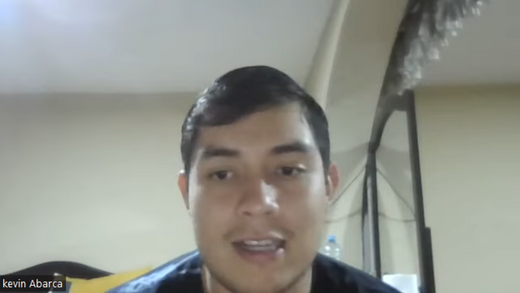
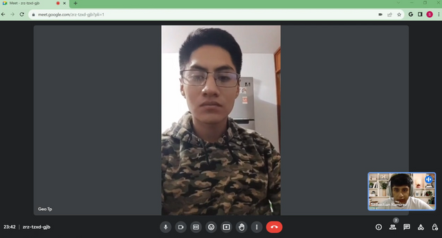
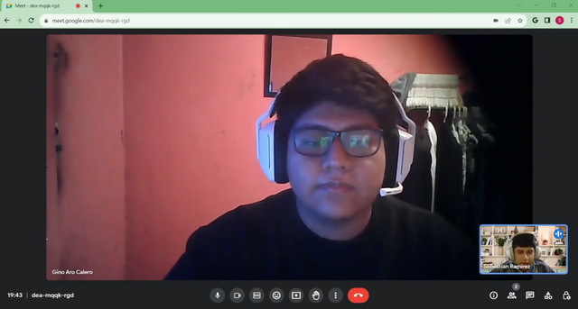
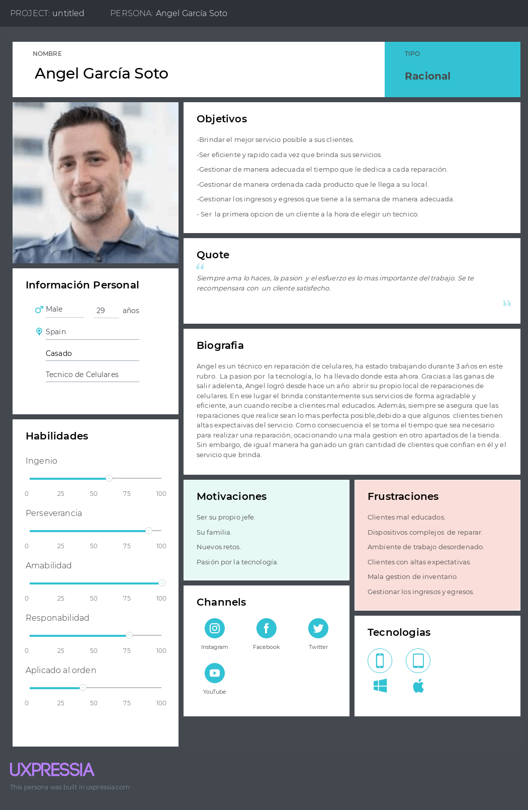
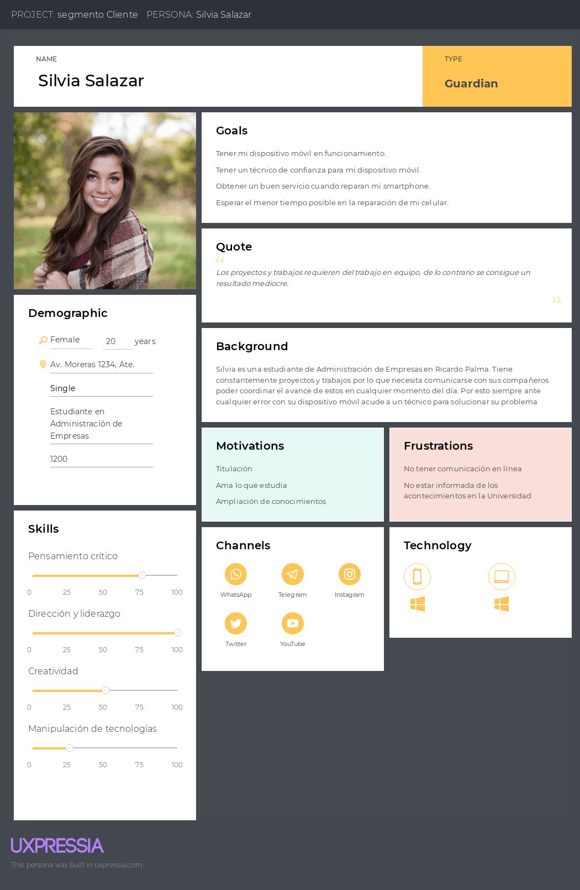
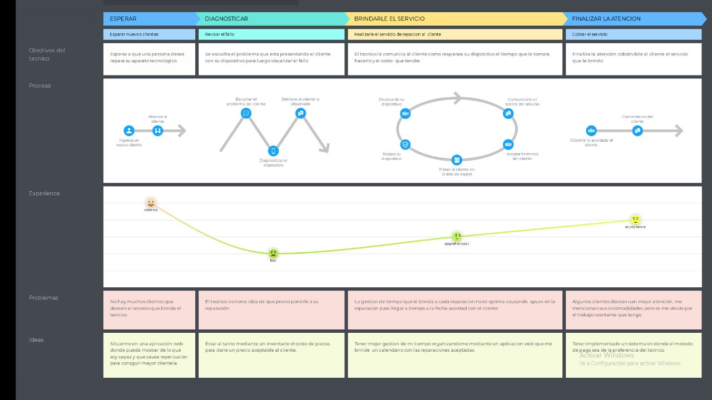
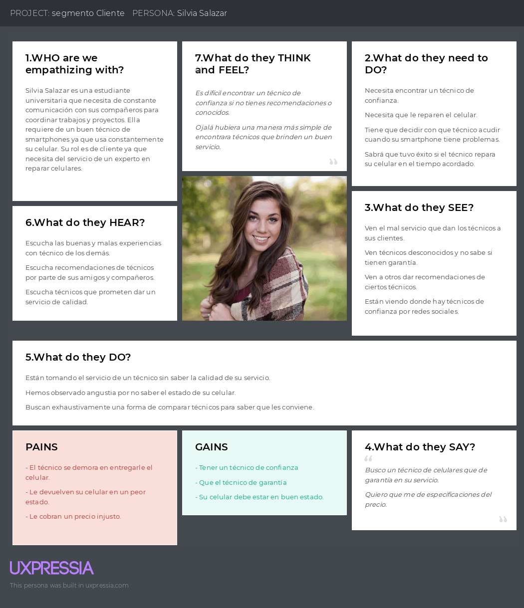
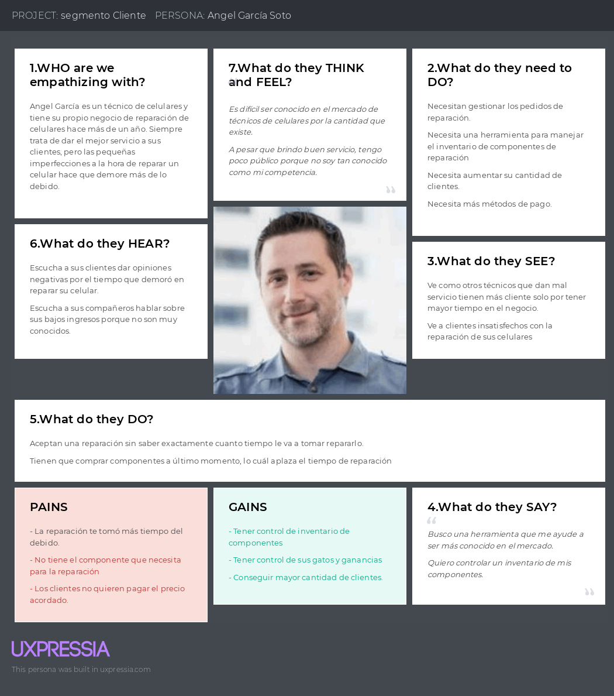
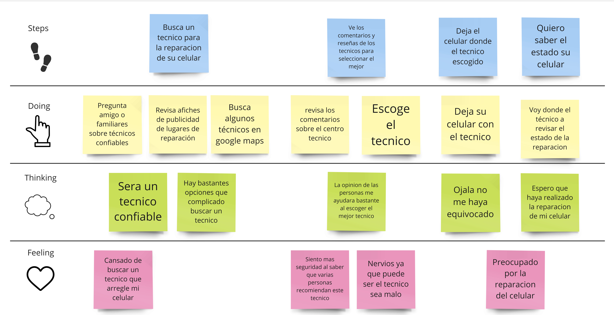
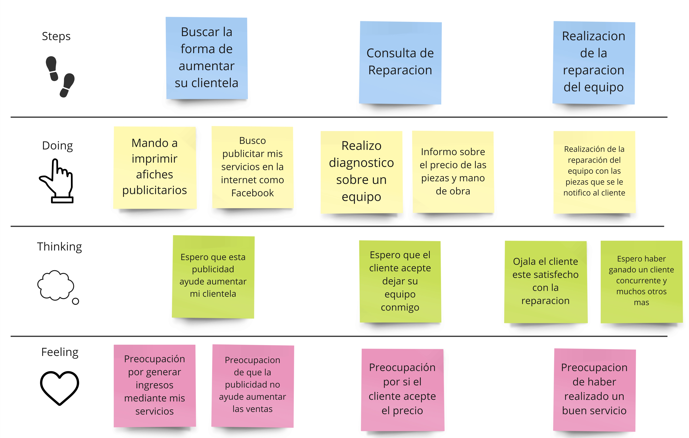

# Capítulo 2: Requirements Elicitation & Analysis

## 2.1. Competidores

### 2.1.1. Analisis competitivo

#### Competitive Analysis Landscape  

El objetivo del siguiente analisis competitivo es identificar las fortalezas y debilidades en relacion con los competidores para desarrollar diseños y estrategias efectivas para competir en el mercado.

| Competidor          |                                                       | TecHelp                                                                                                                                                                                                                                                                                                 | AyFix                                                                                                                                                                                                                          | Timbrit                                                                                                                                                                                                                                                                                                                     | Helpers                                                                                                                                                                                                                                  |
| ------------------- | ----------------------------------------------------- | ------------------------------------------------------------------------------------------------------------------------------------------------------------------------------------------------------------------------------------------------------------------------------------------------------- |--------------------------------------------------------------------------------------------------------------------------------------------------------------------------------------------------------------------------------|-----------------------------------------------------------------------------------------------------------------------------------------------------------------------------------------------------------------------------------------------------------------------------------------------------------------------------|------------------------------------------------------------------------------------------------------------------------------------------------------------------------------------------------------------------------------------------|
| Logo                |                                                       |                                                                                                                                                                                                                                                                                                         |                                                                                                                                                                                       |                                                                                                                                                                                                                                                                                    |                                                                                                                                                                                                 |
| Perfil              | Overview                                              | Aplicacion movil y web                                                                                                                                                                                                                                                                                  | Aplicacion movil y web                                                                                                                                                                                                         | Aplicacion Web                                                                                                                                                                                                                                                                                                              | Aplicacion movil y web                                                                                                                                                                                                                   |
|                     | Ventaja competitiva ¿Que valor ofrece a los clientes? | Permite visualizar el flujo de reparacion del telefono celular. Ademas, registra comentarios de satisfaccion por cada reparacion y brinda la facilidad de encontrar un servicio tecnico de alta calidad. Por otro lado, tiene alta disponibilidad en diferentes sistemas operativos como IOS y Android. | La propuesta de valor de AyFix radica en su enfoque conveniente, confiable y eficiente para la reparacion y mantenimiento de dispositivos electronicos. AyFix ofrece comodidad a los clientes al brindar servicio a domicilio. | Timbrit ofrece a sus clientes comodidad, variedad de servicios, profesionales verificados, transparencia en precios y pagos, atencion al cliente lo cual puede ser su ventaja competitiva para brindar un servicio completo y confiable en el mercado de contratacion de profesionales para el hogar y el cuidado personal. | Contactar profesionales al servicio del hogar desde donde se requiera, se puede programar visitas, garantizan profesionales competentes de acuerdo con el servicio que se requiera debido a que tienen un riguroso proceso de seleccion. |
| Perfil de Marketing | Mercado objetivo                                      | Personas que buscan servicios tecnicos de reparacion de celulares confiables y cercanos. Tecnicos que brindan servicios tecnicos de reparacion de telefonos celulares que busquen mejorar la comunicacion con los clientes y expandir su mercado objetivo.                                              | Profesionales en servicios del hogar. Personas que requieren de servicios del hogar como electricidad, linea blanca, carpinteria, cerrajeria, etc.                                                                             | Propietarios de viviendas que necesiten servicios de reparacion, mantenimiento y mejoras para sus hogares, pequeoas empresas como tiendas minoristas y restaurantes, oficinas y otros negocios locales.                                                                                                                     | Profesionales en servicios del hogar Personas que requieren de servicios del hogar como electricidad, linea blanca, carpinteria, cerrajeria, etc.                                                                                        |
|                     | Estrategias de marketing                              | Publicidad en redes sociales posicionamiento del Landing Page en internet y recomendaciones de clientes. Posicionamiento de marca: en cuanto al valor agregado de nuestro producto. Marketing de influencers: Colaboraciones con personas influyentes para promocionar el producto.                     | Publicidad y posicionamiento de su Landing Page y entrevistas                                                                                                                                                                  | Marketing de contenido, utiliza blogs y videos                                                                                                                                                                                                                                                                              | Publicidad y posicionamiento de su Landing Page                                                                                                                                                                                          |
| Perfil de Producto  | Productos & Servicios                                 | Permite visualizar el flujo de reparacion del telefono celular, lo que permite la trazabilidad de cada estado de la reparacion. Ademas, registra comentarios de satisfaccion por cada reparacion y brinda la facilidad de encontrar un servicio tecnico de alta calidad y seguridad.                    | Proporciona profesionales en servicios del hogar calificados de acuerdo a la necesidad del solicitante.                                                                                                                        | Contratacion de servicios profesionales, gestion de citas y pagos y evaluacion y reseñas de sus afiliados                                                                                                                                                                                                                   | Brinda servicios relacionados con problemas del hogar, oficina u empresa relacionado con la electricidad, electrodomesticos de linea blanca, carpinteria, cerrajeria, etc.                                                               |
|                     | Precios & Costos                                      | Usuarios: Free Servicios tecnicos: Plan basico: S/. 0.00 Plan TechSOS: S/. 30 Plan avanzado: S/. 80                                                                                                                                                                                                     | El pago de una cuota fija mensual de 85 soles por parte de los profesionales en servicios del hogar.                                                                                                                           | Timbrit utiliza un modelo de negocio basado en comisiones y tarifas por servicio                                                                                                                                                                                                                                            | Si un helper hace un servicio, cobramos una comision de entre 17% y 22%, dependiendo de la categoria de servicio y el monto acordado.                                                                                                    |
|                     | Canales de distribucion (Web y/o Movil)               | Web/Movil                                                                                                                                                                                                                                                                                               | Web/Movil                                                                                                                                                                                                                      | Web/Movil                                                                                                                                                                                                                                                                                                                   | Web/WhatsApp                                                                                                                                                                                                                             |
| Analisis SWOT       | Fortalezas                                            | Seguridad, confianza, calidad, garantia, cercano, los clientes ahorraran tiempo, ahorraran dinero y evitaran estafas y visualizacion de estado de reparacion en tiempo real.                                                                                                                            | Proporciona diferentes tipos de servicios del hogar con profesionales capacitados.                                                                                                                                             | Cobertura para España, Colombia, Argentina, Chile y Estados Unidos.                                                                                                                                                                                                                                                         | Helpers participo en Startup Peru y fue seleccionado como proyecto ganador y gano el programa Startup Chile.                                                                                                                             |
|                     | Debilidades                                           | Tener poca experiencia en el mercado.                                                                                                                                                                                                                                                                   | Solo tiene cobertura en Mexico.                                                                                                                                                                                                | Dependencia de la reputacion de sus afiliados.                                                                                                                                                                                                                                                                              | Falta integrar funcionalidades de contacto con el profesional en la misma plataforma.                                                                                                                                                    |
|                     | Oportunidades                                         | Mala comunicacion entre cliente y tecnico de reparacion de telefonos celulares. Alta demanda de reparacion de telefonos celulares.                                                                                                                                                                      | Muchos de los que se dedican a solucionar problemas de servicios del hogar se suelen anunciar por volantes o anuncios en los postes y paredes.                                                                                 | Timbrit puede aprovechar la oportunidad de seguir innovando y utilizando tecnologia de vanguardia en su plataforma, tambien puede considerar la oportunidad de diversificar su oferta de servicios para abarcar una mayor variedad de categorias y tipos de servicios para el hogar                                         | Problemas domesticos recurrentes y que usualmente toman tiempo solucionarlos, ya que no se encuentra con facilidad a un tecnico de confianza, cumplido y que ofrezca un servicio de calidad.                                             |
|                     | Amenazas                                              | Competidores con alta experiencia en el mercado.                                                                                                                                                                                                                                                        | Cambios en la demanda del mercado.                                                                                                                                                                                             | Opiniones o reseñas negativas de los clientes                                                                                                                                                                                                                                                                               | Problemas con la calidad del servicio, la puntualidad, la atencion al cliente u otros aspectos relacionados con la experiencia del usuario.                                                                                              |

### 2.1.2. Estrategias y tácticas frente a competidores

#### Matriz CAME para el desarrollo de estrategias en base al análisis FODA

| Matriz F.O.D.A. y C.A.M.E.                                                                                                                         | Oportunidades Mercado grande con millones de clientes. Servicios técnicos con necesidades para organizarse mejor.                                                                                                                                                                                                                                                                         | Amenazas Competidores reconocidos Competidores con muchos años de experiencia                                                                                                                                                                                     |
| ------------------------------------------------------------------------------------------------------------------------------------------------------ | --------------------------------------------------------------------------------------------------------------------------------------------------------------------------------------------------------------------------------------------------------------------------------------------------------------------------------------------------------------------------------------------------------- | ------------------------------------------------------------------------------------------------------------------------------------------------------------------------------------------------------------------------------------------------------------------------------- |
| Fortalezas Idea innovadora Diseño sencillo Multiplataforma Gratuita para los clientes Costos accesibles para servicios técnicos afiliados. | Estrategia Ofensiva Diseñar chat de comunicación con técnicos fáciles e interactivos para hacer sencillo el uso por parte de los usuarios. Diseñar una forma de que la plataforma sea compatible con diversos S.O, como Android, IOS y versión Web, para ser accesibles con cualquier técnico o usuario. Buscar más formas de precios en función de la cantidad de servicios técnicos afiliados. | Estrategia Defensiva Diseñar e investigar más sobre la idea innovadora para hacer frente a algunos productos monótonos como el de Apple. Diseñar interfaces para diferentes sistemas operativos a diferencia de otras compañías que tienen centralizada en un solo lugar. |
| Debilidades Poca experiencia en el mercado Falta de más conocimiento en algunas áreas tecnológicas                                               | Estrategia de Reorientación Aprovechar la gran cantidad de usuarios del mercado para validar mejor el diseño del producto. Aprender de los requisitos necesitan los técnicos y diseñar de acuerdo con las tecnologías necesarias que faciliten la usabilidad tanto al técnico com                                                                                                                   | Estrategia de Supervivencia Diseñar campañas de marketing presentando y destacar nuestra propuesta diferenciadora que genera valor a los clientes y técnicos.                                                                                                                |

Nota:  Este cuadro muestra la matriz C.A.M.E que sirve para definir acciones luego de los datos obtenidos de las
fortalezas, debilidades, oportunidades y amenazas.

## 2.2. Entrevistas

### 2.2.1. Diseño de entrevistas

#### Usuario:

##### Preguntas demográficas:

¿Cual es tu nombre?

¿Qué edad tienes?

¿Tienes una ocupación?

¿De qué distrito resides ?

##### Preguntas principales:

1. ¿En algún momento usted ha acudido a los servicios de un técnico para reparar su celular? ¿Qué problema tenía su celular? ¿El técnico pudo reparar su celular? ¿Se sintió satisfecho con la atención que le brindó?
2. ¿Ha vuelto a tener ese mismo fallo con su celular u otro fallo distinto? ¿Lo ha vuelto a enviar al mismo técnico? ¿Cuántas veces ha tenido que acudir a un técnico por el mismo fallo u otro?
3. ¿Trataste de solucionar el problema por tu propia cuenta?
4. La atención general de los técnicos que ha acudido ¿Fue la que esperaba? ¿Ha tenido que realizar filas para poder ser atendida?
5. ¿Alguna vez el técnico le dijo que tenía que dejar su celular por una cierta cantidad de días? ¿Cuántos días dejó su celular a un técnico? ¿El técnico cumplió con el tiempo establecido? Si no fue así ¿Cuántos días tuvo que esperar para que le devolvieran su celular?
6. Por experiencia,¿Cuál es el costo promedio por reparación de tu equipo? ¿Te parece justo ese precio?
7. ¿Se te ha brindado garantía luego de la reparación de tu celular? ¿Qué tipo de garantía?
8. ¿Conoce algún familiar que ha sufrido un accidente con su equipo luego de ser reparado por un técnico?
9. Por su experiencia,¿Que toma en cuenta a la hora de elegir un técnico?

#### Preguntas sobre el proyecto:

1. ¿Ha escuchado de una aplicación web que brinde los mismos servicios que ofrece nuestro proyecto?
2. ¿Cree que nuestra aplicación solucionara las malas experiencias que ha tenido al acudir los servicios de un técnico?
3. Al escuchar nuestra aplicación ¿Qué otras funcionalidades le gustaría ver en nuestra aplicación?

#### Tecnico:

Preguntas demográficas:

¿Cual es tu nombre?

¿Qué edad tienes?

¿De qué distrito resides ?

#### Preguntas principales:

1. Aproximadamente ¿Cuántas personas al día han solicitado sus servicios?
2. ¿Trabaja solo o tiene algún personal que lo apoye ? si tiene personal ¿Cuántos?
3. ¿Ha tenido dificultad a la hora de gestionar su tiempo para atender a los clientes? ¿Se organiza para poder gestionar bien su negocio?
4. ¿De qué manera usted gestiona las piezas que recibe para poder reparar los celulares?
5. ¿Cuál es el problema que se presenta constantemente en los celulares de los clientes?
6. De todos los problemas que ha solucionado¿Cuáles son los problemas más complicados y tediosos que ha encontrado a la hora de reparar un celular?
7. ¿De qué manera usted gestiona el tiempo para poder reparar un equipo?
8. ¿Cómo usted maneja los precios de reparación? ¿El precio que ofrece a los clientes es justo para usted?
9. ¿Cuáles son los métodos de pago con los que trabaja?
10. ¿Siente que da la mejor atención posible a cada cliente que se presente para acudir a sus servicios?
11. ¿Qué acciones realiza cuando un cliente no se siente satisfecho por los servicios que le ha brindado?
12. ¿Cómo le garantiza al cliente que su equipo está en buenas manos?
13. En su opinión ¿Cuáles son los factores para que un técnico pueda ser solicitado más que otro?
14. En su experiencia como técnico¿Es rentable actualmente acudir a uno?
15. ¿Usted disfruta su trabajo?

#### Preguntas sobre el proyecto:

1. ¿Ha escuchado de una aplicación web que brinde los  mismos servicios que ofrece nuestro proyecto?
2. ¿Cree que nuestra aplicación solucionara las malas experiencias que ha tenido  al acudir los  servicios de un técnico  ?
3. Al escuchar nuestra aplicación ¿ Qué otras funcionalidades le gustaría  ver en nuestra aplicación?

### 2.2.2. Registro de entrevistas

#### Entrevista de usuario

Entrevista 1

Datos Demográficos:  
 
- Nombre: Abelardo Huañec Chirinos  
- Edad: 20 años  
- Ocupación: Estudiante de Ingeniería Industrial  
- Distrito de Residencia: San Juan de Miraflores  

Duración de la entrevista: [00:00:00 - 00:10:57]

#### Preguntas principales:

Abelardo es un estudiante de 20 años que reside en San Juan de Miraflores. Ha acudido a un técnico para reparar su celular en el pasado debido a problemas en la pantalla. El técnico pudo reparar el celular, pero la reparación no duró mucho, por lo que no se sintió satisfecho con la atención. Ha enfrentado el mismo problema con su celular nuevamente pero no ha vuelto a enviarlo al mismo técnico y solo ha recurrido a un técnico en una ocasión.  

Abelardo no ha intentado solucionar problemas en su celular por su cuenta debido a su falta de conocimiento en reparaciones de dispositivos. La atención que ha recibido de los técnicos no cumplió con sus expectativas, aunque no ha tenido que hacer filas para ser atendido.  

En cuanto al tiempo de reparación, el técnico le pidió que dejara su celular por unas horas y cumplió con el tiempo estimado. El costo promedio de una reparación fue de aproximadamente 130 soles, y Abelardo consideró que este precio era justo.  

No le brindaron garantía después de la reparación, y no conoce a ningún familiar que haya tenido problemas con su equipo después de ser reparado por un técnico.  

En relación con el proyecto de la aplicación web, Abelardo no ha escuchado de una aplicación similar y cree que podría ayudar a mejorar sus malas experiencias con técnicos. Le gustaría ver en la aplicación una funcionalidad que muestre la ubicación de los técnicos en un mapa interactivo.  

Entrevista 2

Datos Demográficos:  

- Nombre: Kevin Abarca  
- Edad: 19 años  
- Ocupación: Estudiante en la UPC (5to ciclo)  
- Distrito de Residencia: San Juan de Lurigancho  

Duración de la entrevista: [00:10:57 - 00:20:10]

#### Preguntas principales:  

Kevin Abarca es un estudiante de 19 años que reside en San Juan de Lurigancho. Ha acudido a servicios de técnicos para reparar su celular en varias ocasiones. La primera vez, fue por un problema en la cámara, y el técnico pudo reparar su celular. Sin embargo, no se sintió satisfecho debido a la demora en la entrega del dispositivo (5 días).  

En otras ocasiones, tuvo fallos en la batería y acudió a otro técnico conocido por su servicio a través de redes sociales. En general, ha tenido que recurrir a técnicos tres o cuatro veces por diferentes problemas en su celular.  

Kevin intentó solucionar problemas en su celular por su cuenta, pero empeoró la situación debido a la falta de conocimientos y materiales adecuados.  

En cuanto a la atención de los técnicos, la primera experiencia no cumplió con sus expectativas, aunque el técnico fue amable. La segunda experiencia fue mejor debido a la reputación del técnico en redes sociales. No tuvo que hacer filas para ser atendido.  

Uno de los técnicos le pidió que dejara su celular por un día, pero no cumplió con el tiempo establecido y Kevin tuvo que esperar 5 días para recuperarlo.  

El costo promedio de reparación de su celular es de 150 soles, y considera que este precio es justo, especialmente cuando el técnico en Polvos Azules pudo devolverle el celular el mismo día.  

Kevin conoce a un amigo que tuvo problemas con la reparación de la pantalla de su celular debido a que el técnico la colocó incorrectamente y le cobró extra por corregirlo.  

A la hora de elegir un técnico, Kevin toma en cuenta la reputación del técnico, el tiempo estimado de reparación y las recomendaciones de amigos.  

En relación con el proyecto de la aplicación web, Kevin no ha escuchado de aplicaciones similares. Cree que la aplicación podría solucionar las malas experiencias con técnicos si los técnicos ofrecen un excelente servicio. Le gustaría que la aplicación incluyera una forma de comunicación entre el cliente y el técnico, así como la posibilidad de que los técnicos establezcan sus propios precios y tiempos de reparación.  

Entrevista 3

Datos Demográficos:  

- Nombre: Brenda Lluyacc  
- Edad: 19 años  
- Ocupación: Estudiante de Marketing y asistente de ventas en Ripley  
- Distrito de Residencia: San Juan de Miraflores  

Duración de la entrevista: [00:10:57 - 00:33:25]

#### Preguntas principales:

Brenda Lluyacc es una estudiante de 19 años que reside en San Juan de Miraflores y trabaja como asistente de ventas en Ripley. Ha acudido una vez a los servicios de un técnico para reparar su celular debido a un fallo en los botones de volumen y apagado. En esa ocasión, el técnico pudo reparar su celular, y Brenda se sintió satisfecha con la atención recibida.  

Aunque no ha tenido el mismo problema nuevamente, menciona que si ocurriera volvería a acudir a un técnico. No ha intentado solucionar problemas por su cuenta debido a la falta de conocimiento.  

La atención que ha recibido de los técnicos ha sido la que esperaba, y nunca tuvo que hacer fila, ya que la atención fue inmediata.  

En cuanto a los plazos de reparación, menciona que en su caso el problema se solucionó en cuestión de minutos. Sin embargo, estaría dispuesta a dejar su celular por un máximo de dos días en caso de que fuera necesario. Si el técnico no cumpliera con el tiempo acordado, se sentiría insatisfecha y perdería confianza en ese técnico.  

El costo promedio de reparación de su celular fue de 20 soles, y le pareció justo, especialmente en comparación con lo que otros familiares han pagado por problemas similares.  

No le brindaron garantía después de la reparación de su celular.  

Brenda no conoce a ningún familiar que haya tenido problemas con su equipo después de que un técnico lo haya reparado.  

A la hora de elegir un técnico, Brenda se basa en las experiencias de sus familiares, especialmente en las de sus padres, quienes le mencionan qué lugar y técnico es el mejor para ellos.  

Respecto al proyecto de la aplicación web, Brenda no ha escuchado de ninguna aplicación que ofrezca los mismos beneficios para usuarios y técnicos.  

Cree que la aplicación podría solucionar sus malas experiencias anteriores, especialmente por la falta de garantía en las reparaciones. Usaría la aplicación debido a la mayor confianza que tendría al acudir a un técnico a través de ella.  

Brenda sugiere que la aplicación permita agregar fotos en el apartado de comentarios para que otros usuarios puedan ver el trabajo realizado por el técnico.  

#### Entrevista de técnico

Entrevista 1

Datos Demográficos:  

- Nombre: George Galvan  
- Edad: 20 años  
- Distrito de Residencia: Surco  

Duración de la entrevista: [00:33:25 - 00:44:05]

#### Preguntas principales:

George Galvan, de 20 años y residente de Surco, es un técnico en reparación de celulares que trabaja junto a un compañero. Atienden a aproximadamente 60 personas al día y gestionan su tiempo para atender a los clientes de manera efectiva, especialmente durante campañas.  

George organiza las piezas de los celulares en una bandeja para diferenciar los diferentes tipos de accesorios y facilitar su trabajo.  

Los problemas más comunes que encuentra en los celulares de los clientes están relacionados con la batería y la suciedad en la entrada del dispositivo.  

Los trabajos más complicados y tediosos involucran desarmar completamente la arquitectura del celular y sacar cada componente.  

Gestiona el tiempo de reparación según la dificultad, con reparaciones fáciles tomando entre 15 y 20 minutos, y cambios más exhaustivos, como el reemplazo de baterías y pantallas, que pueden llevar hasta 1 hora.  

Los precios de reparación varían según la dificultad de la tarea, comenzando desde 10 nuevos soles para problemas básicos y llegando a alrededor de 100 nuevos soles para reparaciones más complicadas.  

Acepta métodos de pago como carteras digitales, tarjetas de débito/crédito y efectivo.  

George se esfuerza por brindar la mejor atención posible a cada cliente, adaptando su trato según las necesidades y actitudes de los clientes.  

Cuando un cliente no está satisfecho, se esfuerza por resolver el problema de manera inmediata y, en casos de error técnico, devuelve la mitad del dinero de la reparación.  

La confianza de los clientes se basa en recomendaciones y la calidad del servicio en el centro de Lima.  

Los factores que considera clave para que un técnico sea más solicitado que otro incluyen la comunicación efectiva y la capacidad de explicar las reparaciones de manera práctica.  

En su experiencia, ser un técnico honesto y ofrecer buenos precios y calidad de servicio es rentable.  

George disfruta su trabajo y se siente feliz haciendo lo que hace.  

En cuanto al proyecto de la aplicación web, George ha escuchado que los servicios se comparten en páginas de Facebook, pero no ha escuchado de una aplicación web que ofrezca servicios similares.  

Cree que la aplicación podría solucionar las malas experiencias relacionadas con estafas en el servicio de reparación de celulares.  

George sugiere agregar una función de reseñas para los técnicos en la aplicación y destacarlas en el perfil del técnico.  

Entrevista 2

Datos Demográficos:  

Nombre: Luis Ramos  
Edad: 24 años   
Distrito de Residencia: La Victoria  

Duración de la entrevista: [00:44:05 - 00:52:09]

### Preguntas principales:  
Luis Ramos, de 24 años y residente en La Victoria, es un técnico en reparación de celulares que trabaja solo en su negocio, atendiendo aproximadamente de 15 a 20 personas al día.  

Luis menciona que a veces tiene dificultades para gestionar su tiempo ya que es el único trabajador, y muchas personas vienen a su tienda.  

Para gestionar las piezas de repuesto, intercambia accesorios con otros técnicos que también tienen tiendas en la misma área.  

Los problemas más comunes que enfrenta en los celulares de los clientes son la ruptura de pantallas y el desgaste físico de las baterías.  

Considera que el cambio de pantalla es una de las reparaciones más tediosas, ya que a menudo surgen problemas adicionales que no son visibles a simple vista.  

Gestiona el tiempo de reparación según la complejidad del trabajo, variando entre 15 minutos y 1 hora en casos extremos.  

Los precios de reparación dependen de las piezas de repuesto utilizadas y Luis se esfuerza por ofrecer precios justos para atraer a los clientes.  

Acepta varios métodos de pago, incluyendo carteras digitales, tarjetas de crédito/débito y efectivo.  

Siempre trata de brindar una buena atención a sus clientes, siendo amable y transparente sobre los problemas de reparación.  

Cuando un cliente no está satisfecho, prioriza la empatía y trata de resolver cualquier problema que se presente.  

Luis garantiza la seguridad de los equipos entregando una tarjeta de recomendación y manteniendo su puesto de trabajo físico y permanente.  

Considera que los factores clave para que un técnico sea solicitado son los precios bajos y las recomendaciones entre clientes.  

En su experiencia, ser un técnico es rentable, incluso como una sola persona ejerciendo esta profesión.  

Luis disfruta de su trabajo, especialmente las reparaciones en dispositivos móviles.  

En cuanto al proyecto de la aplicación web, no ha escuchado de ninguna aplicación similar a la propuesta.  

Cree que la aplicación podría solucionar las malas experiencias de los usuarios al proporcionar opiniones y recomendaciones.  

Luis recomienda implementar la venta de celulares y accesorios en la aplicación para beneficiar a otros técnicos que también venden estos productos.  

### 2.2.3. Análisis de entrevistas

#### Segmento objetivo usuarios:  

Análisis de las Entrevistas  
En base a las tres entrevistas realizadas, se pueden identificar algunas características y tendencias comunes en la experiencia de los usuarios al buscar servicios de reparación de celulares. Aquí se presenta un análisis de cada segmento objetivo:

Entrevista 1:   
Abelardo Huañec Chirinos   
Edad: 20 años.  
Ocupación: Estudiante de Ingeniería Industrial.  
Distrito de Residencia: San Juan de Miraflores.  

Principales Conclusiones:  
Abelardo ha acudido a un técnico para reparar su celular debido a un problema en la pantalla.  Aunque el técnico pudo reparar el celular, la reparación no duró mucho tiempo, lo que resultó en una experiencia insatisfactoria.  Ha experimentado el mismo fallo en su celular y no ha vuelto a enviarlo al mismo técnico ni a otro.  Su experiencia negativa anterior influyó en su decisión.No intentó solucionar el problema por su cuenta debido a la falta de conocimientos.  La atención de los técnicos no cumplió con sus expectativas, pero no tuvo que esperar en filas para ser atendido.  No se le ofreció garantía después de la reparación.  El costo promedio de reparación fue de aproximadamente 130 soles, y le pareció justo.  Su elección de técnico se basaría en recomendaciones de familiares, amigos o personas conocedoras del tema.  

Entrevista 2:  
Kevin Abarca  
Edad: 19 años.  
Ocupación: Estudiante en la UPC (quinto ciclo).  
Distrito de Residencia: San Juan de Lurigancho.  

Principales Conclusiones:  
Kevin ha acudido a un técnico para reparar la cámara de su celular y, en otra ocasión, para problemas con la batería. La primera experiencia fue satisfactoria, pero la segunda no lo fue debido a la demora en la entrega.  No intentó solucionar el problema por su cuenta.  La atención del técnico en la primera experiencia cumplió con sus expectativas, y no tuvo que esperar en filas.  En la segunda experiencia, el técnico le pidió que dejara su celular por un día, pero no cumplió con el tiempo establecido, lo que afectó su satisfacción.  El costo promedio de reparación fue de 150 soles, y Kevin lo consideró justo.  No se le ofreció garantía después de la reparación.  Conoce a un amigo que tuvo problemas con un técnico que no colocó correctamente una nueva pantalla y le cobró extra por corregir el error.  Su elección de técnico se basa en la reputación del técnico, el tiempo estimado de reparación y las recomendaciones de amigos.

Entrevista 3:   
Brenda Lliuyacc  
Edad: 19 años.  
Ocupación: Estudiante de Marketing y asistente de ventas en Ripley.  
Distrito de Residencia: San Juan de Miraflores.  

Principales Conclusiones:
Brenda ha acudido una vez a un técnico para reparar los botones de su celular y quedó satisfecha con la atención.  No intentó solucionar el problema por su cuenta debido a la falta de conocimientos.  La atención del técnico cumplió con sus expectativas, y no tuvo que esperar en filas.  No se le pidió dejar su celular por un período prolongado.  El costo de reparación fue de 20 soles, y Brenda lo consideró justo.  No se le brindó garantía después de la reparación.  No conoce a familiares que hayan tenido accidentes con sus equipos después de la reparación.  Su elección de técnico se basa en las experiencias de sus familiares y las recomendaciones de amigos.

##### Conclusiones Generales:  
En los tres casos, los usuarios han acudido a técnicos para reparaciones de celular, y la calidad de la atención y la satisfacción varían según la experiencia.  Los usuarios no suelen intentar solucionar los problemas por sí mismos debido a la falta de conocimientos técnicos.  La atención y la calidad del servicio del técnico son factores importantes en la elección de un técnico, así como las recomendaciones de familiares y amigos.  La falta de garantía después de la reparación es una preocupación común para los usuarios.  El precio de reparación varía, pero en general, los usuarios consideran justo el costo.  Los usuarios desean un servicio más transparente y una forma de comunicación efectiva con los técnicos.

#### Estadística general del sector objetivo:  
Porcentaje de usuarios que han acudido a técnicos para reparar celulares: 100%.  
Satisfacción promedio con la atención del técnico: 50% satisfecho, 50% insatisfecho.  
Porcentaje de usuarios que intentaron solucionar el problema por sí mismos: 0%.  
Porcentaje de usuarios que usan recomendaciones para elegir un técnico: 100%.  
Porcentaje de usuarios a los que no se les ofreció garantía después de la reparación: 100%.  
Rango de costo promedio de reparación: 20 a 150 soles.  
Porcentaje de usuarios que no conocen una aplicación web similar: 100%.  
Principales mejoras deseadas en la aplicación: Comunicación con el técnico, transparencia en precios y tiempos de reparación, publicación de fotos en comentarios.  

#### Segmento objetivo técnicos:

#### Análisis de las Entrevistas  

En el análisis de las dos entrevistas, se identificaron aspectos comunes que proporcionan una base sólida para la construcción de arquetipos de técnicos de reparación de celulares.  Estos aspectos incluyen estadísticas importantes sobre demanda de servicios, gestión del tiempo, problemas comunes de reparación, métodos de pago, atención al cliente y opiniones sobre la aplicación propuesta.  Estos datos cuantitativos y cualitativos ayudarán a diseñar perfiles de técnicos más realistas y a adaptar la aplicación para abordar las necesidades y desafíos específicos de estos profesionales.

#### Gestión del Tiempo:  
El 50% de los técnicos menciona que la gestión del tiempo puede ser un desafío debido a la alta demanda de clientes.  
El 50% de los técnicos menciona dificultades en la gestión del tiempo, especialmente cuando trabajan solos.

#### Gestión de Piezas de Repuesto:  
El 50% de los técnicos menciona que gestionan las piezas de repuesto en bandejas para facilitar la organización.  
El 50% de los técnicos intercambia piezas de repuesto con otros técnicos en la misma área.

#### Problemas Comunes de Reparación:  
El 100% de los técnicos menciona problemas comunes como la batería y la rotura de pantallas en los dispositivos móviles.
Reparaciones Tediosas:  
El 100% de los técnicos encuentra tedioso el cambio de pantalla, ya que a menudo presenta problemas adicionales.

#### Tiempo de Reparación:  
El tiempo de reparación varía desde 15 minutos hasta 1 hora, según la complejidad.

#### Precios de Reparación:  
Los precios de reparación oscilan desde 10 hasta 150 nuevos soles, dependiendo de la dificultad de la reparación.

#### Métodos de Pago:  
El 100% de los técnicos acepta métodos de pago como carteras digitales, tarjetas de crédito/débito y efectivo.

#### Atención al Cliente:  
El 100% de los técnicos se esfuerza por ofrecer la mejor atención posible a los clientes.

#### Gestión de Conflictos:  
El 100% de los técnicos muestra empatía y busca soluciones cuando los clientes no están satisfechos.

#### Comunicación Efectiva:  
El 100% de los técnicos considera que la comunicación efectiva con los clientes es esencial para ser solicitado más que otros técnicos.

#### Rentabilidad como Técnico:  
El 100% de los técnicos considera que ser técnico es rentable si se ofrece un buen precio y calidad de servicio.

#### Opiniones sobre la Aplicación Propuesta:  
El 100% de los técnicos no ha escuchado de una aplicación web que ofrezca servicios similares a la propuesta.  
El 100% de los técnicos cree que la aplicación podría solucionar problemas comunes, especialmente en relación con estafas.  
El 50% de los técnicos sugiere la posibilidad de incluir una función de reseñas destacadas en los perfiles de técnicos.  
El 50% de los técnicos sugiere la venta de celulares y accesorios en la aplicación como una función adicional.

## 2.3. Needfinding

En este apartado se mostrarán los artefactos resultantes del proceso de recolección que se realizó en los segmentos objetivos y que concluye con la construcción del User Personas, User Task Matrix, User Journey Maps, Empathy Mapping y As-Is Scenario Mapping.

### 2.3.1. User Persona

En esta parte del documento, se presentan perfiles ficticios que personifican a los grupos de interés identificados y que han sido objeto de entrevistas. Los datos proporcionados abarcan información demográfica, características de personalidad, motivaciones, preferencias, objetivos, desafíos y patrones de conducta. Estos detalles están respaldados por las entrevistas realizadas anteriormente. Se han empleado herramientas disponibles en UXPressia para facilitar la creación de estos artefactos.

#### User Empathy Mapping: Técnico

#### User Empathy Mapping: Cliente

### 2.3.2. User Task Matrix

En el User Task Matrix hemos identificado las actividades que realizan nuestros dos segmentos e identificamos la importancia de cada una de estas tareas para cada segmento. 

Indicadores de importancia:

| ALTA | BAJA | MEDIA |
|------|------|-------|      

Indicadores de frecuencia:

| SIEMPRE | RARA VEZ | NUNCA |
|------|------|-------|      
                     
<table>
    <thead>
        <tr>
            <th>Segmento objetivo</th>
            <th colspan="2">Silvia Salazar - Cliente</th>
            <th colspan="2">Angel Garcia Soto - Técnico</th>
        </tr>
    </thead>
    <tbody>
        <tr>
            <th>Tareas</th>
            <th>Frecuencia</th>
            <th>Importancia</th>
            <th>Frecuencia</th>
            <th>Importancia</th>
        </tr>
        <tr>
            <td>Buscar un sitio con buenos técnicos</td>
            <td>Siempre</td>
            <td>Media</td>
            <td>Rara vez</td>
            <td>Media</td>
        </tr>
        <tr>
            <td>Elegir un técnico confiable</td>
            <td>Siempre</td>
            <td>Alta</td>
            <td>Nunca</td>
            <td>Media</td>
        </tr>   
        <tr>
            <td>Considerar que componente usar para la reparación</td>
            <td>Rara vez</td>
            <td>Media</td>
            <td>Siempre</td>
            <td>Alta</td>
        </tr>  
        <tr>
            <td>Recoger el celular reparado</td>
            <td>Siempre</td>
            <td>Alta</td>
            <td>A menudo</td>
            <td>Alta</td>
        </tr>  
        <tr>
            <td>Comprar los componentes para reparar el celular</td>
            <td>Rara vez</td>
            <td>Alta</td>
            <td>Siempre</td>
            <td>Alta</td>
        </tr>  
        <tr>
            <td>Determinar problema de celular </td>
            <td>Rara vez</td>
            <td>Alta</td>
            <td>Siempre</td>
            <td>Alta</td>
        </tr>  
        <tr>
            <td>Reparar celular </td>
            <td>Nunca</td>
            <td>Alta</td>
            <td>Siempre</td>
            <td>Alta</td>
        </tr>  
        <tr>
            <td>Entregar celular a tiempo </td>
            <td>Nunca</td>
            <td>Alta</td>
            <td>A veces</td>
            <td>Alta</td>
        </tr>  
        <tr>
            <td>Determinar precio de reparación</td>
            <td>Nunca</td>
            <td>Baja</td>
            <td>Siempre</td>
            <td>Alta</td>
        </tr>      
    </tbody>
</table>  

A través del User Task Matrix podemos identificar las frecuencias e importancias entre las diferentes User Persona que presentamos y esta nos sirva de guía.  
#### Clientes:
Para los clientes las tareas que presentan mayor frecuencia son:  
- Buscar un sitio con buenos técnicos.  
- Elegir un técnico confiable.  
- Recoger el celular reparado.  

Estos datos describen el proceso que el cliente siempre sigue cuando su teléfono móvil se avería por algún motivo. Son importantes porque detallan cómo elegir un lugar con buenos técnicos y asegurarse de que sean confiables. Al final del proceso, se trata de recoger el teléfono celular ya reparado.

Para los clientes las tareas que presentan mayor importancia son:
- Elegir un técnico confiable.
- Recoger el celular reparado.
- Comprar los componente para reparar el celular.
- Determinar problema de celular.
- Reparar celular.
- Entregar celular a tiempo.  

Estas tareas son importantes para el cliente, ya que establecen un escenario adecuado para el proceso de reparación de un teléfono móvil averiado. Incluyen la elección de un técnico confiable, la recogida del celular, la identificación del problema, la gestión de los componentes necesarios para la reparación, la correcta ejecución de la reparación y la entrega oportuna del dispositivo.

#### Técnicos:
Para los técnicos las tareas que presentan mayor frecuencia son:
- Considerar que componente usar para la reparación.
- Comprar los componentes para reparar el celular.
- Determinar problema de celular.
- Reparar celular.
- Determinar precio de reparación.  

Estos datos describen el proceso que el técnico sigue para realizar la reparación del celular. Comienza por determinar el problema del celular, luego considera qué componentes deben reemplazarse y los adquiere. A continuación, lleva a cabo la reparación integral del celular y finalmente establece un precio justo para el servicio de reparación.  

Para los técnicos las tareas con mayor importancia son:
- Considerar que componente usar para la reparación.
- Recoger el celular reparado.
- Comprar los componentes para reparar el celular.
- Determinar problema de celular.
- Reparar celular.
- Entregar celular a tiempo.
- Determinar precio de reparación.  

Estos datos indican la importancia que el técnico le otorga a las tareas rutinarias que realiza. A diferencia de las de mayor frecuencia, hay algunas que se destacan, como la entrega puntual del celular, que puede influir en una mejor experiencia del usuario al reparar su dispositivo. Esto puede llevar al cliente a regresar en caso de futuras averías y a confiar en el técnico.  

#### Diferencias:  
Al realizar un análisis entre ambos segmentos objetivo, es evidente que el cliente busca reparar su celular mientras que el técnico se enfoca en llevar a cabo dicha reparación. Aunque siguen diferentes roles y procesos, comparten un objetivo común: lograr una reparación efectiva, en un tiempo razonable y a un precio justo. Mientras el cliente busca confianza en el servicio, el técnico busca perfeccionar su calidad de trabajo y su experiencia en la atención al usuario.  

### 2.3.3. User Journey Mapping

En esta sección, desarrollamos los User Journey Mapping para cada User Persona (cliente y técnico). El flujo comienza desde que el cliente busca un técnico para reparar su dispositivo móvil, elige un técnico, solicita información sobre la reparación, espera el proceso de la reparación y finalmente recoge el producto reparado. Esta secuencia nos muestra metas, desafíos, oportunidades y procesos clave. Por otro lado, desde la perspectiva del técnico, se busca atraer a personas que requieran sus servicios de reparación, diagnosticar el problema, proporcionar el servicio y concluir la atención con éxito, brindando una experiencia positiva para que el cliente pueda recomendar el lugar y convertirlo en un sitio confiable para la reparación de celulares.

#### User Journey Mapping: Cliente

#### User Journey Mapping: Técnico

### 2.3.4. Empathy Mapping

En esta sección, se presenta el Empathy Mapping realizado para ambos segmentos (cliente y técnico). Esta herramienta resulta útil para crear perfiles detallados de los User Persona y desarrollar descripciones más profundas desde su perspectiva. Para cada User Persona, se incluyen elementos clave que son fundamentales para la implementación del artefacto, que incluyen lo que el usuario ve, escucha, dice, hace y siente. Además, se abordan las preocupaciones y los beneficios, analizados a partir de preguntas como: ¿Qué le preocupa? ¿Qué puede contribuir a resolver sus problemas? ¿Qué podría convencerlo de que somos la elección adecuada? ¿Qué comunica? Todo esto es de gran ayuda para crear un artefacto de fácil implementación y de vital importancia para el proceso de Needfinding.  

#### User Empathy Mapping: Cliente

#### User Empathy Mapping: Técnico

### 2.3.5. As-is Scenario Mapping

En el escenario actual (As-Is), el mapeo de la experiencia del usuario comienza cuando el cliente busca a un técnico para reparar su celular, lo que puede resultar en una tarea agotadora. El usuario busca comentarios en diversas fuentes, como recomendaciones de familiares o aplicaciones de mapas, lo que a menudo añade a su carga de trabajo. Posteriormente, cuando el usuario confía su dispositivo al técnico, lo hace con cierta desconfianza e inseguridad acerca de si el técnico llevará a cabo un buen trabajo.

__As-is Scenario Mapping: Usuario__ 

 

En el escenario actual (As-Is) del mapeo de la experiencia del técnico, comienza con la forma en que intenta destacarse en el mercado de reparación de celulares, a menudo utilizando métodos poco eficaces o lentos, lo que genera preocupación sobre si sus ventas aumentarán. Cuando el técnico recibe una consulta de reparación, siente preocupación acerca de si logrará convencer al cliente de confiarle su dispositivo. Si el técnico logra persuadir al cliente para que deje su celular, la posibilidad de que el usuario recomiende sus servicios es bastante incierta.  

 

__As-is Scenario Mapping: Tecnicos__ 

