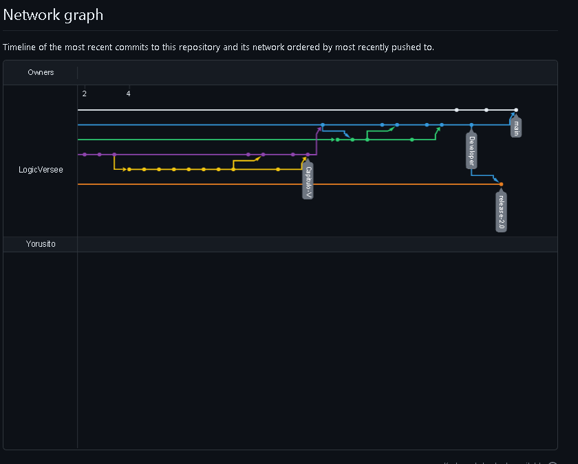

# Universidad Peruana De Ciencas Aplicadas
## Desarrollo de Aplicaciones Open Source SW51

 </img> 

# **Informe TF**
## **LogicVerse - TecHelp**
## Profesor: Angel Augusto Velasquez Nuñez

## **Integrantes:**

*  **Morales Quispe Brayan Smith       U20211F984** 
*  **Ramirez Mendez Sebastián André    U20191E575**    
*  **Lagos Aguilar Luis Eduardo        U202121975** 
*  **Ramos Calderon Giovanni Andres    U202122512**
*  **Saldaña Vela, Janover Gonzalo     U20201B510**
-----

## Registro de Versiones Del Informe 

| **Version** | **Fecha** | **Autor**                                                                               | **Descripcion de modificacion**                                                                 |
|-------------|-----------|-----------------------------------------------------------------------------------------|-------------------------------------------------------------------------------------------------|
| 0.1         | 22/08/23  | Gonzalo Saldaña                                                                         | Descripcion Profile Start Up                                                                    |
| 0.2         | 22/08/23  | Brayan Morales Luis Lagos Gonzalo Saldaña Giovanni Ramos  Sebastian Ramirez | Perfil de Integrantes                                                                           | 
| 0.3         | 23/08/23  | Gonzalo Saldaña                                                                         | Antecedentes y Problematicas                                                                    |
| 0.4         | 23/08/23  | Gonzalo Saldaña                                                                         | Lean UX Segmento objetivo                                                                    |
| 0.5         | 23/08/23  | Sebastián Ramirez                                                                       | Analisis Competitivo                                                                            |
| 0.6         | 30/08/23  | Brayan Morales Luis Lagos Giovanni Ramos  Sebastian Ramirez                    | Registro y Analisis de entrevista                                                               |
| 0.7         | 31/08/23  | Luis Lagos Giovanni Ramos                                                            | User Person                                                                                     |
| 0.8         | 31/08/23  | Luis Lagos Giovanni Ramos                                                            | Needfinding                                                                                     |
| 0.9         | 31/08/23  | Brayan Morales                                                                          | As is Scenary Mapping To-be Scenary Mapping                                                  |
| 0.91        | 31/08/23  | Brayan Morales Luis Lagos Gonzalo Saldaña Giovanni Ramos  Sebastian Ramirez | User Story Epics Acceptance Criteria                                                      |
| 1.0         | 31/08/23  | Luis Lagos                                                                              | Style Guidelines                                                                                |
| 1.1         | 02/09/23  | Luis Lagos   Sebastián Ramirez                                                       | Information Architecture                                                                        |
| 1.2         | 07/09/23  | Luis Lagos                                                                              | Lading Page UI Desing                                                                           |
| 1.3         | 07/09/23  | Luis Lagos                                                                              | Web Applications UX/UI Desing                                                                   |
| 1.4         | 08/09/23  | Brayan Morales                                                                          | Web Applications Prototyping Software Object-Oriented Desing                                 |
| 1.5         | 08/09/23  | Gonzalo Saldaña                                                                         | Software Configuration Management                                                               |
| 2.0         | 15/09/23  | Brayan Morales Luis Lagos Gonzalo Saldaña Giovanni Ramos  Sebastian Ramirez | Sprint 1                                                                                        |
| 2.1         | 18/09/23  | Luis Lagos                                                                              | Correcion: Product Backlog y User Stories                                                       |
| 2.2         | 19/09/23  | Sebastián Ramirez                                                                       | Correcion: Registro de entrevistas, analisis de entrevistas y analisis competitivo              |
| 2.3         | 19/09/23  | Gonzalo Saldaña                                                                         | Correcion: Hypothesis Statement                                                                 |
| 2.4         | 20/09/23  | Sebastián Ramirez  Giovanni Ramos                                                    | Correcion: User Tax Matrix, identificar los roles y modificar el cuadro.                        |
| 2.5         | 21/09/23  | Giovanni Ramos                                                                          | Correcion: Verificar imágenes Journey Mapping , Empathy Map  Y Impact Mapping  C4               |
| 2.6         | 22/09/23  | Gonzalo Saldaña                                                                         | Implementacion de organizacion de github                                                        |
| 2.7         | 24/09/23  | Brayan Morales Luis Lagos Gonzalo Saldaña Giovanni Ramos  Sebastian Ramirez | Correccion:Landing Page estático, falta Web Applications, el Web API desde ser un solo programa |
| 3.0         | 26/09/23  | Brayan Morales Luis Lagos Gonzalo Saldaña Giovanni Ramos  Sebastian Ramirez | Sprint 2                                                                                        |
| 3.1         | 23/10/23  | Brayan Morales Luis Lagos Gonzalo Saldaña Giovanni Ramos  Sebastian Ramirez | Sprint 3                                                                                        |
| 3.2         | 29/10/23  |  Giovanni Ramos                                                                      | Implementación del backend primer  bounded context                                              |
| 3.3         | 31/10/23  |  Luis Lagos                                                                          | Implementación del backend segundo bounded context                                              |
| 3.3         | 1/10/23   | Brayan Morales Luis Lagos Gonzalo Saldaña Giovanni Ramos  Sebastian Ramirez | Implementación del frontend                                                                     |
| 3.4         | 1/10/23   | Sebastian Ramirez                                                                       | Diseño de entrevista                                                                            |
| 3.5         | 2/10/23   | Giovanni Ramos  Sebastian Ramirez                                                    | Grabacion de entrevista                                                                         |
| 3.6         | 2/10/23   | Sebastian Ramirez                                                                       | Analisis  de entrevista                                                                         |
| 3.6         | 3/10/23   | Sebastian Ramirez                                                                       | Documentacion de la heuristica                                                                  |
| 4.0         | 3/10/23   | Brayan Morales                                                                          | Concluiones                                                                                     |

## Project Report Collaboration Insights 

Link del repositorio-Informe:[https://github.com/LogicVersee/TecHelp-InformeDelProyecto](https://github.com/LogicVersee/TecHelp-InformeDelProyecto)

Link de los repositorios de la oraganización :[https://github.com/orgs/LogicVersee/repositories](https://github.com/orgs/LogicVersee/repositories)

* **Reporte de colaboración de la entrega del TB1:**

En este punto el equipo identificó una problemática que necesita ser resuelto. En base a problemática el equipo se propuso una idea de solución, se hicieron las investigaciones correspondientes y se implementó una primera versión de la landing page. 

En la imagen se evidencia el gráfico de barras de la cantidad de commits realizadas por cada uno de los integrantes del equipo en el presentable del TB1. 

En esta imagen, se ofrece una representación visual de las fechas en las que se llevaron a cabo cambios en el repositorio de nuestra Landing Page, junto con la cantidad de modificaciones realizadas en cada uno de los commits. Esta representación gráfica es una herramienta valiosa para comprender la evolución temporal del proyecto y la intensidad del desarrollo a lo largo del tiempo.

Estos gráficos ofrecen una representación visual de las clonaciones registradas en nuestro repositorio, junto con la fecha en que cada una de estas acciones se llevó a cabo. Además, se presenta información sobre la cantidad de visitantes que ha tenido el repositorio de nuestro equipo a lo largo del tiempo.

* **Reporte de colaboración de la entrega del TP:**

En la imagen se evidencia el gráfico de barras de la cantidad de commits realizadas por cada uno de los integrantes del equipo. 

En esta imagen, se ofrece una representación visual de las fechas en las que se llevaron a cabo cambios en el repositorio de nuestra segundo sprint, junto con la cantidad de modificaciones realizadas en cada uno de los commits. Esta representación gráfica es una herramienta valiosa para comprender la evolución temporal del proyecto y la intensidad del desarrollo a lo largo del tiempo.

Estos gráficos ofrecen una representación visual de las clonaciones registradas en nuestro repositorio, junto con la fecha en que cada una de estas acciones se llevó a cabo. Además, se presenta información sobre la cantidad de visitantes que ha tenido el repositorio de nuestro equipo a lo largo del tiempo.

* **Reporte de colaboración de la entrega del TB2:**

En esta entrega, nuestra meta principal fue la implementación parcial del backend. Para llevar a cabo este objetivo, hicimos uso de diversas herramientas como GitHub, intellij y java. A continuación, vamos a presentar los diagramas de flujo que representan los commits realizados por cada miembro del equipo LogicVerse:

En la imagen se evidencia el gráfico de barras de la cantidad de commits realizadas por cada uno de los integrantes del equipo. 

En esta imagen, se ofrece una representación visual de las fechas en las que se llevaron a cabo cambios en el repositorio de nuestra Landing Page, junto con la cantidad de modificaciones realizadas en cada uno de los commits. Esta representación gráfica es una herramienta valiosa para comprender la evolución temporal del proyecto y la intensidad del desarrollo a lo largo del tiempo.

En esta imagen se muestra las ramas realizadas para el desarrollo del backend de nuestra app web.Siendo una muestra del desarrollo de esta.

__Frontend__

En esta entrega, nuestra segunda meta fue la implementación total del fontend. Para llevar a cabo este objetivo, hicimos uso de diversas herramientas como GitHub y Webstrom. A continuación, vamos a presentar los diagramas de flujo que representan los commits realizados por cada miembro del equipo LogicVerse:

En la imagen se evidencia el gráfico de barras de la cantidad de commits realizadas por cada uno de los integrantes del equipo. 

En esta imagen, se ofrece una representación visual de las fechas en las que se llevaron a cabo cambios en el repositorio de nuestra Landing Page, junto con la cantidad de modificaciones realizadas en cada uno de los commits. Esta representación gráfica es una herramienta valiosa para comprender la evolución temporal del proyecto y la intensidad del desarrollo a lo largo del tiempo.

En esta imagen se muestra las ramas realizadas para el desarrollo del frontend de nuestra app web.Siendo una muestra del desarrollo de esta.

* **Reporte de colaboración de la entrega del TF:**

----------------------------------------------------------------------------

------

# Contenido 
## Capitulo I: Introducción
### [1.1. Startup Profile](/Docs//chapter-I.md/#11-startup-profile)
* #### [1.1.1. Descripcion de la Startup](/Docs/chapter-I.md/#111-descripción-de-la-startup)
* #### [1.1.2. Perfiles de Integrantes del equipo](/Docs/chapter-I.md/#112-perfiles-de-integrantes-del-equipo)
### [1.2. Solution Profile](/Docs/chapter-I.md/#12-solution-profile)
* #### [1.2.1. Antecedentes y problematica](/Docs/chapter-I.md/#121-antecedentes-y-problemática)
* #### [1.2.2. Lean UX Process](/Docs/chapter-I.md/#122-lean-ux-process) 
    * ##### [1.2.2.1. Lean UX Problem Statements](/Docs/chapter-I.md/#1221-lean-ux-problem-statements)
    * ##### [1.2.2.2. Lean UX Assumptions](/Docs/chapter-I.md/#1222-lean-ux-assumptions)
    * ##### [1.2.2.3. Lean UX Hypothesis Statements](/Docs/chapter-I.md/#1223-lean-ux-hypothesis-statements)
    * ##### [1.2.2.4. Lean UX Canvas](/Docs/chapter-I.md/#1224-lean-ux-canvas)
### [1.3. Segmentos Objetivos](/Docs/chapter-I.md/#13-segmentos-objetivos)

## Capitulo II: Requirements Elicitation & Analysis
### [2.1. Competidores](/Docs/chapter-II.md/#21-competidores)
* #### [2.1.1. Analisis Competitivo](/Docs/chapter-II.md#211-análisis-competitivo)
* #### [2.1.2. Estrategias y tacticas frente a competidores](/Docs/chapter-II.md#212-estrategias-y-tácticas-frente-a-competidores)
### [2.2. Entrevistas](/Docs/chapter-II.md#22-entrevistas)
* #### [2.2.1. Diseño de entrevistas](/Docs/chapter-II.md#221-diseño-de-entrevistas)
* #### [2.2.2. Registro de entrevistas](/Docs/chapter-II.md#222-registro-de-entrevistas)
* #### [2.2.3. Analisis de entrevistas ](/Docs/chapter-II.md#223-análisis-de-entrevistas)
### [2.3. Needfinding](/Docs/chapter-II.md#23-needfinding)
* #### [2.3.1. User Personas](/Docs/chapter-II.md#231-user-persona)
* #### [2.3.2. User Task Matrix](/Docs/chapter-II.md#232-user-task-matrix)
* #### [2.3.3. User Journey Mapping](/Docs/chapter-II.md#233-user-journey-mapping)
* #### [2.3.4. Empathy Mapping](/Docs/chapter-II.md#234-empathy-mapping)
* #### [2.3.5. As-is Scenario Mapping](/Docs/chapter-II.md#235-as-is-scenario-mapping)

## Capitulo III: Requirements Specification
### [3.1. To-Be Scenario Mapping](/Docs/chapter-III.md#31-to-be-scenario-mapping)
### [3.2. User Stories ](/Docs/chapter-III.md#32-user-stories)
### [3.3. Impact Mapping](/Docs/chapter-III.md#33-impact-mapping)
### [3.4. Product Backlog](/Docs/chapter-III.md#34-product-backlog)

## Capitulo IV: Product  Design
### [4.1. Style Guidelines ](/Docs/chapter-IV.md#41-styleguidelines)
* #### [4.1.1 General Style Guidelines ](/Docs/chapter-IV.md#411-general-style-guidelines)
* #### [4.1.2. Web Style Guidelines](/Docs/chapter-IV.md#412-web-style-guidelines)
### [4.2. Information Architecture](/Docs/chapter-IV.md#42-information-architecture)
* #### [4.2.1. Organization Systems](/Docs/chapter-IV.md#421-organization-systems)
* #### [4.2.2. Labeling Systems](/Docs/chapter-IV.md#422-labeling-systems)
* #### [4.2.3. SEO Tags and Meta Tags](/Docs/chapter-IV.md#423-seo-tags-and-meta-tags)
* #### [4.2.4. Searching Systems](/Docs/chapter-IV.md#)
* #### [4.2.5. Navigation Systems](/Docs/chapter-IV.md#)
### [4.3. Landing Page UI Design](/Docs/chapter-IV.md#)
* #### [4.3.1. Landing Page Wireframe](/Docs/chapter-IV.md#431-landing-page-wireframe)
* #### [4.3.2. Landing Page Mock-up](/Docs/chapter-IV.md#432-landing-page-mock-up)
### [4.4. Web Applications UX/UI Desing](/Docs)
* #### [4.4.1. Web Application Wireframes](/Docs/chapter-IV.md#441-web-application-wireframes)
* #### [4.4.2. Web Application Wireflow Diagrams](/Docs/chapter-IV.md#442-web-application-wireflow-diagrams)
* #### [4.4.3. Web Application Mock-ups](/Docs/chapter-IV.md#443-web-application-mock-ups)
* #### [4.4.4. Web Application User Flow Diagrams](/Docs/chapter-IV.md#443-web-application-user-flow-diagram)
* ### [4.5. Web Applications Prototyping](/Docs/chapter-IV.md#45-web-applications-prototyping)
### [4.6. Domain-Drive Software Architecture](/Docs/chapter-IV.md#46-domain-driven-software-architecture)
* #### [4.6.1 Software Architecture Context Diagram](/Docs/chapter-IV.md#461-software-architecture-context-diagram)
* #### [4.6.2. Software Architecture Container Diagrams](/Docs/chapter-IV.md#462-software-architecture-container-diagrams)
* #### [4.6.3. Software Architecture Components Diagrams](/Docs/chapter-IV.md#463-software-architecture-components-diagrams)
### [4.7. Software Object-Oriented Design](/Docs/chapter-IV.md#47-software-object-oriented-design)
* #### [4.7.1 Class Diagrams](/Docs/chapter-IV.md#471-class-diagrams)
* #### [4.7.2. Class Dictionary](/Docs/chapter-IV.md#472-class-dictionary)
### [4.8. Database Design](/Docs/chapter-IV.md#48-database-design)
* #### [4.8.1. Databse Diagram](/Docs/chapter-IV.md#481-database-diagram)

## Capitulo V: Product Implementation, Validation & Deployment
### [5.1. Software Configuration Management](/Docs/chapter-V.md#51-software-configuration-management)
* #### [5.1.1. Software Development Environment](/Docs/chapter-V.md#511-software-development-environment-configuration)
* #### [5.1.2. Source Code Management ](/Docs/chapter-V.md#512-source-code-management)
* #### [5.1.3. Source Code Style Guide & Conventions](/Docs/chapter-V.md#513-source-code-style-guide--conventions)
* #### [5.1.4. Software Deployment Configuration](/Docs/chapter-V.md#514-software-deployment-configuration)
### [5.2 Landing Page, Services & Applications ](/Docs/chapter-V.md#52-landing-page-services--applications-implementation)
* #### [5.2.1. Sprint 1](/Docs/chapter-V.md#521-sprint-1)
    * ##### [5.2.1.1. Sprint Planning 1](/Docs/chapter-V.md#5211-sprint-planning-1)
    * ##### [5.2.1.2. Sprint Backlog 1 ](/Docs/chapter-V.md#5212-sprint-backlog-1)
    * ##### [5.2.1.3. Development Evidence for Sprint Review](/Docs/chapter-V.md#5213-development-evidence-for-sprint-review)
    * ##### [5.2.1.4. Testing Suite Evidence for Sprint Review](/Docs/chapter-V.md#5214-testing-suite-evidence-for-sprint-review)
    * ##### [5.2.1.5. Execution Evidence for Sprint Review](/Docs/chapter-V.md#5215-execution-evidence-for-sprint-review)
    * ##### [5.2.1.6. Services Documentation Evidence for Sprint Review](/Docs/chapter-V.md#5216-services-documentation-evidence-for-sprint-review)
    * ##### [5.2.1.7. Software Deployment Evidence for Sprint Review](/Docs/chapter-V.md#5217-software-deployment-evidence-for-sprint-review)
    * ##### [5.2.1.8. Team Collaboration Insights during Sprint](/Docs/chapter-V.md#5218-team-collaboration-insights-during-sprint)

* #### [5.2.1. Sprint 2](/Docs/chapter-V.md#521-sprint-2)
    * ##### [5.2.2.1. Sprint Planning 2](/Docs/chapter-V.md#5221-sprint-planning-2)
    * ##### [5.2.2.2. Sprint Backlog 2](/Docs/chapter-V.md#5222-sprint-backlog-2)
    * ##### [5.2.2.3. Development Evidence for Sprint Review](/Docs/chapter-V.md#5223-development-evidence-for-sprint-review)
    * ##### [5.2.2.4. Testing Suite Evidence for Sprint Review](/Docs/chapter-V.md#5224-execution-evidence-for-sprint-review)
    * ##### [5.2.2.5. Execution Evidence for Sprint Review](/Docs/chapter-V.md#5226-services-documentation-evidence-for-sprint-review)
    * ##### [5.2.2.6. Services Documentation Evidence for Sprint Review](/Docs/Docs/chapter-V.md#5226-services-documentation-evidence-for-sprint-review)
    * ##### [5.2.2.7. Software Deployment Evidence for Sprint Review](/Docs/chapter-V.md#5227-software-deployment-evidence-for-sprint-review)
    * ##### [5.2.2.8. Team Collaboration Insights during Sprint](/Docs/chapter-V.md#5228-team-collaboration-insights-during-sprint)

* #### [5.2.3 Sprint 3](/Docs/chapter-V.md#523-sprint-3)
    * ##### [5.2.3.1. Sprint Planning 3](/Docs/chapter-V.md#5231-sprint-planning-3)
    * ##### [5.2.3.2. Sprint Backlog 3](/Docs/chapter-V.md#5232-sprint-backlog-3)
    * ##### [5.2.3.3. Development Evidence for Sprint Review](/Docs/chapter-V.md#5233-development-evidence-for-sprint-review)
    * ##### [5.2.3.4. Testing Suite Evidence for Sprint Review](/Docs/chapter-V.md#5234-testing-suite-evidence-for-sprint-review)
    * ##### [5.2.3.5. Execution Evidence for Sprint view](Docs/chapter-V.md#5235-execution-evidence-for-sprint-review)
    * ##### [5.2.3.6. Services Documentation Evidence for Sprint Review](/Docs/chapter-V.md#5236-services-documentation-evidence-for-sprint-review)
    * ##### [5.2.3.7. Software Deployment Evidence for Sprint Review](/Docs/chapter-V.md#5237-software-deployment-evidence-for-sprint-review)
    * ##### [5.2.3.8. Team Collaboration Insights during Sprint](/Docs/chapter-V.md#5238-team-collaboration-insights-during-sprint)

* #### [5.2.4 Sprint 4](/Docs/chapter-V.md#524-sprint-4)
    * ##### [5.2.4.1. Sprint Planning 3](/Docs/chapter-V.md#5241-sprint-planning-4)
    * ##### [5.2.4.2. Sprint Backlog 3](/Docs/chapter-V.md#5242-sprint-backlog-4)
    * ##### [5.2.4.3. Development Evidence for Sprint Review](/Docs/chapter-V.md#5243-development-evidence-for-sprint-review)
    * ##### [5.2.4.4. Testing Suite Evidence for Sprint Review](/Docs/chapter-V.md#5244-testing-suite-evidence-for-sprint-review)
    * ##### [5.2.4.5. Execution Evidence for Sprint view](Docs/chapter-V.md#5245-execution-evidence-for-sprint-review)
    * ##### [5.2.4.6. Services Documentation Evidence for Sprint Review](/Docs/chapter-V.md#5246-services-documentation-evidence-for-sprint-review)
    * ##### [5.2.4.7. Software Deployment Evidence for Sprint Review](/Docs/chapter-V.md#5247-software-deployment-evidence-for-sprint-review)
    * ##### [5.2.4.8. Team Collaboration Insights during Sprint](/Docs/chapter-V.md#5248-team-collaboration-insights-during-sprint)

## [Concluciones](/Docs)
## [Referencia Bibliografica](/Docs)
-----

## Student Outcome

| **Criterio Especifico**                                                                                                                                                                   | **Acciones Realizadas**                                                                                                                                                                                                                                                                                                                                                                                                                                                                                                                                                                                                                                                                                                                                                                                                                                                                                                                                                                                                                                                                                                                                                                                                                                                                                                                                                                                                                                                                                                                                                                                                                                                                                                                                                                 | **Conclusiones**                                                                                                                                                                                                                                                                                                                                                                                                      | 
|-------------------------------------------------------------------------------------------------------------------------------------------------------------------------------------------|-----------------------------------------------------------------------------------------------------------------------------------------------------------------------------------------------------------------------------------------------------------------------------------------------------------------------------------------------------------------------------------------------------------------------------------------------------------------------------------------------------------------------------------------------------------------------------------------------------------------------------------------------------------------------------------------------------------------------------------------------------------------------------------------------------------------------------------------------------------------------------------------------------------------------------------------------------------------------------------------------------------------------------------------------------------------------------------------------------------------------------------------------------------------------------------------------------------------------------------------------------------------------------------------------------------------------------------------------------------------------------------------------------------------------------------------------------------------------------------------------------------------------------------------------------------------------------------------------------------------------------------------------------------------------------------------------------------------------------------------------------------------------------------------|-----------------------------------------------------------------------------------------------------------------------------------------------------------------------------------------------------------------------------------------------------------------------------------------------------------------------------------------------------------------------------------------------------------------------|
| **Comunica en forma escrita ideas y/o resultados con objetividad a público de diferentes especialidades y niveles jerarquicos, en el marco del desarrollo de un proyecto en ingeniería.** | __Morales Quispe Brayan  Smith__  __TB1__  * Lo aportado por mi fue el desarrollo de diagramas as-is y to-be __TP__ * Lo desarrollado por mi fue la correccion del informe y desarrollo del front end (membership)  __TB2__ Realice corregciones en el sprint 2,desarrolle las vistas de membresias para la frontend y ayude a la elaboracion del sprint3   __Ramirez Mendez Sebastián André__  __TB1__  Desarrollé el registro de entrevistas  que dio lugar a la formación del Needfinding  __TP__  Realicé las correciones en los puntos de observación realizados en el capítulo 2 __TB2__   Se desarrolló en base a los errores del sprint 2, y el deployment del proyecto API. __Lagos Aguilar Luis Eduardo__ __TB1__ Se organizó reuniones de equipo para planificar las entregas y el diseño de la aplicación web.  __TP__ Se diseñó la aplicación web, se implementó y se desplegó el Sprint 2   __TB2__  Se colabora la programacion del backend  y del frontend, usando intelij idea y web storm respectivamente. __Ramos Calderon Giovanni Andres__ __TB1__ * Se implementó una arquitectura con enfoque en los bounded context del negocio.  __TP__ * Se realizaron los componentes requeridos por las tareas del sprint Backlog  __TB2__ __Saldaña Vela, Janover Gonzalo__  __TB1__ * Mantuve una comunicación directa con todos los integrantes del grupo para delegar funciones y mantener inofrmado al equipo de trabajo sobre las responsabilidades y tareas que tenemos que realizar. __TP__ * Me comuniqué de forma constante con el equipo para generar un ambiente de trabajo ordenado manteniendo el nivel jerarquico de los roles dentro del equipo adoptadas por cada integrante al inicio del proyecto. __TB2__  |  __TB1__ Para la elaboracion de nuestro trabajo la comunicacion se dio por discord para compartir ideas,informacion e imagenes.Ademas de establecer tiempos de entregas fijos. __TP__  La comuniacion Oral se dio en el aula en los tiempos asignado por el profesor donde se coordino las partes a mejorar de la sigiente entrega   __TB2__  En busca de la mejora continua, se transmite las ideas entre cada uno de los integrantes y se integra de mejor forma para un mejor desarrollo.                                                  | 
| **Comunica oralmente sus ideas y/o resultados con objetividad a público de diferentes especialidades y niveles jerarquicos, en el marco del desarrollo de un proyecto en ingeniería.**    | Morales Quispe Brayan  Smith  __TB1__ * Buscamos comunicar de manera efectiva nuestras ideas y resultados de manera objetiva  __TP__ * Buscamos adaptar nuestra comunicacion de nuestro proyecto    __TB2__  Buscamos mostrar el desarrollo de nuestra backend parcialmente y frontend completamente de manera clara y organizada  Ramirez Mendez Sebastián André  __TB1__ Se compartieron ideas para mejorar el enfoque del proyecto. __TP__ Se aplicaron mejoras para el entendimiento del documento. __TB2__   Se comunicó las mejoras que se puede brindar al proyecto y también enfocarlo en el talento de cada uno. Lagos Aguilar Luis Eduardo __TB1__ Nos comunicamos claramente con el equipo sobre los objetivos que deseamos alcanzar.  __TP__ Se comunicó los errores que se tuvo en la entrega anterior y se corrigieron en su totalidad.  __TB2__ Ramos Calderon Giovanni Andres __TB1__ * Se corrigieron los puntos asignados por la retroalimentación __TP__ * Se dió una comunicación efectiva para el cumplimiento de deberes   __TB2__ Se comunico de manera concretaa y precisa los inconvenientes que se tuvo en el desarrollo de ambas capas tanto frontend como backend. Apoyo constante, demostrando un solido grupo Saldaña Vela, Janover Gonzalo  __TB1__ * Comunicar nuestras ideas jugó un rol importante para identificar una problemática y plantear un salucion para ello. __TP__ * Durant e esta entrega la comunicación representó algo indispensable debido a que gracias a ello podimos culminar esta ultima entrega de forma exitosa.  __TB2__                                                                                                                                                                                  |  __TB1__ Nuestras ideas fueron comunicadas a medias en esta primera entrega puesto que hubo una pequeña falta de comunicacion entre los integrantes del equipo. __TP__ Hubo un mejoramiento enorme en la realizacion del trabajo puesto que se realizaron mejoras.Esto es debido al mejoramiento de la comunicacion entre en elquipo de trabajo y su organizacion que trajo consigo  __TB2__  En base a lo desarrollado en el Sprint 3, se manejó una mejor integración dando un valor a cada uno de los integrantes, desempeñando su lado más fuerte dentro del proyecto.| 

-----
